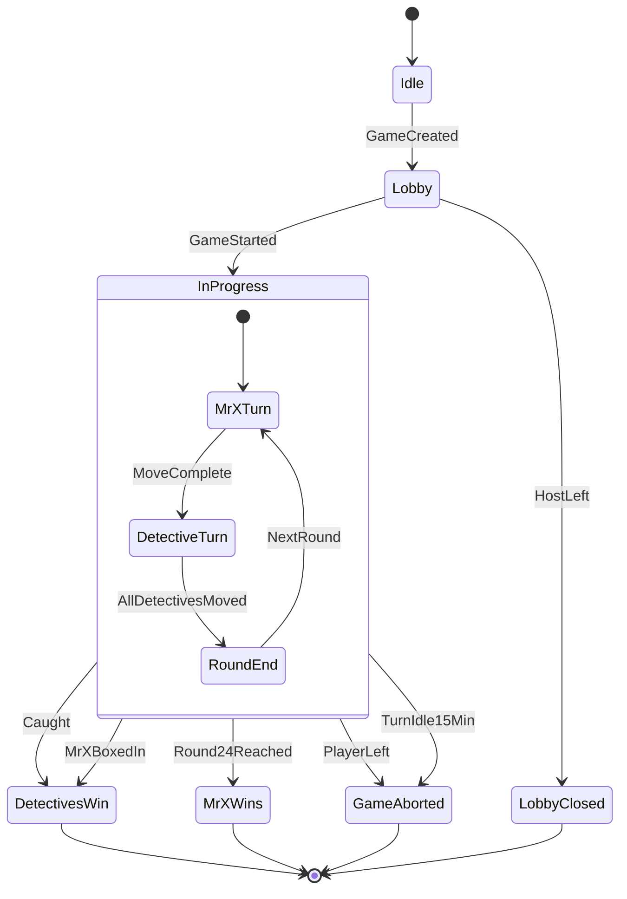
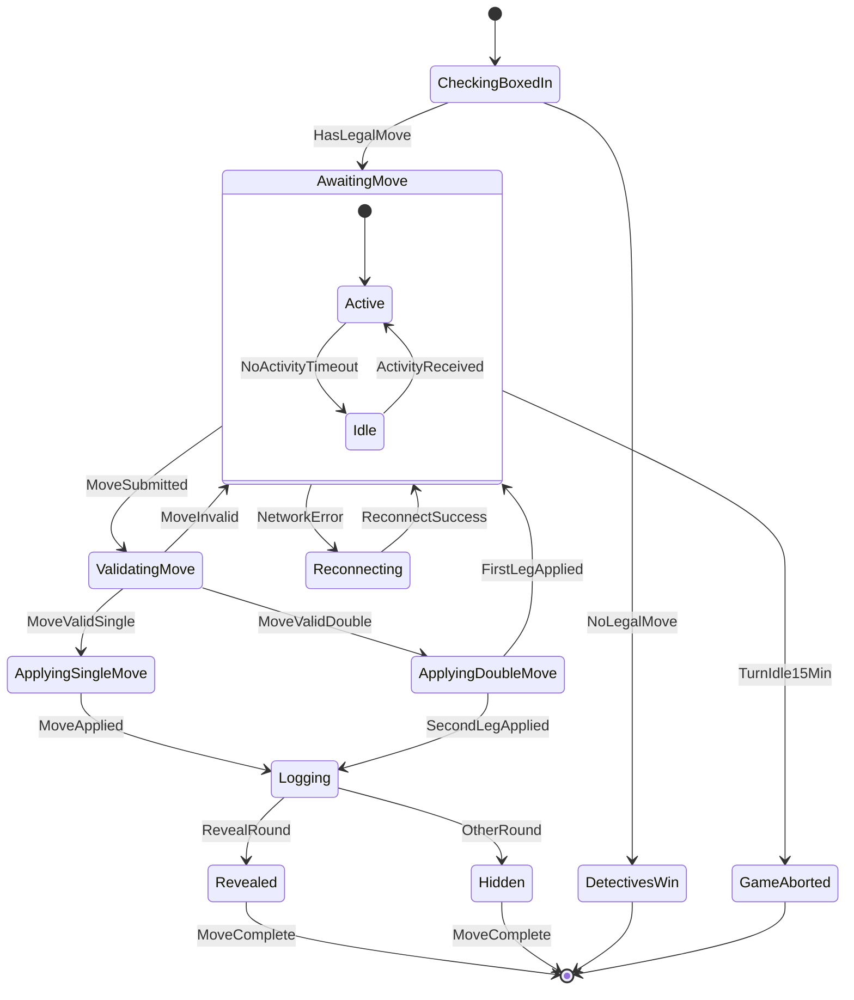
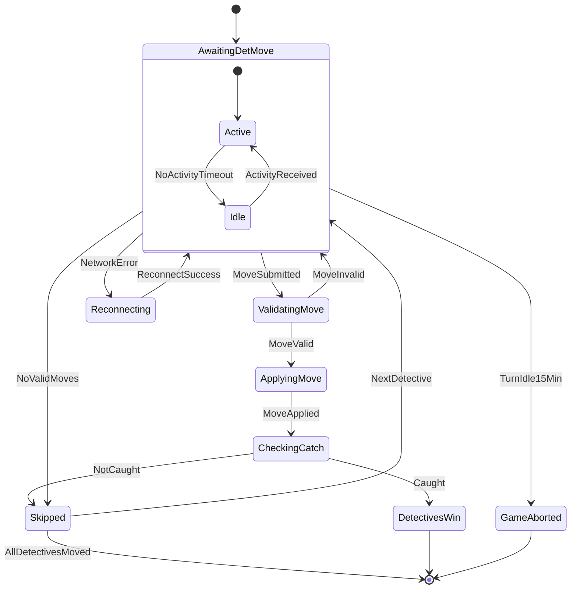
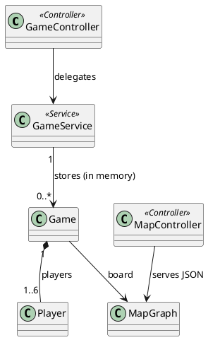
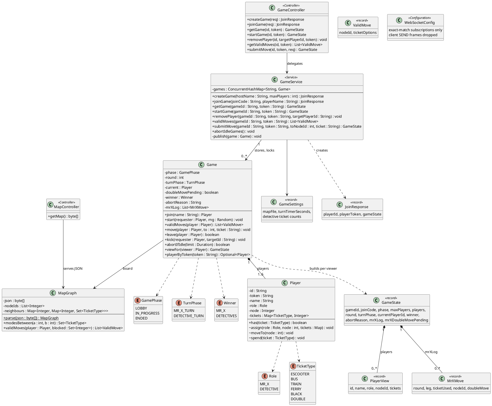

# Backend Rewrite Implementation Plan

> **For agentic workers:** REQUIRED SUB-SKILL: Use superpowers:subagent-driven-development (recommended) or superpowers:executing-plans to implement this plan task-by-task. Steps use checkbox (`- [ ]`) syntax for tracking.

**Goal:** Rebuild the backend as a plain-Java rules core behind a thin Spring service. This fixes bugs B1–B8, adds secret player tokens and STOMP hardening, and replaces the test suite with one that covers the proposal's evaluation plan: unit, mock, lifecycle, integration, functional, property/fuzz, performance, coverage and mutation.

**Architecture:**
- `game/` holds every rule (`Game`, `Player`, `MapGraph`) plus the views sent to clients, with no Spring.
- `GameService` stores games, locks around each call, and resolves the `X-Player-Token` header.
- After every change, `GameService` publishes the public view, each player's private view (on a topic named by their token), and the current player's valid moves.
- The STOMP broker matches exact destinations only and drops client SEND frames.

**Tech Stack:** Java 21, Spring Boot 4.0.6 (Spring 7.0.7, Jackson 3.1 in `tools.jackson`), JUnit 6 + AssertJ + Mockito (from spring-boot-starter-test), jqwik 1.10.1, JaCoCo 0.8.13, PIT 1.30.0 + pitest-junit5-plugin 1.2.3, Vue 3 + TypeScript frontend.

**Spec:** `docs/superpowers/specs/2026-09-21-backend-rewrite-design.md`. Per-bug detail is in `documentation/backend-fixes.md`.

## Global Constraints

- Never write the board game's brand name anywhere (code, tests, docs, commit messages). Say "the board game".
- `TicketType.BLACK` is the wire value. Prose and comments call it the Invisible ticket.
- `documentation/openapi.yaml` must be updated (Task 13) before this branch is merged. `info.version` goes 0.1.11 → 0.1.12.
- Tests use no reflection (`ReflectionTestUtils`) and no `Thread.sleep`. STOMP waits go through `StompTestClient` queues with timeouts.
- Java: 4-space indent, match the surrounding code. `pom.xml` and `HuntingMrXApplication.java` use tabs.
- Frontend: `gameApi.ts` uses 4 spaces and double quotes. `gameStore.ts` and `.vue` files use 2 spaces and single quotes.
- Docs prose: plain and direct, no em dashes used as punctuation.
- Every task ends with `cd backend && mvn -B -q test` passing (the perf test is excluded by default).
- Detective tickets (12/8/6/2) and the 900 s idle limit live only in `backend/src/main/resources/application.properties`.
- Commit after each task on branch `code-compress`. End every commit message with the line `Co-Authored-By: Claude Opus 5 <noreply@anthropic.com>`.
- All paths below are relative to the repo root. `B/` means `backend/src/main/java/com/huntingmrxwellington/` and `T/` means `backend/src/test/java/com/huntingmrxwellington/`.

## File Structure

**Created (main):**
- `B/game/GamePhase.java`, `TurnPhase.java`, `Role.java`, `TicketType.java`, `Winner.java`: enums
- `B/game/Player.java`: one player; public id, secret token, role, node, tickets
- `B/game/MapGraph.java`: the board, parsed once; valid-move search
- `B/game/ValidMove.java`, `MrXMove.java`, `PlayerView.java`, `GameState.java`: records sent to clients
- `B/game/Game.java`: every rule
- `B/config/GameSettings.java`: the `game.*` properties

**Rewritten (main):**
- `B/service/GameService.java`
- `B/controller/GameController.java`, `MapController.java`, `ApiExceptionHandler.java`
- `B/config/WebSocketConfig.java`
- `B/HuntingMrXApplication.java`
- `backend/src/main/resources/application.properties`
- `backend/pom.xml`

**Deleted (main):**
- `B/model/` (all 11 files), `B/dto/` (all 9 files)
- `B/service/MapGraph.java`, `B/config/WebConfig.java`
- `backend/src/main/resources/static/e2e.html`

**Tests created:**
- Game rules: `T/game/TestMaps.java`, `PlayerTest.java`, `MapGraphTest.java`, `GameTest.java`
- Service: `T/service/ServiceFixtures.java`, `GameServiceTest.java`, `GameLifecycleTest.java`
- Test clients: `T/support/HttpTestClient.java`, `StompTestClient.java`
- Controller: `T/controller/ApiIntegrationTest.java`, `WebSocketIntegrationTest.java`
- End to end: `T/e2e/FullGameE2ETest.java` (new content)
- Property and fuzz: `T/property/GameInvariantProperties.java`, `ApiFuzzProperties.java`
- Performance: `T/perf/MultiplayerPerfTest.java`

**Tests deleted:**
- `T/model/` (3 files)
- `T/controller/GameControllerTest.java`
- `T/HuntingMrXApplicationTests.java`
- the old `T/service/GameServiceTest.java` and `GameLifecycleTest.java` (replaced by files with the same names)
- the Selenium `T/e2e/FullGameE2ETest.java`

**Frontend modified:**
- `frontend/src/api/gameApi.ts`, `stores/gameStore.ts`, `types/game.ts`
- `frontend/src/views/CreateGameView.vue`, `JoinGameView.vue`, `LobbyView.vue`, `GameBoardView.vue`

**Docs modified:**
- `documentation/openapi.yaml`, `documentation/spec.md`, `documentation/plans/states-diagrams.md`
- `backend/doc.md`, `frontend/doc.md`, `README.md`, `CLAUDE.md`
- `documentation/backend-fixes.md`, `documentation/final_report/final_report.tex`

---

### Task 1: Build tooling (JaCoCo, PIT, jqwik) and remove Selenium

**Files:**
- Modify: `backend/pom.xml` (whole file)
- Delete: `T/e2e/FullGameE2ETest.java`, `backend/src/main/resources/static/e2e.html`

**Interfaces:**
- Produces: `mvn test` writes `backend/target/site/jacoco/index.html`. `mvn test-compile org.pitest:pitest-maven:mutationCoverage` runs PIT. jqwik is on the test classpath. Tests tagged `perf` are skipped unless you pass `-Dgroups=perf -DexcludedGroups=`.

- [ ] **Step 1: Replace `backend/pom.xml` with:**

```xml
<?xml version="1.0" encoding="UTF-8"?>
<project xmlns="http://maven.apache.org/POM/4.0.0" xmlns:xsi="http://www.w3.org/2001/XMLSchema-instance"
	xsi:schemaLocation="http://maven.apache.org/POM/4.0.0 https://maven.apache.org/xsd/maven-4.0.0.xsd">
	<modelVersion>4.0.0</modelVersion>
	<parent>
		<groupId>org.springframework.boot</groupId>
		<artifactId>spring-boot-starter-parent</artifactId>
		<version>4.0.6</version>
		<relativePath/> 
	</parent>
	<groupId>com.huntingmrxwellington</groupId>
	<artifactId>hunting-mrx-wellington-backend</artifactId>
	<version>0.0.1-SNAPSHOT</version>
	<name>HuntingMrXWellington</name>
	<description/>
	<url/>
	<licenses>
		<license/>
	</licenses>
	<developers>
		<developer/>
	</developers>
	<scm>
		<connection/>
		<developerConnection/>
		<tag/>
		<url/>
	</scm>
	<properties>
		<java.version>21</java.version>
		<!-- The latency test is opt-in: mvn test -Dgroups=perf -DexcludedGroups= -->
		<excludedGroups>perf</excludedGroups>
	</properties>
	<dependencies>
		<dependency>
			<groupId>org.springframework.boot</groupId>
			<artifactId>spring-boot-starter-web</artifactId>
		</dependency>
		<dependency>
			<groupId>org.springframework.boot</groupId>
			<artifactId>spring-boot-starter-websocket</artifactId>
		</dependency>

		<dependency>
			<groupId>org.springframework.boot</groupId>
			<artifactId>spring-boot-starter-test</artifactId>
			<scope>test</scope>
		</dependency>
		<dependency>
			<groupId>net.jqwik</groupId>
			<artifactId>jqwik</artifactId>
			<version>1.10.1</version>
			<scope>test</scope>
		</dependency>
	</dependencies>

	<build>
		<plugins>
			<plugin>
				<groupId>org.springframework.boot</groupId>
				<artifactId>spring-boot-maven-plugin</artifactId>
			</plugin>
			<!-- Coverage report on every `mvn test`: target/site/jacoco/index.html -->
			<plugin>
				<groupId>org.jacoco</groupId>
				<artifactId>jacoco-maven-plugin</artifactId>
				<version>0.8.13</version>
				<executions>
					<execution>
						<goals>
							<goal>prepare-agent</goal>
						</goals>
					</execution>
					<execution>
						<id>report</id>
						<phase>test</phase>
						<goals>
							<goal>report</goal>
						</goals>
					</execution>
				</executions>
			</plugin>
			<!-- Mutation testing, on demand:
			     mvn test-compile org.pitest:pitest-maven:mutationCoverage
			     Report: target/pit-reports/index.html. Runs only the fast rules and service tests. -->
			<plugin>
				<groupId>org.pitest</groupId>
				<artifactId>pitest-maven</artifactId>
				<version>1.30.0</version>
				<dependencies>
					<dependency>
						<groupId>org.pitest</groupId>
						<artifactId>pitest-junit5-plugin</artifactId>
						<version>1.2.3</version>
					</dependency>
				</dependencies>
				<configuration>
					<targetClasses>
						<param>com.huntingmrxwellington.game.*</param>
						<param>com.huntingmrxwellington.service.*</param>
					</targetClasses>
					<targetTests>
						<param>com.huntingmrxwellington.game.*</param>
						<param>com.huntingmrxwellington.service.*</param>
					</targetTests>
					<threads>4</threads>
					<timestampedReports>false</timestampedReports>
				</configuration>
			</plugin>
		</plugins>
	</build>

</project>
```

- [ ] **Step 2: Delete the Selenium test and its page**

```bash
git rm backend/src/test/java/com/huntingmrxwellington/e2e/FullGameE2ETest.java backend/src/main/resources/static/e2e.html
```

- [ ] **Step 3: Run the suite and check the coverage report exists**

Run: `cd backend && mvn -B test 2>&1 | grep -E "Tests run:|BUILD" | tail -3 && ls target/site/jacoco/index.html`
Expected: `Tests run: 113, Failures: 0, Errors: 0`, `BUILD SUCCESS`, and the report path printed.

- [ ] **Step 4: Commit**

This first commit also carries the design spec, this plan and the fixes doc, which are untracked until now.

```bash
git add backend/pom.xml docs/superpowers documentation/backend-fixes.md
git commit -m "build: add JaCoCo, PIT and jqwik; drop Selenium

Also adds the backend rewrite spec, plan and fixes doc.

Co-Authored-By: Claude Opus 5 <noreply@anthropic.com>"
```

---

### Task 2: Game enums, Player and MapGraph

**Files:**
- Create: `B/game/GamePhase.java`, `B/game/TurnPhase.java`, `B/game/Role.java`, `B/game/TicketType.java`, `B/game/Winner.java`, `B/game/Player.java`, `B/game/ValidMove.java`, `B/game/MapGraph.java`
- Test: `T/game/TestMaps.java`, `T/game/PlayerTest.java`, `T/game/MapGraphTest.java`

This builds next to the old `model/` package; nothing old changes yet.

**Interfaces:**
- Produces:
  - `enum GamePhase { LOBBY, IN_PROGRESS, ENDED }`
  - `enum TurnPhase { MR_X_TURN, DETECTIVE_TURN }`
  - `enum Role { MR_X, DETECTIVE }`
  - `enum TicketType { ESCOOTER, BUS, TRAIN, FERRY, BLACK, DOUBLE }`
  - `enum Winner { MR_X, DETECTIVES }`
  - `final class Player`:
    - `static final int UNLIMITED = -1`
    - package-private `Player(String name)`
    - `String id()`, `String token()`, `String name()`, `Role role()`, `Integer node()`, `boolean isMrX()`
    - `Map<TicketType,Integer> tickets()` (a copy), `boolean has(TicketType)`
    - package-private `void assign(Role, int node, Map<TicketType,Integer> tickets)`, `void moveTo(int)`, `void spend(TicketType)`
  - `record ValidMove(int nodeId, List<TicketType> ticketOptions)`
  - `final class MapGraph`:
    - `static MapGraph parse(byte[] json)`
    - `byte[] json()`, `List<Integer> nodeIds()`
    - `Set<TicketType> modesBetween(int a, int b)`
    - `List<ValidMove> validMoves(Player player, Set<Integer> blocked)`
  - test helper `TestMaps.small()`: the 7-node board drawn in `TestMaps`

- [ ] **Step 1: Write the test board and the failing tests**

`T/game/TestMaps.java`:

```java
package com.huntingmrxwellington.game;

import java.nio.charset.StandardCharsets;

/** A small hand-drawn board for tests:
 *
 *    1 -BUS/ESCOOTER- 2 -ESCOOTER- 3 -TRAIN- 4 -BUS- 5
 *    |                |                               |
 *    |               BUS                              |
 *    |                6 -ESCOOTER- 7                  |
 *    +------------------ FERRY -----------------------+
 *
 *  Node 7 is a dead end: a detective on 6 boxes in Mr X on 7. */
public final class TestMaps {

    public static final String SMALL = """
            {"nodes": [{"id": 1}, {"id": 2}, {"id": 3}, {"id": 4}, {"id": 5}, {"id": 6}, {"id": 7}],
             "edges": [
               {"from": 1, "to": 2, "modes": ["BUS", "ESCOOTER"]},
               {"from": 2, "to": 3, "modes": ["ESCOOTER"]},
               {"from": 3, "to": 4, "modes": ["TRAIN"]},
               {"from": 4, "to": 5, "modes": ["BUS"]},
               {"from": 5, "to": 1, "modes": ["FERRY"]},
               {"from": 2, "to": 6, "modes": ["BUS"]},
               {"from": 6, "to": 7, "modes": ["ESCOOTER"]}]}
            """;

    private TestMaps() {}

    public static MapGraph small() {
        return MapGraph.parse(SMALL.getBytes(StandardCharsets.UTF_8));
    }
}
```

`T/game/PlayerTest.java`:

```java
package com.huntingmrxwellington.game;

import org.junit.jupiter.api.Test;

import java.util.Map;

import static com.huntingmrxwellington.game.TicketType.*;
import static org.assertj.core.api.Assertions.*;

class PlayerTest {

    static Player detective(Map<TicketType, Integer> tickets) {
        Player p = new Player("Alice");
        p.assign(Role.DETECTIVE, 1, tickets);
        return p;
    }

    @Test
    void spendingAFiniteTicketUsesOneUp() {
        Player p = detective(Map.of(BUS, 2));
        p.spend(BUS);
        assertThat(p.tickets()).containsEntry(BUS, 1);
    }

    @Test
    void unlimitedTicketsNeverRunOut() {
        Player p = detective(Map.of(BUS, Player.UNLIMITED));
        for (int i = 0; i < 100; i++) p.spend(BUS);
        assertThat(p.tickets()).containsEntry(BUS, Player.UNLIMITED);
        assertThat(p.has(BUS)).isTrue();
    }

    @Test
    void spendingAnEmptyOrMissingTicketFails() {
        Player p = detective(Map.of(BUS, 1));
        p.spend(BUS);
        assertThat(p.has(BUS)).isFalse();
        assertThatThrownBy(() -> p.spend(BUS)).isInstanceOf(IllegalArgumentException.class);
        assertThatThrownBy(() -> p.spend(BLACK)).isInstanceOf(IllegalArgumentException.class);
    }

    @Test
    void ticketsReturnsACopy() {
        Player p = detective(Map.of(BUS, 1));
        p.tickets().put(BUS, 99);
        assertThat(p.tickets()).containsEntry(BUS, 1);
    }

    @Test
    void aLobbyPlayerHasNoRoleNodeOrTickets() {
        Player p = new Player("Alice");
        assertThat(p.role()).isNull();
        assertThat(p.node()).isNull();
        assertThat(p.tickets()).isEmpty();
        assertThat(p.isMrX()).isFalse();
    }

    @Test
    void idAndTokenAreDifferentAndUnique() {
        Player a = new Player("A");
        Player b = new Player("B");
        assertThat(java.util.Set.of(a.id(), a.token(), b.id(), b.token())).hasSize(4);
    }
}
```

`T/game/MapGraphTest.java`:

```java
package com.huntingmrxwellington.game;

import org.junit.jupiter.api.Test;
import org.springframework.core.io.ClassPathResource;

import java.nio.charset.StandardCharsets;
import java.util.List;
import java.util.Map;
import java.util.Set;

import static com.huntingmrxwellington.game.TicketType.*;
import static org.assertj.core.api.Assertions.*;

class MapGraphTest {

    final MapGraph small = TestMaps.small();

    static MapGraph parse(String json) {
        return MapGraph.parse(json.getBytes(StandardCharsets.UTF_8));
    }

    static Player placed(Role role, int node, Map<TicketType, Integer> tickets) {
        Player p = new Player("P");
        p.assign(role, node, tickets);
        return p;
    }

    @Test
    void readsNodesAndUndirectedEdges() {
        assertThat(small.nodeIds()).containsExactly(1, 2, 3, 4, 5, 6, 7);
        assertThat(small.modesBetween(1, 2)).containsExactlyInAnyOrder(BUS, ESCOOTER);
        assertThat(small.modesBetween(2, 1)).containsExactlyInAnyOrder(BUS, ESCOOTER);
        assertThat(small.modesBetween(1, 3)).isEmpty();
    }

    @Test
    void modesOnARepeatedNodePairAreMerged() {
        MapGraph g = parse("""
                {"nodes": [{"id": 1}, {"id": 2}],
                 "edges": [{"from": 1, "to": 2, "modes": ["BUS"]}, {"from": 2, "to": 1, "modes": ["TRAIN"]}]}""");
        assertThat(g.modesBetween(1, 2)).containsExactlyInAnyOrder(BUS, TRAIN);
    }

    @Test
    void anUnknownModeFailsTheLoad() {
        assertThatThrownBy(() -> parse("""
                {"nodes": [{"id": 1}, {"id": 2}], "edges": [{"from": 1, "to": 2, "modes": ["TAXI"]}]}"""))
                .isInstanceOf(IllegalStateException.class).hasMessageContaining("TAXI");
    }

    @Test
    void invisibleAndDoubleAreNotEdgeModes() {
        assertThatThrownBy(() -> parse("""
                {"nodes": [{"id": 1}, {"id": 2}], "edges": [{"from": 1, "to": 2, "modes": ["BLACK"]}]}"""))
                .isInstanceOf(IllegalStateException.class);
    }

    @Test
    void anEdgeToAMissingNodeFailsTheLoad() {
        assertThatThrownBy(() -> parse("""
                {"nodes": [{"id": 1}], "edges": [{"from": 1, "to": 9, "modes": ["BUS"]}]}"""))
                .isInstanceOf(IllegalStateException.class).hasMessageContaining("1-9");
    }

    @Test
    void validMovesOfferMatchingTicketsPlusInvisible() {
        Player mrX = placed(Role.MR_X, 1, Map.of(ESCOOTER, -1, BUS, -1, TRAIN, -1, FERRY, -1, BLACK, 1));
        assertThat(small.validMoves(mrX, Set.of())).containsExactly(
                new ValidMove(2, List.of(ESCOOTER, BUS, BLACK)),
                new ValidMove(5, List.of(FERRY, BLACK)));
    }

    @Test
    void blockedNodesAndUsedUpTicketsAreLeftOut() {
        Player detective = placed(Role.DETECTIVE, 2, Map.of(ESCOOTER, 0, BUS, 3, TRAIN, 0, FERRY, 0));
        assertThat(small.validMoves(detective, Set.of(6))).containsExactly(new ValidMove(1, List.of(BUS)));
    }

    @Test
    void theShippedMapsLoad() throws Exception {
        for (String file : List.of("map.json", "test-map.json")) {
            byte[] json = new ClassPathResource("static/" + file).getContentAsByteArray();
            MapGraph g = MapGraph.parse(json);
            assertThat(g.nodeIds()).isNotEmpty();
            assertThat(g.json()).isEqualTo(json);
        }
    }
}
```

- [ ] **Step 2: Run the tests to see them fail**

Run: `cd backend && mvn -B -q test -Dtest='PlayerTest,MapGraphTest' 2>&1 | grep -E "ERROR.*(cannot find symbol|class Player|class MapGraph)" | head -3`
Expected: compile errors, because `com.huntingmrxwellington.game.Player` and `MapGraph` don't exist yet.

- [ ] **Step 3: Write the enums, Player, ValidMove and MapGraph**

`B/game/GamePhase.java`:

```java
package com.huntingmrxwellington.game;

public enum GamePhase {
    LOBBY, IN_PROGRESS, ENDED
}
```

`B/game/TurnPhase.java`:

```java
package com.huntingmrxwellington.game;

public enum TurnPhase {
    MR_X_TURN, DETECTIVE_TURN
}
```

`B/game/Role.java`:

```java
package com.huntingmrxwellington.game;

public enum Role {
    MR_X, DETECTIVE
}
```

`B/game/TicketType.java`:

```java
package com.huntingmrxwellington.game;

/** BLACK is shown to players as the Invisible ticket; the wire value stays BLACK.
 *  DOUBLE is only ever sent as a prefix on a move ("DOUBLE_BUS"), never as a leg. */
public enum TicketType {
    ESCOOTER, BUS, TRAIN, FERRY, BLACK, DOUBLE
}
```

`B/game/Winner.java`:

```java
package com.huntingmrxwellington.game;

public enum Winner {
    MR_X, DETECTIVES
}
```

`B/game/Player.java`:

```java
package com.huntingmrxwellington.game;

import java.util.EnumMap;
import java.util.Map;
import java.util.UUID;

/** One player. id is public and sent to everyone; token is the secret the player
 *  acts with, and it must never appear in a view or broadcast. */
public final class Player {

    /** Ticket count that never runs out (Mr X's transport tickets). */
    public static final int UNLIMITED = -1;

    private final String id = UUID.randomUUID().toString();
    private final String token = UUID.randomUUID().toString();
    private final String name;
    private final EnumMap<TicketType, Integer> tickets = new EnumMap<>(TicketType.class);
    private Role role;      // null until the game starts
    private Integer node;   // null until the game starts

    Player(String name) {
        this.name = name;
    }

    public String id() { return id; }
    public String token() { return token; }
    public String name() { return name; }
    public Role role() { return role; }
    public Integer node() { return node; }
    public boolean isMrX() { return role == Role.MR_X; }

    /** A copy of the ticket counts; empty until the game starts. */
    public Map<TicketType, Integer> tickets() {
        return new EnumMap<>(tickets);
    }

    public boolean has(TicketType ticket) {
        int count = tickets.getOrDefault(ticket, 0);
        return count == UNLIMITED || count > 0;
    }

    void assign(Role role, int node, Map<TicketType, Integer> startingTickets) {
        this.role = role;
        this.node = node;
        tickets.clear();
        tickets.putAll(startingTickets);
    }

    void moveTo(int node) {
        this.node = node;
    }

    /** Uses up one ticket; unlimited tickets are never used up. */
    void spend(TicketType ticket) {
        if (!has(ticket)) throw new IllegalArgumentException("No " + ticket + " tickets left");
        int count = tickets.get(ticket);
        if (count != UNLIMITED) tickets.put(ticket, count - 1);
    }
}
```

`B/game/ValidMove.java`:

```java
package com.huntingmrxwellington.game;

import java.util.List;

/** A node the player can reach in one leg, and the tickets that would pay for it. */
public record ValidMove(int nodeId, List<TicketType> ticketOptions) {}
```

`B/game/MapGraph.java`:

```java
package com.huntingmrxwellington.game;

import tools.jackson.databind.JsonNode;
import tools.jackson.databind.ObjectMapper;

import java.nio.charset.StandardCharsets;
import java.util.ArrayList;
import java.util.Collections;
import java.util.Comparator;
import java.util.EnumSet;
import java.util.HashMap;
import java.util.List;
import java.util.Map;
import java.util.Set;

/** The static board, parsed once from the map JSON. Edges are undirected and modes on a
 *  repeated node pair are merged. An unknown mode or node fails the load instead of
 *  silently dropping the edge. */
public final class MapGraph {

    private static final Set<TicketType> EDGE_MODES =
            EnumSet.of(TicketType.ESCOOTER, TicketType.BUS, TicketType.TRAIN, TicketType.FERRY);

    private final byte[] json;
    private final List<Integer> nodeIds;
    private final Map<Integer, Map<Integer, Set<TicketType>>> neighbours; // node -> neighbour -> modes

    private MapGraph(byte[] json, List<Integer> nodeIds, Map<Integer, Map<Integer, Set<TicketType>>> neighbours) {
        this.json = json;
        this.nodeIds = nodeIds;
        this.neighbours = neighbours;
    }

    public static MapGraph parse(byte[] json) {
        JsonNode root = new ObjectMapper().readTree(new String(json, StandardCharsets.UTF_8));
        List<Integer> ids = new ArrayList<>();
        Map<Integer, Map<Integer, Set<TicketType>>> neighbours = new HashMap<>();
        for (JsonNode node : root.get("nodes")) {
            int id = node.get("id").asInt();
            ids.add(id);
            neighbours.put(id, new HashMap<>());
        }
        for (JsonNode edge : root.get("edges")) {
            int from = edge.get("from").asInt();
            int to = edge.get("to").asInt();
            if (!neighbours.containsKey(from) || !neighbours.containsKey(to))
                throw new IllegalStateException("Edge " + from + "-" + to + " uses a node that isn't in the map");
            for (JsonNode mode : edge.get("modes")) {
                TicketType ticket = edgeMode(mode.asString(), from, to);
                neighbours.get(from).computeIfAbsent(to, k -> EnumSet.noneOf(TicketType.class)).add(ticket);
                neighbours.get(to).computeIfAbsent(from, k -> EnumSet.noneOf(TicketType.class)).add(ticket);
            }
        }
        return new MapGraph(json, List.copyOf(ids), neighbours);
    }

    private static TicketType edgeMode(String name, int from, int to) {
        for (TicketType t : EDGE_MODES) if (t.name().equals(name)) return t;
        throw new IllegalStateException("Edge " + from + "-" + to + " has unknown mode " + name);
    }

    /** The raw map JSON, served as-is to the frontend. Callers must not modify it. */
    public byte[] json() {
        return json;
    }

    public List<Integer> nodeIds() {
        return nodeIds;
    }

    /** Modes on the edge between a and b; empty if they aren't adjacent. */
    public Set<TicketType> modesBetween(int a, int b) {
        return Collections.unmodifiableSet(neighbours.getOrDefault(a, Map.of()).getOrDefault(b, Set.of()));
    }

    /** Every node the player can reach in one leg, sorted by node id, with the tickets that
     *  would pay for it: matching transport tickets they hold, plus Invisible (BLACK) on any
     *  edge if they hold one. Blocked nodes are left out. */
    public List<ValidMove> validMoves(Player player, Set<Integer> blocked) {
        List<ValidMove> moves = new ArrayList<>();
        neighbours.getOrDefault(player.node(), Map.of()).forEach((to, modes) -> {
            if (blocked.contains(to)) return;
            List<TicketType> options = new ArrayList<>();
            for (TicketType mode : modes) if (player.has(mode)) options.add(mode);
            if (player.has(TicketType.BLACK)) options.add(TicketType.BLACK);
            if (!options.isEmpty()) moves.add(new ValidMove(to, List.copyOf(options)));
        });
        moves.sort(Comparator.comparingInt(ValidMove::nodeId));
        return moves;
    }
}
```

- [ ] **Step 4: Run the tests to see them pass**

Run: `cd backend && mvn -B -q test -Dtest='PlayerTest,MapGraphTest' 2>&1 | tail -5; echo "exit $?"`
Expected: no failures (Maven prints nothing in `-q` mode on success).

- [ ] **Step 5: Run the whole suite, then commit**

Run: `cd backend && mvn -B -q test`
Expected: exits 0.

```bash
git add backend/src/main/java/com/huntingmrxwellington/game backend/src/test/java/com/huntingmrxwellington/game
git commit -m "feat(game): plain Player and MapGraph for the new rules core

Co-Authored-By: Claude Opus 5 <noreply@anthropic.com>"
```

---

### Task 3: Game lobby, start and views

**Files:**
- Create: `B/game/MrXMove.java`, `B/game/PlayerView.java`, `B/game/GameState.java`, `B/game/Game.java`
- Test: `T/game/GameTest.java`

**Interfaces:**
- Consumes: Task 2 (`Player`, `MapGraph`, `ValidMove`, enums).
- Produces:
  - `record MrXMove(int round, int leg, TicketType ticketUsed, Integer nodeId, boolean doubleMove)`
  - `record PlayerView(String id, String name, Role role, Integer nodeId, Map<TicketType,Integer> tickets)`
  - `record GameState(String gameId, String joinCode, GamePhase phase, int maxPlayers, List<PlayerView> players, int round, TurnPhase turnPhase, String currentPlayerId, Winner winner, String abortReason, List<MrXMove> mrXLog, boolean mrXDoubleMovePending)`
  - `final class Game`:
    - `Game(String id, String joinCode, int maxPlayers, MapGraph map, Map<TicketType,Integer> detectiveTickets, InstantSource clock)`
    - constants `MAX_NAME_LENGTH = 20`, `LAST_ROUND = 24`, `REVEAL_ROUNDS = {2, 8, 13, 18, 24}`
    - `Player join(String name)`, `Player host()`
    - `void start(Player requester, Random rng)`
    - package-private `void start(Player requester, List<Player> order, List<Integer> startNodes)`
    - `List<ValidMove> validMoves(Player)`, `GameState viewFor(Player viewerOrNull)`
    - `Optional<Player> playerByToken(String)`, `List<Player> players()`, `Optional<Player> currentPlayer()`
    - getters `id()`, `joinCode()`, `phase()`, `round()`, `winner()`, `abortReason()`, `doubleMovePending()`, `mrXLog()`

- [ ] **Step 1: Write the failing tests**

`T/game/GameTest.java`:

```java
package com.huntingmrxwellington.game;

import com.huntingmrxwellington.exception.ConflictException;
import com.huntingmrxwellington.exception.ForbiddenException;
import com.huntingmrxwellington.exception.GameNotFoundException;
import org.junit.jupiter.api.Nested;
import org.junit.jupiter.api.Test;
import tools.jackson.databind.ObjectMapper;

import java.time.Duration;
import java.time.Instant;
import java.util.ArrayList;
import java.util.Arrays;
import java.util.List;
import java.util.Map;
import java.util.Random;

import static com.huntingmrxwellington.game.TicketType.*;
// Explicit AssertJ imports: Assertions.* also brings in a DOUBLE constant that clashes with TicketType.DOUBLE.
import static org.assertj.core.api.Assertions.assertThat;
import static org.assertj.core.api.Assertions.assertThatCode;
import static org.assertj.core.api.Assertions.assertThatThrownBy;

/** Every rule of the game, on the hand-drawn board in TestMaps with players on exact nodes. */
class GameTest {

    static final Map<TicketType, Integer> TICKETS = Map.of(ESCOOTER, 30, BUS, 30, TRAIN, 30, FERRY, 30);
    static final String[] NAMES = {"Xavier", "Alice", "Bob", "Carol", "Dan", "Eve"};

    Instant now = Instant.parse("2026-01-01T00:00:00Z");
    Game game;
    Player mrX, alice, bob;

    Game newGame(int maxPlayers, Map<TicketType, Integer> detectiveTickets) {
        return new Game("g1", "ABC123", maxPlayers, TestMaps.small(), detectiveTickets, () -> now);
    }

    Game newGame(int maxPlayers) {
        return newGame(maxPlayers, TICKETS);
    }

    /** Starts a game with Mr X on nodes[0] and detectives, in turn order, on the rest. */
    void start(int... nodes) {
        startWith(TICKETS, nodes);
    }

    void startWith(Map<TicketType, Integer> detectiveTickets, int... nodes) {
        game = newGame(6, detectiveTickets);
        List<Player> order = new ArrayList<>();
        for (int i = 0; i < nodes.length; i++) order.add(game.join(NAMES[i]));
        game.start(order.get(0), order, Arrays.stream(nodes).boxed().toList());
        mrX = order.get(0);
        alice = order.get(1);
        bob = order.size() > 2 ? order.get(2) : null;
    }

    void advance(Duration duration) {
        now = now.plus(duration);
    }

    /** The node this view shows for player p (null when hidden). */
    static Integer nodeSeen(GameState view, Player p) {
        return view.players().stream().filter(v -> v.id().equals(p.id())).findFirst().orElseThrow().nodeId();
    }

    @Nested
    class Lobby {

        @Test
        void theFirstPlayerToJoinIsTheHost() {
            Game g = newGame(4);
            Player host = g.join("Alice");
            g.join("Bob");
            assertThat(g.host()).isSameAs(host);
        }

        @Test
        void namesAreTrimmedAndLimitedTo20Characters() {
            Game g = newGame(4);
            assertThat(g.join("  Alice  ").name()).isEqualTo("Alice");
            assertThat(g.join("x".repeat(20)).name()).hasSize(20);
            assertThatThrownBy(() -> g.join("x".repeat(21)))
                    .isInstanceOf(IllegalArgumentException.class).hasMessageContaining("20 characters");
        }

        @Test
        void aBlankOrMissingNameIsRejected() {
            Game g = newGame(4);
            assertThatThrownBy(() -> g.join("   ")).isInstanceOf(IllegalArgumentException.class);
            assertThatThrownBy(() -> g.join(null)).isInstanceOf(IllegalArgumentException.class);
        }

        @Test
        void maxPlayersMustBeBetween2And6() {
            assertThatThrownBy(() -> newGame(1)).isInstanceOf(IllegalArgumentException.class);
            assertThatThrownBy(() -> newGame(7)).isInstanceOf(IllegalArgumentException.class);
            assertThatCode(() -> newGame(2)).doesNotThrowAnyException();
            assertThatCode(() -> newGame(6)).doesNotThrowAnyException();
        }

        @Test
        void aFullGameRejectsJoins() {
            Game g = newGame(2);
            g.join("Alice");
            g.join("Bob");
            assertThatThrownBy(() -> g.join("Carol")).isInstanceOf(ConflictException.class).hasMessageContaining("full");
        }

        @Test
        void aStartedGameRejectsJoins() {
            start(1, 3);
            assertThatThrownBy(() -> game.join("Late")).isInstanceOf(ConflictException.class).hasMessageContaining("lobby");
        }

        @Test
        void theLobbyViewHasNoRolesTicketsOrTurn() {
            Game g = newGame(3);
            g.join("Alice");
            GameState view = g.viewFor(null);
            assertThat(view.phase()).isEqualTo(GamePhase.LOBBY);
            assertThat(view.round()).isZero();
            assertThat(view.currentPlayerId()).isNull();
            assertThat(view.turnPhase()).isNull();
            assertThat(view.players()).singleElement().satisfies(p -> {
                assertThat(p.role()).isNull();
                assertThat(p.tickets()).isNull();
                assertThat(p.nodeId()).isNull();
            });
        }

        @Test
        void playersAreFoundByTokenOnly() {
            Game g = newGame(3);
            Player alice = g.join("Alice");
            assertThat(g.playerByToken(alice.token())).contains(alice);
            assertThat(g.playerByToken(alice.id())).isEmpty();
            assertThat(g.playerByToken(null)).isEmpty();
        }
    }

    @Nested
    class Start {

        @Test
        void onlyTheHostCanStart() {
            Game g = newGame(3);
            g.join("Host");
            Player guest = g.join("Guest");
            assertThatThrownBy(() -> g.start(guest, new Random(1))).isInstanceOf(ForbiddenException.class);
        }

        @Test
        void startingNeedsTwoPlayers() {
            Game g = newGame(3);
            Player host = g.join("Host");
            assertThatThrownBy(() -> g.start(host, new Random(1)))
                    .isInstanceOf(IllegalArgumentException.class).hasMessageContaining("2 players");
        }

        @Test
        void aGameCannotStartTwice() {
            start(1, 3);
            assertThatThrownBy(() -> game.start(mrX, new Random(1))).isInstanceOf(ConflictException.class);
        }

        @Test
        void aRandomStartHasOneMrXAndDistinctNodes() {
            Game g = newGame(6);
            Player host = g.join("P0");
            for (int i = 1; i < 6; i++) g.join("P" + i);
            g.start(host, new Random(42));
            assertThat(g.players()).filteredOn(Player::isMrX).hasSize(1);
            assertThat(g.players()).filteredOn(p -> p.role() == Role.DETECTIVE).hasSize(5);
            assertThat(g.players().stream().map(Player::node).distinct()).hasSize(6);
        }

        @Test
        void mrXGetsUnlimitedTransportTwoDoublesAndOneInvisiblePerDetective() {
            start(1, 3, 6);
            assertThat(mrX.tickets()).containsExactlyInAnyOrderEntriesOf(Map.of(
                    ESCOOTER, Player.UNLIMITED, BUS, Player.UNLIMITED, TRAIN, Player.UNLIMITED,
                    FERRY, Player.UNLIMITED, DOUBLE, 2, BLACK, 2));
        }

        @Test
        void detectivesGetTheConfiguredTicketsOnly() {
            start(1, 3);
            assertThat(alice.tickets()).containsExactlyInAnyOrderEntriesOf(TICKETS);
        }

        @Test
        void theGameStartsInRoundOneWithMrXToMove() {
            start(1, 3);
            assertThat(game.phase()).isEqualTo(GamePhase.IN_PROGRESS);
            assertThat(game.round()).isEqualTo(1);
            assertThat(game.currentPlayer()).contains(mrX);
            assertThat(game.viewFor(null).turnPhase()).isEqualTo(TurnPhase.MR_X_TURN);
        }

        @Test
        void mrXBoxedInAtTheStartLosesStraightAway() {   // B1
            start(7, 6);                                  // node 7's only neighbour is 6
            assertThat(game.phase()).isEqualTo(GamePhase.ENDED);
            assertThat(game.winner()).isEqualTo(Winner.DETECTIVES);
            assertThat(game.currentPlayer()).isEmpty();
        }
    }

    @Nested
    class Views {

        @Test
        void detectivesAndThePublicNeverSeeMrXOutsideAReveal() {
            start(1, 3);
            assertThat(nodeSeen(game.viewFor(alice), mrX)).isNull();
            assertThat(nodeSeen(game.viewFor(null), mrX)).isNull();
            assertThat(nodeSeen(game.viewFor(alice), alice)).isEqualTo(3);
        }

        @Test
        void mrXSeesEveryone() {
            start(1, 3);
            GameState view = game.viewFor(mrX);
            assertThat(nodeSeen(view, mrX)).isEqualTo(1);
            assertThat(nodeSeen(view, alice)).isEqualTo(3);
        }

        @Test
        void rolesAndTicketsArePublic() {
            start(1, 3);
            GameState view = game.viewFor(null);
            assertThat(view.players()).extracting(PlayerView::role).containsExactly(Role.MR_X, Role.DETECTIVE);
            assertThat(view.players().get(1).tickets()).containsExactlyInAnyOrderEntriesOf(TICKETS);
        }

        @Test
        void viewsNeverContainAToken() throws Exception {
            start(1, 3);
            String json = new ObjectMapper().writeValueAsString(game.viewFor(mrX));
            assertThat(json).doesNotContain(mrX.token()).doesNotContain(alice.token());
        }
    }
}
```

- [ ] **Step 2: Run the tests to see them fail**

Run: `cd backend && mvn -B -q test -Dtest=GameTest 2>&1 | grep -E "cannot find symbol" | head -3`
Expected: compile errors for `Game`, `GameState` and `PlayerView`.

- [ ] **Step 3: Write the view records and Game**

`B/game/MrXMove.java`:

```java
package com.huntingmrxwellington.game;

/** One leg of Mr X's travel log. nodeId is only set on the final leg of a reveal round,
 *  so the record is safe to send to every player as-is. doubleMove marks the first leg of
 *  a double move. */
public record MrXMove(int round, int leg, TicketType ticketUsed, Integer nodeId, boolean doubleMove) {}
```

`B/game/PlayerView.java`:

```java
package com.huntingmrxwellington.game;

import java.util.Map;

/** What one viewer sees of one player. nodeId is null for Mr X unless the viewer is Mr X
 *  or he was revealed this round; role and tickets are null in the lobby. No token. */
public record PlayerView(String id, String name, Role role, Integer nodeId, Map<TicketType, Integer> tickets) {}
```

`B/game/GameState.java`:

```java
package com.huntingmrxwellington.game;

import java.util.List;

/** Client-facing snapshot of a game, built per viewer by Game.viewFor and sent over REST and STOMP. */
public record GameState(
        String gameId,
        String joinCode,
        GamePhase phase,
        int maxPlayers,
        List<PlayerView> players,
        int round,
        TurnPhase turnPhase,
        String currentPlayerId,
        Winner winner,
        String abortReason,
        List<MrXMove> mrXLog,
        boolean mrXDoubleMovePending) {}
```

`B/game/Game.java`:

```java
package com.huntingmrxwellington.game;

import com.huntingmrxwellington.exception.ConflictException;
import com.huntingmrxwellington.exception.ForbiddenException;

import java.time.Instant;
import java.time.InstantSource;
import java.util.ArrayList;
import java.util.Collections;
import java.util.EnumMap;
import java.util.HashSet;
import java.util.List;
import java.util.Map;
import java.util.Optional;
import java.util.Random;
import java.util.Set;
import java.util.stream.Collectors;

import static com.huntingmrxwellington.game.TicketType.*;

/** One game and every rule of it: lobby, start, moves, turns, reveals, wins, leaving and
 *  the idle abort. Not thread-safe; GameService locks around every call. */
public final class Game {

    public static final int MAX_NAME_LENGTH = 20;
    public static final int LAST_ROUND = 24;
    public static final Set<Integer> REVEAL_ROUNDS = Set.of(2, 8, 13, 18, 24);

    private final String id;
    private final String joinCode;
    private final int maxPlayers;
    private final MapGraph map;
    private final Map<TicketType, Integer> detectiveTickets;
    private final InstantSource clock;

    // Lobby: join order, so the host is first. In play: Mr X first, then detectives in turn order.
    private final List<Player> players = new ArrayList<>();
    private final List<MrXMove> mrXLog = new ArrayList<>();

    private GamePhase phase = GamePhase.LOBBY;
    private int round;                  // 0 in the lobby
    private TurnPhase turnPhase;        // null outside IN_PROGRESS
    private Player current;             // whose move it is; null outside IN_PROGRESS
    private boolean doubleMovePending;
    private Winner winner;
    private String abortReason;
    private Instant turnStartedAt;

    public Game(String id, String joinCode, int maxPlayers, MapGraph map,
                Map<TicketType, Integer> detectiveTickets, InstantSource clock) {
        if (maxPlayers < 2 || maxPlayers > 6)
            throw new IllegalArgumentException("Max players must be between 2 and 6");
        this.id = id;
        this.joinCode = joinCode;
        this.maxPlayers = maxPlayers;
        this.map = map;
        this.detectiveTickets = Map.copyOf(detectiveTickets);
        this.clock = clock;
    }

    // ── Lobby ────────────────────────────────────────────────────────────────

    /** Adds a player to the lobby. The first player to join is the host. */
    public Player join(String name) {
        String stripped = name == null ? "" : name.strip();
        if (stripped.isEmpty()) throw new IllegalArgumentException("Name is required");
        if (stripped.length() > MAX_NAME_LENGTH)
            throw new IllegalArgumentException("Name must be " + MAX_NAME_LENGTH + " characters or fewer");
        requirePhase(GamePhase.LOBBY, "Game is not in the lobby phase");
        if (players.size() >= maxPlayers) throw new ConflictException("Game is full");
        Player player = new Player(stripped);
        players.add(player);
        return player;
    }

    /** Whoever has been in the lobby longest, which is also what the frontend assumes. */
    public Player host() {
        return players.isEmpty() ? null : players.get(0);
    }

    // ── Start ────────────────────────────────────────────────────────────────

    /** The host starts the game: random Mr X, random detective order, random distinct start nodes. */
    public void start(Player requester, Random rng) {
        checkCanStart(requester);
        List<Player> order = new ArrayList<>(players);
        Collections.shuffle(order, rng);
        List<Integer> nodes = new ArrayList<>(map.nodeIds());
        if (nodes.size() < order.size())
            throw new IllegalArgumentException("The map needs at least " + order.size() + " nodes");
        Collections.shuffle(nodes, rng);
        start(requester, order, nodes.subList(0, order.size()));
    }

    /** Deterministic start, which tests call directly: order.get(0) becomes Mr X, the rest are
     *  detectives in that turn order, and order.get(i) starts on startNodes.get(i). */
    void start(Player requester, List<Player> order, List<Integer> startNodes) {
        checkCanStart(requester);
        if (!new HashSet<>(order).equals(new HashSet<>(players)) || startNodes.size() != order.size())
            throw new IllegalArgumentException("order must list every player once, with one start node each");
        Map<TicketType, Integer> mrXTickets = new EnumMap<>(TicketType.class);
        for (TicketType t : List.of(ESCOOTER, BUS, TRAIN, FERRY)) mrXTickets.put(t, Player.UNLIMITED);
        mrXTickets.put(DOUBLE, 2);
        mrXTickets.put(BLACK, order.size() - 1);
        order.get(0).assign(Role.MR_X, startNodes.get(0), mrXTickets);
        for (int i = 1; i < order.size(); i++)
            order.get(i).assign(Role.DETECTIVE, startNodes.get(i), detectiveTickets);
        players.clear();
        players.addAll(order);
        phase = GamePhase.IN_PROGRESS;
        round = 1;
        giveTurnToMrX();
    }

    private void checkCanStart(Player requester) {
        requirePhase(GamePhase.LOBBY, "Game is not in the lobby phase");
        if (requester != host()) throw new ForbiddenException("Only the host can start the game");
        if (players.size() < 2) throw new IllegalArgumentException("Need at least 2 players to start");
    }

    // ── Moves ────────────────────────────────────────────────────────────────

    /** The player's legal moves from where they stand, whoever's turn it is. */
    public List<ValidMove> validMoves(Player player) {
        requirePhase(GamePhase.IN_PROGRESS, "Game is not in progress");
        return movesFrom(player);
    }

    private List<ValidMove> movesFrom(Player player) {
        return map.validMoves(player, player.isMrX() ? detectiveNodes() : Set.of());
    }

    // ── Turns ────────────────────────────────────────────────────────────────

    /** Mr X to move, unless detectives hold every node next to him: then they win. */
    private void giveTurnToMrX() {
        if (movesFrom(mrX()).isEmpty()) {
            end(Winner.DETECTIVES, null);
            return;
        }
        turnPhase = TurnPhase.MR_X_TURN;
        setCurrent(mrX());
    }

    private void setCurrent(Player player) {
        current = player;
        turnStartedAt = clock.instant();
    }

    private void end(Winner winner, String abortReason) {
        phase = GamePhase.ENDED;
        this.winner = winner;
        this.abortReason = abortReason;
        current = null;
        turnPhase = null;
        doubleMovePending = false;
    }

    // ── Views ────────────────────────────────────────────────────────────────

    /** What the viewer may see; a null viewer gets the public (detective-level) view. */
    public GameState viewFor(Player viewer) {
        boolean seesMrX = viewer != null && viewer.isMrX();
        Integer revealed = revealedNodeThisRound();
        List<PlayerView> views = players.stream()
                .map(p -> new PlayerView(p.id(), p.name(), p.role(),
                        p.isMrX() && !seesMrX ? revealed : p.node(),
                        p.role() == null ? null : p.tickets()))
                .toList();
        return new GameState(id, joinCode, phase, maxPlayers, views, round, turnPhase,
                current == null ? null : current.id(), winner, abortReason,
                List.copyOf(mrXLog), doubleMovePending);
    }

    /** Mr X's node if he was revealed this round, else null. */
    private Integer revealedNodeThisRound() {
        Integer revealed = null;
        for (MrXMove m : mrXLog) if (m.round() == round && m.nodeId() != null) revealed = m.nodeId();
        return revealed;
    }

    // ── Lookups ──────────────────────────────────────────────────────────────

    public Optional<Player> playerByToken(String token) {
        return players.stream().filter(p -> p.token().equals(token)).findFirst();
    }

    public List<Player> players() { return List.copyOf(players); }
    public Optional<Player> currentPlayer() { return Optional.ofNullable(current); }
    public String id() { return id; }
    public String joinCode() { return joinCode; }
    public GamePhase phase() { return phase; }
    public int round() { return round; }
    public Winner winner() { return winner; }
    public String abortReason() { return abortReason; }
    public boolean doubleMovePending() { return doubleMovePending; }
    public List<MrXMove> mrXLog() { return List.copyOf(mrXLog); }

    private Player mrX() {
        return players.stream().filter(Player::isMrX).findFirst().orElseThrow();
    }

    private List<Player> detectives() {
        return players.stream().filter(p -> !p.isMrX()).toList();
    }

    private Set<Integer> detectiveNodes() {
        return detectives().stream().map(Player::node).collect(Collectors.toSet());
    }

    private void requirePhase(GamePhase expected, String message) {
        if (phase != expected) throw new ConflictException(message);
    }
}
```

- [ ] **Step 4: Run the tests to see them pass**

Run: `cd backend && mvn -B -q test -Dtest=GameTest; echo "exit $?"`
Expected: `exit 0`. (The unused `Duration` and `GameNotFoundException` imports in `GameTest` are for Tasks 4–5; javac only warns.)

- [ ] **Step 5: Run the whole suite, then commit**

Run: `cd backend && mvn -B -q test`
Expected: exits 0.

```bash
git add backend/src/main/java/com/huntingmrxwellington/game backend/src/test/java/com/huntingmrxwellington/game/GameTest.java
git commit -m "feat(game): lobby, start and per-viewer views in the rules core

Co-Authored-By: Claude Opus 5 <noreply@anthropic.com>"
```

---

### Task 4: Game moves, turns, doubles, reveals and wins

**Files:**
- Modify: `B/game/Game.java` (add methods to the "Moves" and "Turns" sections)
- Test: `T/game/GameTest.java` (add nested classes)

**Interfaces:**
- Consumes: Task 3 `Game`.
- Produces: `void Game.move(Player player, int to, String ticket)`. The ticket is `ESCOOTER|BUS|TRAIN|FERRY|BLACK` or `DOUBLE_<one of those>`. Errors are `ForbiddenException` (not your turn), `ConflictException` (not in progress) and `IllegalArgumentException` (anything else).

- [ ] **Step 1: Add the failing tests to `GameTest` (paste these nested classes before the final `}`)**

```java
    @Nested
    class Moves {

        @Test
        void onlyTheCurrentPlayerMayMove() {
            start(1, 3);
            assertThatThrownBy(() -> game.move(alice, 2, "ESCOOTER"))
                    .isInstanceOf(ForbiddenException.class).hasMessage("Not your turn");
        }

        @Test
        void aLegalMoveSpendsTheTicketAndMoves() {
            start(1, 3);
            game.move(mrX, 5, "FERRY");
            game.move(alice, 4, "TRAIN");
            assertThat(alice.node()).isEqualTo(4);
            assertThat(alice.tickets().get(TRAIN)).isEqualTo(29);
            assertThat(mrX.tickets().get(FERRY)).isEqualTo(Player.UNLIMITED);
        }

        @Test
        void aMoveMustFollowAnEdge() {
            start(1, 3);
            assertThatThrownBy(() -> game.move(mrX, 4, "BUS"))
                    .isInstanceOf(IllegalArgumentException.class).hasMessageContaining("No connection");
        }

        @Test
        void theTicketMustMatchTheEdge() {
            start(1, 3);
            assertThatThrownBy(() -> game.move(mrX, 5, "BUS"))
                    .isInstanceOf(IllegalArgumentException.class).hasMessageContaining("not valid for this edge");
        }

        @Test
        void aDetectiveWithoutThatTicketIsRejected() {
            startWith(Map.of(ESCOOTER, 5, BUS, 5, TRAIN, 0, FERRY, 0), 1, 3);
            game.move(mrX, 5, "FERRY");
            assertThatThrownBy(() -> game.move(alice, 4, "TRAIN"))
                    .isInstanceOf(IllegalArgumentException.class).hasMessageContaining("No TRAIN tickets");
        }

        @Test
        void unknownOrMissingTicketsAreRejected() {
            start(1, 3);
            assertThatThrownBy(() -> game.move(mrX, 2, "TAXI"))
                    .isInstanceOf(IllegalArgumentException.class).hasMessageContaining("Unknown ticket");
            assertThatThrownBy(() -> game.move(mrX, 2, null)).isInstanceOf(IllegalArgumentException.class);
        }

        @Test
        void mrXCannotMoveOntoADetective() {
            start(1, 2, 7);
            assertThatThrownBy(() -> game.move(mrX, 2, "BUS"))
                    .isInstanceOf(IllegalArgumentException.class).hasMessageContaining("occupied");
        }

        @Test
        void detectivesMayShareANode() {
            start(1, 3, 6);
            game.move(mrX, 5, "FERRY");
            game.move(alice, 2, "ESCOOTER");
            game.move(bob, 2, "BUS");
            assertThat(bob.node()).isEqualTo(2);
        }

        @Test
        void theInvisibleTicketWorksOnAnyEdgeAndIsLogged() {
            start(1, 3);
            game.move(mrX, 5, "BLACK");                         // along the FERRY edge
            assertThat(mrX.tickets().get(BLACK)).isZero();      // one detective, one Invisible ticket
            assertThat(game.mrXLog()).singleElement().extracting(MrXMove::ticketUsed).isEqualTo(BLACK);
        }

        @Test
        void detectivesHaveNoInvisibleOrDoubleTickets() {
            start(1, 3);
            game.move(mrX, 5, "FERRY");
            assertThatThrownBy(() -> game.move(alice, 4, "BLACK")).isInstanceOf(IllegalArgumentException.class);
            assertThatThrownBy(() -> game.move(alice, 4, "DOUBLE_TRAIN")).isInstanceOf(IllegalArgumentException.class);
        }

        @Test
        void nobodyMovesInTheLobby() {
            Game g = newGame(3);
            Player host = g.join("Host");
            assertThatThrownBy(() -> g.move(host, 2, "BUS")).isInstanceOf(ConflictException.class);
        }
    }

    @Nested
    class ValidMoves {

        @Test
        void eachReachableNodeComesWithTheTicketsThatPayForIt() {
            start(1, 3);
            assertThat(game.validMoves(mrX)).containsExactly(
                    new ValidMove(2, List.of(ESCOOTER, BUS, BLACK)),
                    new ValidMove(5, List.of(FERRY, BLACK)));
        }

        @Test
        void detectivesBlockMrXButNotEachOther() {
            start(1, 2, 7);
            assertThat(game.validMoves(mrX)).extracting(ValidMove::nodeId).containsExactly(5);
        }

        @Test
        void usedUpTicketsAreNotOffered() {
            startWith(Map.of(ESCOOTER, 0, BUS, 5, TRAIN, 0, FERRY, 0), 5, 1);
            game.move(mrX, 4, "BUS");
            assertThat(game.validMoves(alice)).containsExactly(new ValidMove(2, List.of(BUS)));
        }
    }

    @Nested
    class Turns {

        @Test
        void detectivesMoveInTurnOrderThenANewRoundStarts() {
            start(1, 3, 6);
            game.move(mrX, 5, "FERRY");
            assertThat(game.currentPlayer()).contains(alice);
            game.move(alice, 4, "TRAIN");
            assertThat(game.currentPlayer()).contains(bob);
            game.move(bob, 7, "ESCOOTER");
            assertThat(game.round()).isEqualTo(2);
            assertThat(game.currentPlayer()).contains(mrX);
            assertThat(game.viewFor(null).turnPhase()).isEqualTo(TurnPhase.MR_X_TURN);
        }

        @Test
        void aDetectiveWithNoLegalMoveIsSkippedWithoutSpendingTickets() {
            startWith(Map.of(ESCOOTER, 0, BUS, 5, TRAIN, 0, FERRY, 0), 1, 3, 6);   // Alice on 3 is stuck
            game.move(mrX, 5, "FERRY");
            assertThat(game.currentPlayer()).contains(bob);
            assertThat(alice.tickets().get(BUS)).isEqualTo(5);
        }

        @Test
        void whenNoDetectiveCanMoveTheRoundEnds() {
            startWith(Map.of(ESCOOTER, 0, BUS, 0, TRAIN, 0, FERRY, 0), 1, 3);
            game.move(mrX, 5, "FERRY");
            assertThat(game.round()).isEqualTo(2);
            assertThat(game.currentPlayer()).contains(mrX);
        }
    }

    @Nested
    class DoubleMoves {

        @Test
        void aDoubleMoveGivesMrXTwoLegsBeforeTheDetectives() {
            start(1, 7);
            game.move(mrX, 2, "DOUBLE_BUS");
            assertThat(game.currentPlayer()).contains(mrX);
            assertThat(game.doubleMovePending()).isTrue();
            game.move(mrX, 3, "ESCOOTER");
            assertThat(game.doubleMovePending()).isFalse();
            assertThat(game.currentPlayer()).contains(alice);
            assertThat(mrX.tickets().get(DOUBLE)).isEqualTo(1);
            assertThat(game.mrXLog()).containsExactly(
                    new MrXMove(1, 1, BUS, null, true),
                    new MrXMove(1, 2, ESCOOTER, null, false));
        }

        @Test
        void aSecondDoubleDuringADoubleIsRejected() {   // B4
            start(1, 7);
            game.move(mrX, 2, "DOUBLE_BUS");
            assertThatThrownBy(() -> game.move(mrX, 3, "DOUBLE_ESCOOTER"))
                    .isInstanceOf(IllegalArgumentException.class).hasMessageContaining("already in progress");
            assertThat(mrX.tickets().get(DOUBLE)).isEqualTo(1);
        }

        @Test
        void aPlainDoubleTicketIsRejected() {   // B5
            start(1, 7);
            assertThatThrownBy(() -> game.move(mrX, 2, "DOUBLE"))
                    .isInstanceOf(IllegalArgumentException.class).hasMessageContaining("Unknown ticket");
            assertThat(mrX.tickets().get(DOUBLE)).isEqualTo(2);
        }

        @Test
        void aDoubleLegStillHasToMatchTheEdgeAndARejectedMoveSpendsNothing() {
            start(1, 7);
            assertThatThrownBy(() -> game.move(mrX, 5, "DOUBLE_BUS")).isInstanceOf(IllegalArgumentException.class);
            assertThat(mrX.tickets().get(DOUBLE)).isEqualTo(2);
        }

        @Test
        void theInvisibleTicketCanPayForADoubleLeg() {
            start(1, 7);
            game.move(mrX, 5, "DOUBLE_BLACK");
            assertThat(mrX.tickets().get(BLACK)).isZero();
            assertThat(game.mrXLog().get(0).ticketUsed()).isEqualTo(BLACK);
        }

        @Test
        void aThirdDoubleIsRejectedOnceBothAreUsed() {
            start(1, 7);
            game.move(mrX, 2, "DOUBLE_BUS");
            game.move(mrX, 1, "BUS");                       // round 1: 1 -> 2 -> 1
            game.move(alice, 6, "ESCOOTER");
            game.move(mrX, 5, "DOUBLE_FERRY");
            game.move(mrX, 4, "BUS");                       // round 2: 1 -> 5 -> 4
            game.move(alice, 7, "ESCOOTER");
            assertThatThrownBy(() -> game.move(mrX, 3, "DOUBLE_TRAIN"))
                    .isInstanceOf(IllegalArgumentException.class).hasMessageContaining("No DOUBLE");
        }
    }

    @Nested
    class Reveals {

        @Test
        void aRevealRoundShowsMrXUntilTheRoundEnds() {
            start(1, 7);
            game.move(mrX, 5, "FERRY");
            game.move(alice, 6, "ESCOOTER");                            // round 1: hidden
            assertThat(game.mrXLog().get(0).nodeId()).isNull();
            game.move(mrX, 4, "BUS");                                   // round 2: revealed
            assertThat(game.mrXLog().get(1).nodeId()).isEqualTo(4);
            assertThat(nodeSeen(game.viewFor(alice), mrX)).isEqualTo(4);
            game.move(alice, 7, "ESCOOTER");                            // round 3 begins
            assertThat(nodeSeen(game.viewFor(alice), mrX)).isNull();
        }

        @Test
        void onADoubleMoveOnlyTheFinalLegIsRevealed() {
            start(1, 7);
            game.move(mrX, 5, "FERRY");
            game.move(alice, 6, "ESCOOTER");
            game.move(mrX, 1, "DOUBLE_FERRY");                          // round 2: 5 -> 1 -> 2
            game.move(mrX, 2, "BUS");
            assertThat(game.mrXLog().subList(1, 3)).extracting(MrXMove::nodeId).containsExactly(null, 2);
        }
    }

    @Nested
    class Endings {

        @Test
        void aDetectiveLandingOnMrXWins() {
            start(1, 3);
            game.move(mrX, 2, "BUS");
            game.move(alice, 2, "ESCOOTER");
            assertThat(game.phase()).isEqualTo(GamePhase.ENDED);
            assertThat(game.winner()).isEqualTo(Winner.DETECTIVES);
            assertThat(game.currentPlayer()).isEmpty();
        }

        @Test
        void mrXWithNoLegalMoveAtTheStartOfHisTurnLoses() {   // B1
            start(6, 2);
            game.move(mrX, 7, "ESCOOTER");
            game.move(alice, 6, "BUS");                        // Mr X's only way out is now held
            assertThat(game.phase()).isEqualTo(GamePhase.ENDED);
            assertThat(game.winner()).isEqualTo(Winner.DETECTIVES);
            assertThat(game.round()).isEqualTo(2);
        }

        @Test
        void mrXSurvivingRound24WinsAndIsRevealedOnTheRevealRounds() {
            start(4, 7);                                       // Mr X shuttles 4 <-> 5, Alice 7 <-> 6
            for (int round = 1; round <= 24; round++) {
                assertThat(game.winner()).isNull();
                game.move(mrX, round % 2 == 1 ? 5 : 4, "BUS");
                game.move(alice, round % 2 == 1 ? 6 : 7, "ESCOOTER");
            }
            assertThat(game.phase()).isEqualTo(GamePhase.ENDED);
            assertThat(game.winner()).isEqualTo(Winner.MR_X);
            assertThat(game.round()).isEqualTo(24);
            assertThat(game.mrXLog()).hasSize(24);
            assertThat(game.mrXLog()).filteredOn(m -> m.nodeId() != null)
                    .extracting(MrXMove::round).containsExactly(2, 8, 13, 18, 24);
        }
    }
```

- [ ] **Step 2: Run the tests to see them fail**

Run: `cd backend && mvn -B -q test -Dtest=GameTest 2>&1 | grep -E "cannot find symbol" | head -2`
Expected: compile errors, because `Game.move` doesn't exist.

- [ ] **Step 3: Add `move` and the turn logic to `Game`**

Paste after `movesFrom(...)`, in the "Moves" section:

```java
    /** Plays one leg for the current player. ticket is ESCOOTER, BUS, TRAIN, FERRY or BLACK,
     *  or DOUBLE_<one of those> for the first leg of Mr X's double move. */
    public void move(Player player, int to, String ticket) {
        requirePhase(GamePhase.IN_PROGRESS, "Game is not in progress");
        if (player != current) throw new ForbiddenException("Not your turn");
        if (ticket == null) throw new IllegalArgumentException("Ticket is required");
        boolean startsDouble = ticket.startsWith("DOUBLE_");
        TicketType leg = legTicket(startsDouble ? ticket.substring("DOUBLE_".length()) : ticket, ticket);
        if (startsDouble) {
            if (doubleMovePending) throw new IllegalArgumentException("A double move is already in progress");
            if (!player.has(DOUBLE)) throw new IllegalArgumentException("No DOUBLE tickets left");
        }
        Set<TicketType> modes = map.modesBetween(player.node(), to);
        if (modes.isEmpty()) throw new IllegalArgumentException("No connection between those nodes");
        if (leg != BLACK && !modes.contains(leg))
            throw new IllegalArgumentException("Ticket type " + leg + " not valid for this edge");
        if (!player.has(leg)) throw new IllegalArgumentException("No " + leg + " tickets left");
        if (player.isMrX() && detectiveNodes().contains(to))
            throw new IllegalArgumentException("Mr X cannot move to a node occupied by a detective");

        if (startsDouble) player.spend(DOUBLE);
        player.spend(leg);
        player.moveTo(to);
        if (player.isMrX()) afterMrXLeg(to, leg, startsDouble);
        else afterDetectiveMove(player);
    }

    private static TicketType legTicket(String name, String asSent) {
        for (TicketType t : List.of(ESCOOTER, BUS, TRAIN, FERRY, BLACK)) if (t.name().equals(name)) return t;
        throw new IllegalArgumentException("Unknown ticket: " + asSent);
    }
```

Paste after `giveTurnToMrX()`, in the "Turns" section:

```java
    private void afterMrXLeg(int to, TicketType leg, boolean startsDouble) {
        Integer revealed = !startsDouble && REVEAL_ROUNDS.contains(round) ? to : null;
        mrXLog.add(new MrXMove(round, doubleMovePending ? 2 : 1, leg, revealed, startsDouble));
        doubleMovePending = startsDouble;
        if (startsDouble) setCurrent(current);   // a fresh clock for the second leg
        else giveTurnToNextDetective(-1);
    }

    private void afterDetectiveMove(Player detective) {
        if (detective.node().equals(mrX().node())) {
            end(Winner.DETECTIVES, null);
            return;
        }
        giveTurnToNextDetective(detectives().indexOf(detective));
    }

    /** The next detective after position `after` who can move; if none can, the round ends. */
    private void giveTurnToNextDetective(int after) {
        List<Player> detectives = detectives();
        for (int i = after + 1; i < detectives.size(); i++) {
            if (!movesFrom(detectives.get(i)).isEmpty()) {
                turnPhase = TurnPhase.DETECTIVE_TURN;
                setCurrent(detectives.get(i));
                return;
            }
        }
        endRound();
    }

    private void endRound() {
        if (round >= LAST_ROUND) {
            end(Winner.MR_X, null);
            return;
        }
        round++;
        giveTurnToMrX();
    }
```

- [ ] **Step 4: Run the tests to see them pass**

Run: `cd backend && mvn -B -q test -Dtest=GameTest; echo "exit $?"`
Expected: `exit 0`.

- [ ] **Step 5: Run the whole suite, then commit**

Run: `cd backend && mvn -B -q test`
Expected: exits 0.

```bash
git add backend/src/main/java/com/huntingmrxwellington/game/Game.java backend/src/test/java/com/huntingmrxwellington/game/GameTest.java
git commit -m "feat(game): moves, turns, doubles, reveals and wins; Mr X boxed in loses

Co-Authored-By: Claude Opus 5 <noreply@anthropic.com>"
```

---

### Task 5: Game leaving, kicking and the idle abort

**Files:**
- Modify: `B/game/Game.java` (add a "Leaving" section and `abortIfIdle`)
- Test: `T/game/GameTest.java` (add nested classes)

**Interfaces:**
- Produces:
  - `boolean Game.leave(Player)`: returns true when nobody is left.
  - `void Game.kick(Player requester, String targetId)`
  - `boolean Game.abortIfIdle(Duration limit)`: returns true if it ended the game.

- [ ] **Step 1: Add the failing tests to `GameTest` (paste before the final `}`)**

```java
    @Nested
    class Leaving {

        @Test
        void aNonHostLeavingTheLobbyIsJustRemoved() {
            Game g = newGame(4);
            Player host = g.join("Host");
            Player guest = g.join("Guest");
            assertThat(g.leave(guest)).isFalse();
            assertThat(g.players()).containsExactly(host);
            assertThat(g.phase()).isEqualTo(GamePhase.LOBBY);
        }

        @Test
        void theHostLeavingTheLobbyEndsItForEveryone() {   // B6
            Game g = newGame(4);
            Player host = g.join("Host");
            g.join("Guest");
            assertThat(g.leave(host)).isFalse();
            assertThat(g.phase()).isEqualTo(GamePhase.ENDED);
            assertThat(g.abortReason()).isEqualTo("The host left the game");
        }

        @Test
        void theLastPlayerLeavingReportsTheGameIsEmpty() {
            Game g = newGame(4);
            Player host = g.join("Host");
            assertThat(g.leave(host)).isTrue();
        }

        @Test
        void aDetectiveLeavingOnTheirTurnEndsTheGame() {   // B3
            start(1, 3, 6);
            game.move(mrX, 5, "FERRY");                     // Alice's turn
            game.leave(alice);
            assertThat(game.phase()).isEqualTo(GamePhase.ENDED);
            assertThat(game.abortReason()).isEqualTo("Alice has left the game");
            assertThat(game.currentPlayer()).isEmpty();
            assertThat(game.players()).doesNotContain(alice);
        }

        @Test
        void aDetectiveLeavingOffTheirTurnAlsoEndsTheGame() {
            start(1, 3, 6);
            game.move(mrX, 5, "FERRY");                     // Alice's turn; Bob leaves
            game.leave(bob);
            assertThat(game.abortReason()).isEqualTo("Bob has left the game");
        }

        @Test
        void mrXLeavingMidDoubleEndsTheGameWithNoWinner() {
            start(1, 7);
            game.move(mrX, 2, "DOUBLE_BUS");
            game.leave(mrX);
            assertThat(game.abortReason()).isEqualTo("Mr. X has left the game");
            assertThat(game.winner()).isNull();
            assertThat(game.doubleMovePending()).isFalse();
        }

        @Test
        void leavingAnEndedGameJustRemovesThePlayer() {
            start(1, 3);
            game.leave(mrX);
            assertThat(game.leave(alice)).isTrue();
            assertThat(game.abortReason()).isEqualTo("Mr. X has left the game");
        }
    }

    @Nested
    class Kicking {

        @Test
        void theHostCanKickInTheLobby() {
            Game g = newGame(4);
            Player host = g.join("Host");
            Player guest = g.join("Guest");
            g.kick(host, guest.id());
            assertThat(g.players()).containsExactly(host);
        }

        @Test
        void onlyTheHostCanKick() {
            Game g = newGame(4);
            Player host = g.join("Host");
            Player guest = g.join("Guest");
            assertThatThrownBy(() -> g.kick(guest, host.id())).isInstanceOf(ForbiddenException.class);
        }

        @Test
        void theHostCannotKickThemselves() {
            Game g = newGame(4);
            Player host = g.join("Host");
            assertThatThrownBy(() -> g.kick(host, host.id()))
                    .isInstanceOf(IllegalArgumentException.class).hasMessageContaining("themselves");
        }

        @Test
        void kickingAnUnknownPlayerIsNotFound() {
            Game g = newGame(4);
            Player host = g.join("Host");
            assertThatThrownBy(() -> g.kick(host, "nobody")).isInstanceOf(GameNotFoundException.class);
        }

        @Test
        void nobodyCanBeKickedOnceTheGameStarts() {   // B2: a detective can't remove Mr X
            start(1, 3);
            assertThatThrownBy(() -> game.kick(alice, mrX.id())).isInstanceOf(ConflictException.class);
            assertThatThrownBy(() -> game.kick(mrX, alice.id())).isInstanceOf(ConflictException.class);
            assertThat(game.phase()).isEqualTo(GamePhase.IN_PROGRESS);
        }
    }

    @Nested
    class IdleAbort {

        final Duration limit = Duration.ofMinutes(15);

        @Test
        void theGameEndsWhenTheCurrentPlayerIdlesPastTheLimit() {
            start(1, 3);
            advance(limit);
            assertThat(game.abortIfIdle(limit)).isFalse();       // exactly at the limit is still fine
            advance(Duration.ofSeconds(1));
            assertThat(game.abortIfIdle(limit)).isTrue();
            assertThat(game.phase()).isEqualTo(GamePhase.ENDED);
            assertThat(game.abortReason()).isEqualTo("A player exceeded the 15-minute turn limit");
        }

        @Test
        void everyNewTurnRestartsTheClock() {
            start(1, 3);
            advance(Duration.ofMinutes(10));
            game.move(mrX, 5, "FERRY");                          // Alice's turn starts now
            advance(Duration.ofMinutes(10));
            assertThat(game.abortIfIdle(limit)).isFalse();
        }

        @Test
        void theSecondLegOfADoubleGetsAFreshClock() {
            start(1, 7);
            advance(Duration.ofMinutes(10));
            game.move(mrX, 2, "DOUBLE_BUS");
            advance(Duration.ofMinutes(10));
            assertThat(game.abortIfIdle(limit)).isFalse();
        }

        @Test
        void lobbiesAreNeverIdleAborted() {
            Game g = newGame(3);
            g.join("Host");
            advance(Duration.ofDays(1));
            assertThat(g.abortIfIdle(limit)).isFalse();
        }
    }
```

- [ ] **Step 2: Run the tests to see them fail**

Run: `cd backend && mvn -B -q test -Dtest=GameTest 2>&1 | grep -E "cannot find symbol" | head -3`
Expected: compile errors for `leave`, `kick` and `abortIfIdle`.

- [ ] **Step 3: Add leaving, kicking and the idle abort to `Game`**

Add these imports to `Game.java`:

```java
import com.huntingmrxwellington.exception.GameNotFoundException;
import java.time.Duration;
```

Paste this section just before `// ── Views`:

```java
    // ── Leaving ──────────────────────────────────────────────────────────────

    /** Removes a player. The host leaving the lobby closes it, and anyone leaving a game in
     *  progress ends it. Returns true when nobody is left, so the caller can forget the game. */
    public boolean leave(Player player) {
        boolean wasHost = player == host();
        players.remove(player);
        if (phase == GamePhase.LOBBY && wasHost && !players.isEmpty()) {
            end(null, "The host left the game");
        } else if (phase == GamePhase.IN_PROGRESS) {
            end(null, (player.isMrX() ? "Mr. X" : player.name()) + " has left the game");
        }
        return players.isEmpty();
    }

    /** The host removes another player from the lobby. */
    public void kick(Player requester, String targetId) {
        requirePhase(GamePhase.LOBBY, "Players can only be kicked during the lobby");
        if (requester != host()) throw new ForbiddenException("Only the host can kick players");
        if (requester.id().equals(targetId)) throw new IllegalArgumentException("Host cannot kick themselves");
        if (!players.removeIf(p -> p.id().equals(targetId))) throw new GameNotFoundException("Player not found");
    }

    /** Ends the game if the current player hasn't moved within the limit. */
    public boolean abortIfIdle(Duration limit) {
        if (phase != GamePhase.IN_PROGRESS || !clock.instant().isAfter(turnStartedAt.plus(limit))) return false;
        end(null, "A player exceeded the " + limit.toMinutes() + "-minute turn limit");
        return true;
    }
```

- [ ] **Step 4: Run the tests to see them pass**

Run: `cd backend && mvn -B -q test -Dtest=GameTest; echo "exit $?"`
Expected: `exit 0`.

- [ ] **Step 5: Run the whole suite, then commit**

Run: `cd backend && mvn -B -q test`
Expected: exits 0.

```bash
git add backend/src/main/java/com/huntingmrxwellington/game/Game.java backend/src/test/java/com/huntingmrxwellington/game/GameTest.java
git commit -m "feat(game): leaving ends the game, host-only lobby kicks, idle abort

Co-Authored-By: Claude Opus 5 <noreply@anthropic.com>"
```

---

### Task 6: Switch the app onto the new core (service, controllers, config) and delete the old code

**Files:**
- Create: `B/config/GameSettings.java`
- Rewrite: `B/service/GameService.java`, `B/controller/GameController.java`, `B/controller/MapController.java`, `B/HuntingMrXApplication.java`, `backend/src/main/resources/application.properties`
- Delete:
  - `B/model/`, `B/dto/`, `B/service/MapGraph.java`, `B/config/WebConfig.java`
  - `T/model/`, `T/controller/GameControllerTest.java`, `T/HuntingMrXApplicationTests.java`
- Test: `T/service/ServiceFixtures.java`; rewrite `T/service/GameServiceTest.java` and `T/service/GameLifecycleTest.java`

**Interfaces:**
- Consumes: the whole `game` package (Tasks 2–5).
- Produces:
  - `record GameSettings(String mapFile, int turnTimerSeconds, int detectiveEscooterTickets, int detectiveBusTickets, int detectiveTrainTickets, int detectiveFerryTickets)` with `Map<TicketType,Integer> detectiveTickets()`.
  - `GameService`:
    - `record JoinResponse(String playerId, String playerToken, GameState gameState)`
    - `JoinResponse createGame(String hostName, int maxPlayers)`, `JoinResponse joinGame(String joinCode, String playerName)`
    - `GameState getGame(String gameId, String token)`, `GameState startGame(String gameId, String token)`
    - `void removePlayer(String gameId, String token, String targetPlayerId)`
    - `List<ValidMove> validMoves(String gameId, String token)`
    - `GameState submitMove(String gameId, String token, int toNodeId, String ticket)`
    - `void abortIdleGames()`
    - test constructor `GameService(SimpMessagingTemplate, MapGraph, GameSettings, Random, InstantSource)`
  - `GameController.TOKEN_HEADER = "X-Player-Token"`, with nested records `CreateGameRequest`, `JoinGameRequest`, `MoveRequest(Integer toNodeId, String ticket)`.
  - `@Bean MapGraph` in `HuntingMrXApplication`.
  - After this task the frontend is out of step with the API until Task 9.

- [ ] **Step 1: Write the service tests (replacing the old files)**

`T/service/ServiceFixtures.java`:

```java
package com.huntingmrxwellington.service;

import com.huntingmrxwellington.config.GameSettings;

import java.util.Random;

final class ServiceFixtures {

    /** Same idle limit as application.properties; 30 of each detective ticket so scripted games never run out. */
    static final GameSettings SETTINGS = new GameSettings("test-map.json", 900, 30, 30, 30, 30);

    /** Always picks the current position, so Collections.shuffle leaves lists as they are (see its
     *  Javadoc): the host becomes Mr X and players start on nodes 1, 2, 3 ... in join order.
     *  Every join code comes out as "999999". */
    static final Random NO_SHUFFLE = new Random() {
        @Override
        public int nextInt(int bound) {
            return bound - 1;
        }
    };

    private ServiceFixtures() {}
}
```

`T/service/GameServiceTest.java` (replace the whole file):

```java
package com.huntingmrxwellington.service;

import com.huntingmrxwellington.exception.ConflictException;
import com.huntingmrxwellington.exception.ForbiddenException;
import com.huntingmrxwellington.exception.GameNotFoundException;
import com.huntingmrxwellington.game.GamePhase;
import com.huntingmrxwellington.game.GameState;
import com.huntingmrxwellington.game.PlayerView;
import com.huntingmrxwellington.game.Role;
import com.huntingmrxwellington.game.TestMaps;
import com.huntingmrxwellington.service.GameService.JoinResponse;
import org.junit.jupiter.api.BeforeEach;
import org.junit.jupiter.api.Test;
import org.junit.jupiter.api.extension.ExtendWith;
import org.mockito.ArgumentCaptor;
import org.mockito.Mock;
import org.mockito.junit.jupiter.MockitoExtension;
import org.springframework.messaging.simp.SimpMessagingTemplate;
import tools.jackson.databind.ObjectMapper;

import java.time.Instant;
import java.util.ArrayList;
import java.util.LinkedHashMap;
import java.util.List;
import java.util.Map;
import java.util.Random;
import java.util.concurrent.CountDownLatch;
import java.util.concurrent.ExecutorService;
import java.util.concurrent.Executors;
import java.util.concurrent.Future;
import java.util.concurrent.TimeUnit;

import static org.assertj.core.api.Assertions.*;
import static org.mockito.Mockito.*;

/** GameService with a real game and board and a mocked messaging template: what gets
 *  published where, token handling, and locking. */
@ExtendWith(MockitoExtension.class)
class GameServiceTest {

    @Mock SimpMessagingTemplate messaging;
    Instant now = Instant.parse("2026-01-01T00:00:00Z");
    GameService service;

    @BeforeEach
    void setUp() {
        service = new GameService(messaging, TestMaps.small(), ServiceFixtures.SETTINGS,
                ServiceFixtures.NO_SHUFFLE, () -> now);
    }

    /** A started two-player game: the host is Mr X on node 1, the guest a detective on node 2. */
    record Started(String gameId, JoinResponse mrX, JoinResponse detective) {
        String topic() { return "/topic/games/" + gameId; }
        String privateTopic(JoinResponse p) { return topic() + "/players/" + p.playerToken(); }
    }

    Started startTwoPlayerGame() {
        JoinResponse host = service.createGame("Host", 2);
        JoinResponse guest = service.joinGame(host.gameState().joinCode(), "Guest");
        clearInvocations(messaging);
        service.startGame(host.gameState().gameId(), host.playerToken());
        return new Started(host.gameState().gameId(), host, guest);
    }

    /** Each destination and the last payload sent there since the last clearInvocations. */
    Map<String, Object> published() {
        ArgumentCaptor<String> destination = ArgumentCaptor.forClass(String.class);
        ArgumentCaptor<Object> payload = ArgumentCaptor.forClass(Object.class);
        verify(messaging, atLeastOnce()).convertAndSend(destination.capture(), payload.capture());
        Map<String, Object> sent = new LinkedHashMap<>();
        for (int i = 0; i < destination.getAllValues().size(); i++)
            sent.put(destination.getAllValues().get(i), payload.getAllValues().get(i));
        return sent;
    }

    static Integer mrXNode(GameState view) {
        return view.players().stream().filter(p -> p.role() == Role.MR_X).findFirst().orElseThrow().nodeId();
    }

    @Test
    void createReturnsASecretTokenAndBroadcastsNothing() {
        JoinResponse host = service.createGame("Host", 4);
        assertThat(host.playerToken()).isNotBlank().isNotEqualTo(host.playerId());
        assertThat(host.gameState().phase()).isEqualTo(GamePhase.LOBBY);
        assertThat(host.gameState().joinCode()).matches("[A-Z0-9]{6}");
        verifyNoInteractions(messaging);
    }

    @Test
    void joinCodesAreCaseInsensitiveAndTrimmed() {
        Random zeros = new Random() {
            @Override
            public int nextInt(int bound) {
                return 0;
            }
        };
        GameService lettersOnly = new GameService(messaging, TestMaps.small(), ServiceFixtures.SETTINGS, zeros, () -> now);
        JoinResponse host = lettersOnly.createGame("Host", 4);
        assertThat(host.gameState().joinCode()).isEqualTo("AAAAAA");
        assertThat(lettersOnly.joinGame("  aaaaaa ", "Guest").gameState().players()).hasSize(2);
    }

    @Test
    void joiningBroadcastsTheLobby() {
        JoinResponse host = service.createGame("Host", 4);
        service.joinGame(host.gameState().joinCode(), "Guest");
        GameState lobby = (GameState) published().get("/topic/games/" + host.gameState().gameId());
        assertThat(lobby.players()).extracting(PlayerView::name).containsExactly("Host", "Guest");
    }

    @Test
    void joinErrorsAreReported() {
        assertThatThrownBy(() -> service.joinGame("ZZZZZZ", "Guest")).isInstanceOf(GameNotFoundException.class);
        assertThatThrownBy(() -> service.joinGame(" ", "Guest")).isInstanceOf(IllegalArgumentException.class);
        assertThatThrownBy(() -> service.joinGame(null, "Guest")).isInstanceOf(IllegalArgumentException.class);
    }

    @Test
    void anUnknownGameIsNotFound() {
        assertThatThrownBy(() -> service.getGame("nope", null)).isInstanceOf(GameNotFoundException.class);
        assertThatThrownBy(() -> service.startGame("nope", "t")).isInstanceOf(GameNotFoundException.class);
    }

    @Test
    void actingNeedsAValidTokenAndAPublicIdIsNotOne() {   // B2
        Started g = startTwoPlayerGame();
        for (String bad : new String[] {null, "not-a-token", g.mrX().playerId()}) {
            assertThatThrownBy(() -> service.validMoves(g.gameId(), bad)).isInstanceOf(ForbiddenException.class);
            assertThatThrownBy(() -> service.submitMove(g.gameId(), bad, 5, "FERRY")).isInstanceOf(ForbiddenException.class);
            assertThatThrownBy(() -> service.removePlayer(g.gameId(), bad, g.mrX().playerId()))
                    .isInstanceOf(ForbiddenException.class);
            assertThatThrownBy(() -> service.startGame(g.gameId(), bad)).isInstanceOf(ForbiddenException.class);
        }
    }

    @Test
    void readingWithAMissingOrUnknownTokenGivesThePublicView() {
        Started g = startTwoPlayerGame();
        assertThat(mrXNode(service.getGame(g.gameId(), null))).isNull();
        assertThat(mrXNode(service.getGame(g.gameId(), "stale-token"))).isNull();
        assertThat(mrXNode(service.getGame(g.gameId(), g.mrX().playerToken()))).isEqualTo(1);
    }

    @Test
    void startPublishesEachPlayersOwnViewAndMovesOnlyToMrX() {
        Started g = startTwoPlayerGame();
        Map<String, Object> sent = published();
        assertThat(mrXNode((GameState) sent.get(g.privateTopic(g.mrX())))).isEqualTo(1);
        assertThat(mrXNode((GameState) sent.get(g.privateTopic(g.detective())))).isNull();
        assertThat(mrXNode((GameState) sent.get(g.topic()))).isNull();
        assertThat(sent).containsKey(g.privateTopic(g.mrX()) + "/valid-moves");
        assertThat(sent).doesNotContainKey(g.privateTopic(g.detective()) + "/valid-moves");
    }

    @Test
    void afterAMoveTheNextPlayerGetsTheirMoves() {
        Started g = startTwoPlayerGame();
        clearInvocations(messaging);
        service.submitMove(g.gameId(), g.mrX().playerToken(), 5, "FERRY");
        Map<String, Object> sent = published();
        assertThat(sent).containsKey(g.privateTopic(g.detective()) + "/valid-moves");
        assertThat(sent).doesNotContainKey(g.privateTopic(g.mrX()) + "/valid-moves");
    }

    @Test
    void tokensAppearInTopicNamesButNeverInPayloads() {   // B2
        Started g = startTwoPlayerGame();
        ObjectMapper json = new ObjectMapper();
        for (Object payload : published().values()) {
            String body = json.writeValueAsString(payload);
            assertThat(body).doesNotContain(g.mrX().playerToken()).doesNotContain(g.detective().playerToken());
        }
    }

    @Test
    void kickingPublishesTheLobbyWithoutTheKickedPlayer() {
        JoinResponse host = service.createGame("Host", 4);
        JoinResponse guest = service.joinGame(host.gameState().joinCode(), "Guest");
        clearInvocations(messaging);
        service.removePlayer(host.gameState().gameId(), host.playerToken(), guest.playerId());
        GameState lobby = (GameState) published().get("/topic/games/" + host.gameState().gameId());
        assertThat(lobby.players()).extracting(PlayerView::id).containsExactly(host.playerId());
    }

    @Test
    void theIdleSweepEndsStaleGamesAndTellsThePlayers() {
        Started g = startTwoPlayerGame();
        clearInvocations(messaging);
        now = now.plusSeconds(ServiceFixtures.SETTINGS.turnTimerSeconds() + 1);
        service.abortIdleGames();
        GameState view = (GameState) published().get(g.privateTopic(g.detective()));
        assertThat(view.phase()).isEqualTo(GamePhase.ENDED);
        assertThat(view.abortReason()).contains("15-minute");
    }

    @Test
    void theIdleSweepLeavesActiveGamesAlone() {
        startTwoPlayerGame();
        clearInvocations(messaging);
        service.abortIdleGames();
        verifyNoInteractions(messaging);
    }

    @Test
    void concurrentJoinsNeverOverfillAGame() throws Exception {   // B7
        JoinResponse host = service.createGame("Host", 6);
        String code = host.gameState().joinCode();
        ExecutorService pool = Executors.newFixedThreadPool(20);
        CountDownLatch go = new CountDownLatch(1);
        List<Future<Boolean>> joins = new ArrayList<>();
        for (int i = 0; i < 40; i++) {
            String name = "P" + i;
            joins.add(pool.submit(() -> {
                go.await();
                try {
                    service.joinGame(code, name);
                    return true;
                } catch (ConflictException full) {
                    return false;
                }
            }));
        }
        go.countDown();
        int joined = 0;
        for (Future<Boolean> join : joins) if (join.get(10, TimeUnit.SECONDS)) joined++;
        pool.shutdown();
        assertThat(joined).isEqualTo(5);
        assertThat(service.getGame(host.gameState().gameId(), null).players()).hasSize(6);
    }
}
```

`T/service/GameLifecycleTest.java` (replace the whole file):

```java
package com.huntingmrxwellington.service;

import com.huntingmrxwellington.exception.GameNotFoundException;
import com.huntingmrxwellington.game.GamePhase;
import com.huntingmrxwellington.game.GameState;
import com.huntingmrxwellington.game.PlayerView;
import com.huntingmrxwellington.game.TestMaps;
import com.huntingmrxwellington.game.Winner;
import com.huntingmrxwellington.service.GameService.JoinResponse;
import org.junit.jupiter.api.BeforeEach;
import org.junit.jupiter.api.Test;
import org.junit.jupiter.api.extension.ExtendWith;
import org.mockito.Mock;
import org.mockito.junit.jupiter.MockitoExtension;
import org.springframework.messaging.simp.SimpMessagingTemplate;

import java.time.Instant;
import java.util.ArrayList;
import java.util.List;

import static org.assertj.core.api.Assertions.*;
import static org.mockito.ArgumentMatchers.any;
import static org.mockito.ArgumentMatchers.eq;
import static org.mockito.Mockito.clearInvocations;
import static org.mockito.Mockito.verify;

/** Complete games through GameService, one for each way a game can end. With NO_SHUFFLE the host
 *  is Mr X on node 1 and each later joiner a detective on node 2, 3, ... of TestMaps.small(). */
@ExtendWith(MockitoExtension.class)
class GameLifecycleTest {

    @Mock SimpMessagingTemplate messaging;
    Instant now = Instant.parse("2026-01-01T00:00:00Z");
    GameService service;
    String gameId;
    List<JoinResponse> players;   // join order; players.get(0) is Mr X

    @BeforeEach
    void setUp() {
        service = new GameService(messaging, TestMaps.small(), ServiceFixtures.SETTINGS,
                ServiceFixtures.NO_SHUFFLE, () -> now);
    }

    void startGame(int playerCount) {
        JoinResponse host = service.createGame("Mr X", playerCount);
        gameId = host.gameState().gameId();
        players = new ArrayList<>(List.of(host));
        for (int i = 1; i < playerCount; i++)
            players.add(service.joinGame(host.gameState().joinCode(), "Det" + i));
        service.startGame(gameId, host.playerToken());
    }

    GameState move(int player, int to, String ticket) {
        return service.submitMove(gameId, players.get(player).playerToken(), to, ticket);
    }

    GameState state() {
        return service.getGame(gameId, null);
    }

    @Test
    void theDetectivesCatchMrX() {
        startGame(2);                          // Mr X on 1, detective on 2
        move(0, 5, "FERRY");
        move(1, 3, "ESCOOTER");
        move(0, 4, "BUS");                     // round 2: Mr X steps next to the detective
        GameState end = move(1, 4, "TRAIN");
        assertThat(end.phase()).isEqualTo(GamePhase.ENDED);
        assertThat(end.winner()).isEqualTo(Winner.DETECTIVES);
    }

    @Test
    void mrXBoxedInLoses() {   // B1
        startGame(3);                          // Mr X on 1, detectives on 2 and 3
        move(0, 5, "FERRY");
        move(1, 1, "BUS");
        GameState end = move(2, 4, "TRAIN");   // both of Mr X's exits (1 and 4) are now held
        assertThat(end.winner()).isEqualTo(Winner.DETECTIVES);
        assertThat(end.round()).isEqualTo(2);
    }

    @Test
    void mrXSurvivesAllTwentyFourRounds() {
        startGame(2);                          // Mr X shuttles 1 <-> 5 by ferry, the detective 2 <-> 6 by bus
        for (int round = 1; round <= 24; round++) {
            move(0, round % 2 == 1 ? 5 : 1, "FERRY");
            move(1, round % 2 == 1 ? 6 : 2, "BUS");
        }
        assertThat(state().winner()).isEqualTo(Winner.MR_X);
        assertThat(state().mrXLog()).hasSize(24);
    }

    @Test
    void aPlayerLeavingEndsTheGameForEveryone() {   // B3
        startGame(3);
        move(0, 5, "FERRY");                   // detective 1's turn
        clearInvocations(messaging);
        service.removePlayer(gameId, players.get(1).playerToken(), players.get(1).playerId());
        GameState forMrX = service.getGame(gameId, players.get(0).playerToken());
        assertThat(forMrX.phase()).isEqualTo(GamePhase.ENDED);
        assertThat(forMrX.abortReason()).isEqualTo("Det1 has left the game");
        verify(messaging).convertAndSend(eq("/topic/games/" + gameId + "/players/" + players.get(2).playerToken()),
                any(Object.class));
    }

    @Test
    void theHostLeavingTheLobbyClosesItForEveryone() {   // B6
        JoinResponse host = service.createGame("Host", 4);
        JoinResponse guest = service.joinGame(host.gameState().joinCode(), "Guest");
        String id = host.gameState().gameId();
        service.removePlayer(id, host.playerToken(), host.playerId());
        GameState forGuest = service.getGame(id, guest.playerToken());
        assertThat(forGuest.phase()).isEqualTo(GamePhase.ENDED);
        assertThat(forGuest.abortReason()).isEqualTo("The host left the game");
    }

    @Test
    void theLastPlayerLeavingDeletesTheGame() {
        JoinResponse host = service.createGame("Host", 4);
        String id = host.gameState().gameId();
        service.removePlayer(id, host.playerToken(), host.playerId());
        assertThatThrownBy(() -> service.getGame(id, null)).isInstanceOf(GameNotFoundException.class);
    }

    @Test
    void aKickedPlayersPollShowsThemGone() {
        JoinResponse host = service.createGame("Host", 4);
        JoinResponse guest = service.joinGame(host.gameState().joinCode(), "Guest");
        String id = host.gameState().gameId();
        service.removePlayer(id, host.playerToken(), guest.playerId());
        GameState forGuest = service.getGame(id, guest.playerToken());   // token no longer valid: public view
        assertThat(forGuest.players()).extracting(PlayerView::id).doesNotContain(guest.playerId());
    }

    @Test
    void anIdleGameIsAbortedByTheSweep() {
        startGame(2);
        now = now.plusSeconds(901);
        service.abortIdleGames();
        assertThat(state().phase()).isEqualTo(GamePhase.ENDED);
        assertThat(state().abortReason()).isEqualTo("A player exceeded the 15-minute turn limit");
    }
}
```

- [ ] **Step 2: Run the tests to see them fail**

Run: `cd backend && mvn -B -q test -Dtest='GameServiceTest,GameLifecycleTest' 2>&1 | grep -E "cannot find symbol|GameSettings|JoinResponse" | head -3`
Expected: compile errors, because `GameSettings` and `GameService.JoinResponse` don't exist yet.

- [ ] **Step 3: Delete the old code**

```bash
git rm -r -q backend/src/main/java/com/huntingmrxwellington/model \
  backend/src/main/java/com/huntingmrxwellington/dto \
  backend/src/main/java/com/huntingmrxwellington/service/MapGraph.java \
  backend/src/main/java/com/huntingmrxwellington/config/WebConfig.java \
  backend/src/test/java/com/huntingmrxwellington/model \
  backend/src/test/java/com/huntingmrxwellington/controller/GameControllerTest.java \
  backend/src/test/java/com/huntingmrxwellington/HuntingMrXApplicationTests.java
```

- [ ] **Step 4: Write the settings, service, controllers and app wiring**

`B/config/GameSettings.java`:

```java
package com.huntingmrxwellington.config;

import com.huntingmrxwellington.game.TicketType;
import org.springframework.boot.context.properties.ConfigurationProperties;

import java.util.Map;

/** The game.* properties from application.properties, the only place these values live. */
@ConfigurationProperties(prefix = "game")
public record GameSettings(
        String mapFile,
        int turnTimerSeconds,
        int detectiveEscooterTickets,
        int detectiveBusTickets,
        int detectiveTrainTickets,
        int detectiveFerryTickets) {

    public Map<TicketType, Integer> detectiveTickets() {
        return Map.of(TicketType.ESCOOTER, detectiveEscooterTickets, TicketType.BUS, detectiveBusTickets,
                TicketType.TRAIN, detectiveTrainTickets, TicketType.FERRY, detectiveFerryTickets);
    }
}
```

`B/service/GameService.java` (replace the whole file):

```java
package com.huntingmrxwellington.service;

import com.huntingmrxwellington.config.GameSettings;
import com.huntingmrxwellington.exception.ForbiddenException;
import com.huntingmrxwellington.exception.GameNotFoundException;
import com.huntingmrxwellington.game.Game;
import com.huntingmrxwellington.game.GameState;
import com.huntingmrxwellington.game.MapGraph;
import com.huntingmrxwellington.game.Player;
import com.huntingmrxwellington.game.ValidMove;
import org.springframework.beans.factory.annotation.Autowired;
import org.springframework.messaging.simp.SimpMessagingTemplate;
import org.springframework.scheduling.annotation.Scheduled;
import org.springframework.stereotype.Service;

import java.security.SecureRandom;
import java.time.Duration;
import java.time.InstantSource;
import java.util.List;
import java.util.Locale;
import java.util.Map;
import java.util.Random;
import java.util.UUID;
import java.util.concurrent.ConcurrentHashMap;

/** Holds the live games, locks around every call into one, resolves player tokens and
 *  publishes the new state after every change. The rules themselves live in Game. */
@Service
public class GameService {

    private static final String JOIN_CODE_CHARS = "ABCDEFGHIJKLMNOPQRSTUVWXYZ0123456789";

    /** What create and join return. playerToken is secret: only this response ever carries it. */
    public record JoinResponse(String playerId, String playerToken, GameState gameState) {}

    // In memory only; games don't outlive the process.
    // ponytail: ended games are never evicted; drop them in abortIdleGames if memory ever matters.
    private final Map<String, Game> games = new ConcurrentHashMap<>();
    private final SimpMessagingTemplate messaging;
    private final MapGraph map;
    private final GameSettings settings;
    private final Random random;
    private final InstantSource clock;

    @Autowired
    public GameService(SimpMessagingTemplate messaging, MapGraph map, GameSettings settings) {
        this(messaging, map, settings, new SecureRandom(), InstantSource.system());
    }

    GameService(SimpMessagingTemplate messaging, MapGraph map, GameSettings settings,
                Random random, InstantSource clock) {
        this.messaging = messaging;
        this.map = map;
        this.settings = settings;
        this.random = random;
        this.clock = clock;
    }

    public JoinResponse createGame(String hostName, int maxPlayers) {
        Game game = new Game(UUID.randomUUID().toString(), newJoinCode(), maxPlayers, map,
                settings.detectiveTickets(), clock);
        Player host = game.join(hostName);
        games.put(game.id(), game);
        return new JoinResponse(host.id(), host.token(), game.viewFor(host));
    }

    public JoinResponse joinGame(String joinCode, String playerName) {
        if (joinCode == null || joinCode.isBlank()) throw new IllegalArgumentException("Join code is required");
        String code = joinCode.trim().toUpperCase(Locale.ROOT);
        Game game = games.values().stream().filter(g -> g.joinCode().equals(code)).findFirst()
                .orElseThrow(() -> new GameNotFoundException("Game not found"));
        synchronized (game) {
            Player player = game.join(playerName);
            publish(game);
            return new JoinResponse(player.id(), player.token(), game.viewFor(player));
        }
    }

    /** A valid token gets that player's view. A missing or unknown one gets the public view rather
     *  than an error, so a kicked player's poll can still see they're gone. */
    public GameState getGame(String gameId, String token) {
        Game game = find(gameId);
        synchronized (game) {
            return game.viewFor(game.playerByToken(token).orElse(null));
        }
    }

    public GameState startGame(String gameId, String token) {
        Game game = find(gameId);
        synchronized (game) {
            Player player = player(game, token);
            game.start(player, random);
            publish(game);
            return game.viewFor(player);
        }
    }

    /** Removing yourself is leaving; the host removing someone else is a kick. */
    public void removePlayer(String gameId, String token, String targetPlayerId) {
        Game game = find(gameId);
        synchronized (game) {
            Player player = player(game, token);
            if (player.id().equals(targetPlayerId)) {
                if (game.leave(player)) {
                    games.remove(gameId);
                    return;
                }
            } else {
                game.kick(player, targetPlayerId);
            }
            publish(game);
        }
    }

    public List<ValidMove> validMoves(String gameId, String token) {
        Game game = find(gameId);
        synchronized (game) {
            return game.validMoves(player(game, token));
        }
    }

    public GameState submitMove(String gameId, String token, int toNodeId, String ticket) {
        Game game = find(gameId);
        synchronized (game) {
            Player player = player(game, token);
            game.move(player, toNodeId, ticket);
            publish(game);
            return game.viewFor(player);
        }
    }

    /** Every 30 s, ends any game whose current player has been idle past game.turn-timer-seconds. */
    @Scheduled(fixedDelay = 30_000)
    public void abortIdleGames() {
        Duration limit = Duration.ofSeconds(settings.turnTimerSeconds());
        for (Game game : games.values()) {
            synchronized (game) {
                if (game.abortIfIdle(limit)) publish(game);
            }
        }
    }

    /** After every change: the public view to the lobby topic, each player's own view to their
     *  private topic (named by their secret token), and valid moves to whoever's turn it is. */
    private void publish(Game game) {
        String topic = "/topic/games/" + game.id();
        messaging.convertAndSend(topic, game.viewFor(null));
        for (Player p : game.players())
            messaging.convertAndSend(topic + "/players/" + p.token(), game.viewFor(p));
        game.currentPlayer().ifPresent(p ->
                messaging.convertAndSend(topic + "/players/" + p.token() + "/valid-moves", game.validMoves(p)));
    }

    private Game find(String gameId) {
        Game game = games.get(gameId);
        if (game == null) throw new GameNotFoundException("Game not found");
        return game;
    }

    private static Player player(Game game, String token) {
        return game.playerByToken(token).orElseThrow(() -> new ForbiddenException("Not a player in this game"));
    }

    private String newJoinCode() {
        StringBuilder code = new StringBuilder();
        for (int i = 0; i < 6; i++) code.append(JOIN_CODE_CHARS.charAt(random.nextInt(JOIN_CODE_CHARS.length())));
        return code.toString();
    }
}
```

`B/controller/GameController.java` (replace the whole file):

```java
package com.huntingmrxwellington.controller;

import com.huntingmrxwellington.game.GameState;
import com.huntingmrxwellington.game.ValidMove;
import com.huntingmrxwellington.service.GameService;
import com.huntingmrxwellington.service.GameService.JoinResponse;
import org.springframework.http.HttpStatus;
import org.springframework.web.bind.annotation.DeleteMapping;
import org.springframework.web.bind.annotation.GetMapping;
import org.springframework.web.bind.annotation.PathVariable;
import org.springframework.web.bind.annotation.PostMapping;
import org.springframework.web.bind.annotation.RequestBody;
import org.springframework.web.bind.annotation.RequestHeader;
import org.springframework.web.bind.annotation.RequestMapping;
import org.springframework.web.bind.annotation.ResponseStatus;
import org.springframework.web.bind.annotation.RestController;

import java.util.List;

/** REST API. Calls that act as a player carry the player's secret token in X-Player-Token. */
@RestController
@RequestMapping("/api/games")
public class GameController {

    public static final String TOKEN_HEADER = "X-Player-Token";

    public record CreateGameRequest(String hostName, int maxPlayers) {}
    public record JoinGameRequest(String joinCode, String playerName) {}
    public record MoveRequest(Integer toNodeId, String ticket) {}

    private final GameService games;

    public GameController(GameService games) {
        this.games = games;
    }

    @PostMapping("/create")
    @ResponseStatus(HttpStatus.CREATED)
    public JoinResponse createGame(@RequestBody CreateGameRequest req) {
        return games.createGame(req.hostName(), req.maxPlayers());
    }

    @PostMapping("/join")
    public JoinResponse joinGame(@RequestBody JoinGameRequest req) {
        return games.joinGame(req.joinCode(), req.playerName());
    }

    @GetMapping("/{id}")
    public GameState getGame(@PathVariable String id,
                             @RequestHeader(value = TOKEN_HEADER, required = false) String token) {
        return games.getGame(id, token);
    }

    @PostMapping("/{id}/start")
    public GameState startGame(@PathVariable String id,
                               @RequestHeader(value = TOKEN_HEADER, required = false) String token) {
        return games.startGame(id, token);
    }

    @DeleteMapping("/{id}/players/{targetPlayerId}")
    @ResponseStatus(HttpStatus.NO_CONTENT)
    public void removePlayer(@PathVariable String id, @PathVariable String targetPlayerId,
                             @RequestHeader(value = TOKEN_HEADER, required = false) String token) {
        games.removePlayer(id, token, targetPlayerId);
    }

    @GetMapping("/{id}/valid-moves")
    public List<ValidMove> getValidMoves(@PathVariable String id,
                                         @RequestHeader(value = TOKEN_HEADER, required = false) String token) {
        return games.validMoves(id, token);
    }

    @PostMapping("/{id}/moves")
    public GameState submitMove(@PathVariable String id,
                                @RequestHeader(value = TOKEN_HEADER, required = false) String token,
                                @RequestBody MoveRequest req) {
        return games.submitMove(id, token, req.toNodeId(), req.ticket());
    }
}
```

`B/controller/MapController.java` (replace the whole file):

```java
package com.huntingmrxwellington.controller;

import com.huntingmrxwellington.game.MapGraph;
import org.springframework.http.MediaType;
import org.springframework.web.bind.annotation.GetMapping;
import org.springframework.web.bind.annotation.RequestMapping;
import org.springframework.web.bind.annotation.RestController;

/** Serves the board JSON that MapGraph read once at startup. */
@RestController
@RequestMapping("/api/map")
public class MapController {

    private final MapGraph map;

    public MapController(MapGraph map) {
        this.map = map;
    }

    @GetMapping(produces = MediaType.APPLICATION_JSON_VALUE)
    public byte[] getMap() {
        return map.json();
    }
}
```

`B/HuntingMrXApplication.java` (replace the whole file; it uses tabs):

```java
package com.huntingmrxwellington;

import com.huntingmrxwellington.config.GameSettings;
import com.huntingmrxwellington.game.MapGraph;
import org.springframework.boot.SpringApplication;
import org.springframework.boot.autoconfigure.SpringBootApplication;
import org.springframework.boot.context.properties.ConfigurationPropertiesScan;
import org.springframework.context.annotation.Bean;
import org.springframework.core.io.ClassPathResource;
import org.springframework.scheduling.annotation.EnableScheduling;

import java.io.IOException;

@SpringBootApplication
@EnableScheduling
@ConfigurationPropertiesScan
public class HuntingMrXApplication {

	public static void main(String[] args) {
		SpringApplication.run(HuntingMrXApplication.class, args);
	}

	/** The board, read once at startup from static/{game.map-file}. */
	@Bean
	MapGraph mapGraph(GameSettings settings) throws IOException {
		return MapGraph.parse(new ClassPathResource("static/" + settings.mapFile()).getContentAsByteArray());
	}
}
```

`backend/src/main/resources/application.properties` (replace the whole file):

```properties
spring.application.name=HuntingMrXWellington
server.port=8999

# Deploying under a URL path prefix (e.g. https://host/mrx/ on a shared
# university server instead of a domain root) needs REST + the /ws STOMP
# endpoint mounted under that same prefix — Spring applies context-path to
# both automatically. Bound to BASE_PATH so one env var also drives the
# frontend build (vite.config.ts) and nginx (docker/render-nginx-conf.sh).
# Empty (the default) reproduces today's root-path behavior exactly. Must
# start with "/" and have no trailing slash when set, e.g. BASE_PATH=/mrx.
server.servlet.context-path=${BASE_PATH:}

# Board file under src/main/resources/static/ (test-map.json is a 5-node board for quick tests).
game.map-file=map.json
# A game is aborted if the current player hasn't moved for this long.
game.turn-timer-seconds=900
game.detective-escooter-tickets=12
game.detective-bus-tickets=8
game.detective-train-tickets=6
game.detective-ferry-tickets=2
```

- [ ] **Step 5: Run the whole suite**

Run: `cd backend && mvn -B test 2>&1 | grep -E "Tests run:|FAIL|BUILD" | tail -4`
Expected: `BUILD SUCCESS` with 0 failures and errors.

- [ ] **Step 6: Commit**

```bash
git add -A backend
git commit -m "refactor(backend): run on the game core; secret player tokens; publish after every change

GameService now only stores games, locks around every call, resolves the
X-Player-Token header and publishes after each change. The old model/,
dto/, MapGraph and CORS config are gone.

Co-Authored-By: Claude Opus 5 <noreply@anthropic.com>"
```

---

### Task 7: HTTP contract tests; 400 instead of 500 for bad bodies

**Files:**
- Test: `T/controller/ApiIntegrationTest.java`
- Modify: `B/controller/ApiExceptionHandler.java` (whole file), `B/controller/GameController.java` (`submitMove`)

**Interfaces:**
- Consumes: Task 6 controllers and service.
- Produces: every error is `{ "error": "..." }`. An unreadable or missing body gives 400 `"Malformed request body"`, and a move without `toNodeId` gives 400.

- [ ] **Step 1: Write the integration test**

`T/controller/ApiIntegrationTest.java`:

```java
package com.huntingmrxwellington.controller;

import org.junit.jupiter.api.BeforeEach;
import org.junit.jupiter.api.Test;
import org.springframework.beans.factory.annotation.Autowired;
import org.springframework.boot.test.context.SpringBootTest;
import org.springframework.test.web.servlet.MockMvc;
import org.springframework.test.web.servlet.ResultActions;
import org.springframework.test.web.servlet.setup.MockMvcBuilders;
import org.springframework.web.context.WebApplicationContext;
import tools.jackson.databind.JsonNode;
import tools.jackson.databind.ObjectMapper;

import java.util.List;
import java.util.Map;

import static org.assertj.core.api.Assertions.assertThat;
import static org.springframework.http.MediaType.APPLICATION_JSON;
import static org.springframework.test.web.servlet.request.MockMvcRequestBuilders.delete;
import static org.springframework.test.web.servlet.request.MockMvcRequestBuilders.get;
import static org.springframework.test.web.servlet.request.MockMvcRequestBuilders.post;
import static org.springframework.test.web.servlet.result.MockMvcResultMatchers.content;
import static org.springframework.test.web.servlet.result.MockMvcResultMatchers.jsonPath;
import static org.springframework.test.web.servlet.result.MockMvcResultMatchers.status;

/** The HTTP contract, through the real application with nothing mocked. */
@SpringBootTest(properties = "game.map-file=test-map.json")
class ApiIntegrationTest {

    static final String TOKEN = GameController.TOKEN_HEADER;

    @Autowired WebApplicationContext context;
    MockMvc mvc;
    final ObjectMapper json = new ObjectMapper();

    record Player(String id, String token) {}
    record Started(String gameId, Player mrX, Player detective) {}

    @BeforeEach
    void setUp() {
        mvc = MockMvcBuilders.webAppContextSetup(context).build();
    }

    @Test
    void createReturns201WithAnIdATokenAndTheLobby() throws Exception {
        create("{\"hostName\":\"Alice\",\"maxPlayers\":4}")
                .andExpect(status().isCreated())
                .andExpect(jsonPath("$.playerId").isNotEmpty())
                .andExpect(jsonPath("$.playerToken").isNotEmpty())
                .andExpect(jsonPath("$.gameState.phase").value("LOBBY"))
                .andExpect(jsonPath("$.gameState.players[0].name").value("Alice"));
    }

    @Test
    void badCreateRequestsAre400WithAnErrorMessage() throws Exception {   // B8
        for (String body : List.of("{\"hostName\":\"\",\"maxPlayers\":4}", "{\"hostName\":\"Alice\",\"maxPlayers\":9}",
                "{}", "not json", "")) {
            create(body).andExpect(status().isBadRequest()).andExpect(jsonPath("$.error").isNotEmpty());
        }
    }

    @Test
    void joinErrorsMapToStatusCodes() throws Exception {
        JsonNode host = body(create("{\"hostName\":\"Host\",\"maxPlayers\":2}"));
        String code = host.get("gameState").get("joinCode").asString();
        join(code, "Bob").andExpect(status().isOk()).andExpect(jsonPath("$.playerToken").isNotEmpty());
        join(code, "Carol").andExpect(status().isConflict()).andExpect(jsonPath("$.error").value("Game is full"));
        join("ZZZZZZ", "Dan").andExpect(status().isNotFound());
        join(code, " ").andExpect(status().isBadRequest());
    }

    @Test
    void theStateNeverContainsATokenAndHidesMrXFromThePublic() throws Exception {
        Started g = startTwoPlayerGame();
        String publicView = mvc.perform(get("/api/games/" + g.gameId()))
                .andReturn().getResponse().getContentAsString();
        String mrXView = mvc.perform(get("/api/games/" + g.gameId()).header(TOKEN, g.mrX().token()))
                .andReturn().getResponse().getContentAsString();
        for (String view : List.of(publicView, mrXView))
            assertThat(view).doesNotContain(g.mrX().token()).doesNotContain(g.detective().token());
        assertThat(mrXNode(json.readTree(publicView)).isNull()).isTrue();
        assertThat(mrXNode(json.readTree(mrXView)).isNull()).isFalse();
    }

    @Test
    void mrXsPublicIdGivesNoAccess() throws Exception {   // B2
        Started g = startTwoPlayerGame();
        String mrXId = g.mrX().id();
        JsonNode peek = body(mvc.perform(get("/api/games/" + g.gameId()).param("playerId", mrXId)));
        assertThat(mrXNode(peek).isNull()).isTrue();      // the old ?playerId= trick is ignored
        mvc.perform(get("/api/games/" + g.gameId() + "/valid-moves").header(TOKEN, mrXId))
                .andExpect(status().isForbidden());
    }

    @Test
    void actingWithoutATokenIsForbidden() throws Exception {   // B2
        Started g = startTwoPlayerGame();
        String game = "/api/games/" + g.gameId();
        mvc.perform(get(game + "/valid-moves")).andExpect(status().isForbidden()).andExpect(jsonPath("$.error").isNotEmpty());
        mvc.perform(post(game + "/moves").contentType(APPLICATION_JSON).content("{\"toNodeId\":1,\"ticket\":\"BUS\"}"))
                .andExpect(status().isForbidden());
        mvc.perform(post(game + "/start")).andExpect(status().isForbidden());
        // a body-less DELETE used to remove anyone, Mr X included
        mvc.perform(delete(game + "/players/" + g.mrX().id())).andExpect(status().isForbidden());
    }

    @Test
    void aDetectiveCannotRemoveMrX() throws Exception {   // B2
        Started g = startTwoPlayerGame();
        mvc.perform(delete("/api/games/" + g.gameId() + "/players/" + g.mrX().id()).header(TOKEN, g.detective().token()))
                .andExpect(status().isConflict());
        mvc.perform(get("/api/games/" + g.gameId())).andExpect(jsonPath("$.phase").value("IN_PROGRESS"));
    }

    @Test
    void onlyTheHostCanStartAndOnlyOnce() throws Exception {
        JsonNode host = body(create("{\"hostName\":\"Host\",\"maxPlayers\":2}"));
        String gameId = host.get("gameState").get("gameId").asString();
        JsonNode guest = body(join(host.get("gameState").get("joinCode").asString(), "Guest"));
        String start = "/api/games/" + gameId + "/start";
        mvc.perform(post(start).header(TOKEN, guest.get("playerToken").asString())).andExpect(status().isForbidden());
        mvc.perform(post(start).header(TOKEN, host.get("playerToken").asString()))
                .andExpect(status().isOk()).andExpect(jsonPath("$.phase").value("IN_PROGRESS"));
        mvc.perform(post(start).header(TOKEN, host.get("playerToken").asString())).andExpect(status().isConflict());
    }

    @Test
    void detectivesGetTheTicketsFromApplicationProperties() throws Exception {
        Started g = startTwoPlayerGame();
        JsonNode state = body(mvc.perform(get("/api/games/" + g.gameId())));
        for (JsonNode p : state.get("players")) {
            if ("DETECTIVE".equals(p.get("role").asString())) {
                assertThat(p.get("tickets").get("ESCOOTER").asInt()).isEqualTo(12);
                assertThat(p.get("tickets").get("BUS").asInt()).isEqualTo(8);
                assertThat(p.get("tickets").get("TRAIN").asInt()).isEqualTo(6);
                assertThat(p.get("tickets").get("FERRY").asInt()).isEqualTo(2);
            }
        }
    }

    @Test
    void theCurrentPlayerCanFetchMovesAndPlayOne() throws Exception {
        Started g = startTwoPlayerGame();
        String game = "/api/games/" + g.gameId();
        JsonNode first = body(mvc.perform(get(game + "/valid-moves").header(TOKEN, g.mrX().token()))
                .andExpect(status().isOk())).get(0);
        String move = json.writeValueAsString(Map.of("toNodeId", first.get("nodeId").asInt(),
                "ticket", first.get("ticketOptions").get(0).asString()));
        mvc.perform(post(game + "/moves").header(TOKEN, g.detective().token()).contentType(APPLICATION_JSON).content(move))
                .andExpect(status().isForbidden()).andExpect(jsonPath("$.error").value("Not your turn"));
        mvc.perform(post(game + "/moves").header(TOKEN, g.mrX().token()).contentType(APPLICATION_JSON).content(move))
                .andExpect(status().isOk()).andExpect(jsonPath("$.turnPhase").value("DETECTIVE_TURN"));
    }

    @Test
    void badMoveRequestsAre400NotServerErrors() throws Exception {   // B5, B8
        Started g = startTwoPlayerGame();
        for (String body : List.of("{}", "{\"toNodeId\":1}", "{\"toNodeId\":\"x\",\"ticket\":\"BUS\"}",
                "{\"toNodeId\":1,\"ticket\":\"DOUBLE\"}", "[]", "")) {
            mvc.perform(post("/api/games/" + g.gameId() + "/moves").header(TOKEN, g.mrX().token())
                            .contentType(APPLICATION_JSON).content(body))
                    .andExpect(status().isBadRequest())
                    .andExpect(jsonPath("$.error").isNotEmpty());
        }
    }

    @Test
    void validMovesBeforeTheStartIsAConflict() throws Exception {
        JsonNode host = body(create("{\"hostName\":\"Host\",\"maxPlayers\":2}"));
        mvc.perform(get("/api/games/" + host.get("gameState").get("gameId").asString() + "/valid-moves")
                .header(TOKEN, host.get("playerToken").asString())).andExpect(status().isConflict());
    }

    @Test
    void anUnknownGameIs404() throws Exception {
        mvc.perform(get("/api/games/nope")).andExpect(status().isNotFound())
                .andExpect(jsonPath("$.error").value("Game not found"));
    }

    @Test
    void leavingAndKickingReturn204() throws Exception {
        JsonNode host = body(create("{\"hostName\":\"Host\",\"maxPlayers\":4}"));
        String gameId = host.get("gameState").get("gameId").asString();
        String code = host.get("gameState").get("joinCode").asString();
        JsonNode bob = body(join(code, "Bob"));
        JsonNode carol = body(join(code, "Carol"));
        mvc.perform(delete("/api/games/" + gameId + "/players/" + bob.get("playerId").asString())
                .header(TOKEN, host.get("playerToken").asString())).andExpect(status().isNoContent());
        mvc.perform(delete("/api/games/" + gameId + "/players/" + carol.get("playerId").asString())
                .header(TOKEN, carol.get("playerToken").asString())).andExpect(status().isNoContent());
        mvc.perform(get("/api/games/" + gameId)).andExpect(jsonPath("$.players.length()").value(1));
    }

    @Test
    void theMapEndpointServesTheConfiguredMap() throws Exception {
        mvc.perform(get("/api/map"))
                .andExpect(status().isOk())
                .andExpect(content().contentTypeCompatibleWith(APPLICATION_JSON))
                .andExpect(jsonPath("$.nodes.length()").value(5));
    }

    ResultActions create(String body) throws Exception {
        return mvc.perform(post("/api/games/create").contentType(APPLICATION_JSON).content(body));
    }

    ResultActions join(String code, String name) throws Exception {
        return mvc.perform(post("/api/games/join").contentType(APPLICATION_JSON)
                .content(json.writeValueAsString(Map.of("joinCode", code, "playerName", name))));
    }

    JsonNode body(ResultActions result) throws Exception {
        return json.readTree(result.andReturn().getResponse().getContentAsString());
    }

    Started startTwoPlayerGame() throws Exception {
        JsonNode host = body(create("{\"hostName\":\"Host\",\"maxPlayers\":2}"));
        String gameId = host.get("gameState").get("gameId").asString();
        JsonNode guest = body(join(host.get("gameState").get("joinCode").asString(), "Guest"));
        JsonNode started = body(mvc.perform(post("/api/games/" + gameId + "/start")
                .header(TOKEN, host.get("playerToken").asString())));
        Player h = new Player(host.get("playerId").asString(), host.get("playerToken").asString());
        Player gu = new Player(guest.get("playerId").asString(), guest.get("playerToken").asString());
        boolean hostIsMrX = mrXId(started).equals(h.id());
        return new Started(gameId, hostIsMrX ? h : gu, hostIsMrX ? gu : h);
    }

    static String mrXId(JsonNode state) {
        for (JsonNode p : state.get("players")) if ("MR_X".equals(p.get("role").asString())) return p.get("id").asString();
        throw new AssertionError("no Mr X in " + state);
    }

    static JsonNode mrXNode(JsonNode state) {
        for (JsonNode p : state.get("players")) if ("MR_X".equals(p.get("role").asString())) return p.get("nodeId");
        throw new AssertionError("no Mr X in " + state);
    }
}
```

- [ ] **Step 2: Run it to see the two bad-request tests fail**

Run: `cd backend && mvn -B test -Dtest=ApiIntegrationTest 2>&1 | grep -E "Tests run:|FAIL|badCreate|badMove" | head -6`
Expected: `badCreateRequestsAre400WithAnErrorMessage` fails (the malformed bodies get Spring's default 400 with no `error` field) and `badMoveRequestsAre400NotServerErrors` fails (`{}` makes `toNodeId` null, which unboxes to an NPE and a 500). The other tests pass.

- [ ] **Step 3: Map unreadable bodies to 400 and check `toNodeId`**

`B/controller/ApiExceptionHandler.java` (replace the whole file):

```java
package com.huntingmrxwellington.controller;

import com.huntingmrxwellington.exception.ConflictException;
import com.huntingmrxwellington.exception.ForbiddenException;
import com.huntingmrxwellington.exception.GameNotFoundException;
import org.springframework.http.HttpStatus;
import org.springframework.http.ResponseEntity;
import org.springframework.http.converter.HttpMessageNotReadableException;
import org.springframework.web.bind.annotation.ExceptionHandler;
import org.springframework.web.bind.annotation.RestControllerAdvice;

import java.util.Map;

/** Maps errors to HTTP statuses, each with an {"error": "..."} body, in one place. */
@RestControllerAdvice
public class ApiExceptionHandler {

    @ExceptionHandler(GameNotFoundException.class)
    public ResponseEntity<Map<String, String>> notFound(GameNotFoundException e) {
        return error(HttpStatus.NOT_FOUND, e.getMessage());
    }

    @ExceptionHandler(ForbiddenException.class)
    public ResponseEntity<Map<String, String>> forbidden(ForbiddenException e) {
        return error(HttpStatus.FORBIDDEN, e.getMessage());
    }

    @ExceptionHandler(ConflictException.class)
    public ResponseEntity<Map<String, String>> conflict(ConflictException e) {
        return error(HttpStatus.CONFLICT, e.getMessage());
    }

    @ExceptionHandler(IllegalArgumentException.class)
    public ResponseEntity<Map<String, String>> badRequest(IllegalArgumentException e) {
        return error(HttpStatus.BAD_REQUEST, e.getMessage());
    }

    /** A missing, malformed or wrongly typed JSON body. */
    @ExceptionHandler(HttpMessageNotReadableException.class)
    public ResponseEntity<Map<String, String>> unreadable(HttpMessageNotReadableException e) {
        return error(HttpStatus.BAD_REQUEST, "Malformed request body");
    }

    private static ResponseEntity<Map<String, String>> error(HttpStatus status, String message) {
        return ResponseEntity.status(status).body(Map.of("error", message));
    }
}
```

In `B/controller/GameController.java`, replace the body of `submitMove`:

```java
        return games.submitMove(id, token, req.toNodeId(), req.ticket());
```

with:

```java
        if (req.toNodeId() == null) throw new IllegalArgumentException("toNodeId is required");
        return games.submitMove(id, token, req.toNodeId(), req.ticket());
```

- [ ] **Step 4: Run it to see it pass**

Run: `cd backend && mvn -B -q test -Dtest=ApiIntegrationTest; echo "exit $?"`
Expected: `exit 0`.

- [ ] **Step 5: Run the whole suite, then commit**

Run: `cd backend && mvn -B -q test`
Expected: exits 0.

```bash
git add backend/src/main/java/com/huntingmrxwellington/controller backend/src/test/java/com/huntingmrxwellington/controller/ApiIntegrationTest.java
git commit -m "test(api): HTTP contract through the real app; bad bodies are 400 not 500

Co-Authored-By: Claude Opus 5 <noreply@anthropic.com>"
```

---

### Task 8: STOMP test clients, WebSocket tests, and broker hardening

**Files:**
- Test: `T/support/HttpTestClient.java`, `T/support/StompTestClient.java`, `T/controller/WebSocketIntegrationTest.java`
- Modify: `B/config/WebSocketConfig.java` (whole file)

**Interfaces:**
- Produces (reused by Tasks 10 and 12):
  - `HttpTestClient(int port)`
    - `Response call(String method, String path, String token, Object body)`, where `record Response(int status, JsonNode body)`
    - `JsonNode ok(String method, String path, String token, Object body)`: fails unless the status is 2xx
    - `TOKEN_HEADER`
  - `StompTestClient(int port, SimpMessagingTemplate server)`, which implements `AutoCloseable`
    - `Inbox subscribe(String topic)`: returns only once the subscription is live
    - `void send(String destination, String body)`
  - `StompTestClient.Inbox`
    - `JsonNode next()`: waits up to 5 s
    - `JsonNode poll(long millis)`: null if nothing arrives
    - `JsonNode awaitMatching(Predicate<JsonNode>)`

- [ ] **Step 1: Write the test clients and the WebSocket test**

`T/support/HttpTestClient.java`:

```java
package com.huntingmrxwellington.support;

import tools.jackson.databind.JsonNode;
import tools.jackson.databind.ObjectMapper;

import java.net.URI;
import java.net.http.HttpClient;
import java.net.http.HttpRequest;
import java.net.http.HttpResponse;

/** JSON over HTTP against a running test server, using the JDK's HttpClient. */
public final class HttpTestClient {

    public static final String TOKEN_HEADER = "X-Player-Token";
    private static final ObjectMapper JSON = new ObjectMapper();

    private final HttpClient http = HttpClient.newBuilder().version(HttpClient.Version.HTTP_1_1).build();
    private final String base;

    public HttpTestClient(int port) {
        this.base = "http://localhost:" + port;
    }

    public record Response(int status, JsonNode body) {}

    /** Sends the request; token and body may be null. */
    public Response call(String method, String path, String token, Object body) throws Exception {
        HttpRequest.Builder request = HttpRequest.newBuilder(URI.create(base + path))
                .header("Content-Type", "application/json")
                .method(method, body == null ? HttpRequest.BodyPublishers.noBody()
                        : HttpRequest.BodyPublishers.ofString(JSON.writeValueAsString(body)));
        if (token != null) request.header(TOKEN_HEADER, token);
        HttpResponse<String> response = http.send(request.build(), HttpResponse.BodyHandlers.ofString());
        return new Response(response.statusCode(), response.body().isBlank() ? null : JSON.readTree(response.body()));
    }

    /** Like call, but fails the test unless the response is 2xx; returns the body. */
    public JsonNode ok(String method, String path, String token, Object body) throws Exception {
        Response response = call(method, path, token, body);
        if (response.status() / 100 != 2)
            throw new AssertionError(method + " " + path + " returned " + response.status() + ": " + response.body());
        return response.body();
    }
}
```

`T/support/StompTestClient.java`:

```java
package com.huntingmrxwellington.support;

import org.springframework.messaging.simp.SimpMessagingTemplate;
import org.springframework.messaging.simp.stomp.StompFrameHandler;
import org.springframework.messaging.simp.stomp.StompHeaders;
import org.springframework.messaging.simp.stomp.StompSession;
import org.springframework.messaging.simp.stomp.StompSessionHandlerAdapter;
import org.springframework.web.socket.client.standard.StandardWebSocketClient;
import org.springframework.web.socket.messaging.WebSocketStompClient;
import org.springframework.web.socket.sockjs.client.SockJsClient;
import org.springframework.web.socket.sockjs.client.WebSocketTransport;
import tools.jackson.databind.JsonNode;
import tools.jackson.databind.ObjectMapper;

import java.lang.reflect.Type;
import java.nio.charset.StandardCharsets;
import java.util.List;
import java.util.concurrent.BlockingQueue;
import java.util.concurrent.CountDownLatch;
import java.util.concurrent.LinkedBlockingQueue;
import java.util.concurrent.TimeUnit;
import java.util.function.Predicate;

/** A real STOMP-over-SockJS client for tests, connected the way the frontend connects. */
public final class StompTestClient implements AutoCloseable {

    private static final String PROBE = "__probe__";
    private static final ObjectMapper JSON = new ObjectMapper();

    private final WebSocketStompClient client = new WebSocketStompClient(
            new SockJsClient(List.of(new WebSocketTransport(new StandardWebSocketClient()))));
    private final SimpMessagingTemplate server;
    private final StompSession session;

    /** server is the app's own messaging template, used to probe new subscriptions. */
    public StompTestClient(int port, SimpMessagingTemplate server) throws Exception {
        this.server = server;
        this.session = client.connectAsync("http://localhost:" + port + "/ws", new StompSessionHandlerAdapter() {})
                .get(10, TimeUnit.SECONDS);
    }

    /** Subscribes, and returns once the broker is delivering to it. The simple broker sends no
     *  RECEIPT for SUBSCRIBE, so this publishes probes to the topic until one arrives. */
    public Inbox subscribe(String topic) throws InterruptedException {
        Inbox inbox = new Inbox();
        session.subscribe(topic, inbox);
        for (int attempt = 0; attempt < 50; attempt++) {
            server.convertAndSend(topic, PROBE);
            if (inbox.probed.await(100, TimeUnit.MILLISECONDS)) return inbox;
        }
        throw new AssertionError("Subscription to " + topic + " never became active");
    }

    /** Sends a raw STOMP SEND frame, as a misbehaving client could. */
    public void send(String destination, String body) {
        session.send(destination, body.getBytes(StandardCharsets.UTF_8));
    }

    @Override
    public void close() {
        session.disconnect();
        client.stop();
    }

    /** The messages that arrive on one subscription, parsed as JSON. Probes are dropped. */
    public static final class Inbox implements StompFrameHandler {

        private final BlockingQueue<String> bodies = new LinkedBlockingQueue<>();
        private final CountDownLatch probed = new CountDownLatch(1);

        @Override
        public Type getPayloadType(StompHeaders headers) {
            return byte[].class;
        }

        @Override
        public void handleFrame(StompHeaders headers, Object payload) {
            String body = new String((byte[]) payload, StandardCharsets.UTF_8);
            if (body.equals(PROBE)) probed.countDown();
            else bodies.add(body);
        }

        /** The next message, or null if none arrives within the timeout. */
        public JsonNode poll(long millis) throws InterruptedException {
            String body = bodies.poll(millis, TimeUnit.MILLISECONDS);
            return body == null ? null : JSON.readTree(body);
        }

        /** The next message; fails the test if none arrives within 5 s. */
        public JsonNode next() throws InterruptedException {
            JsonNode message = poll(5_000);
            if (message == null) throw new AssertionError("No STOMP message within 5 s");
            return message;
        }

        /** Skips messages until one matches; fails the test if none does within 5 s. */
        public JsonNode awaitMatching(Predicate<JsonNode> matches) throws InterruptedException {
            long deadline = System.currentTimeMillis() + 5_000;
            while (System.currentTimeMillis() < deadline) {
                JsonNode message = poll(Math.max(1, deadline - System.currentTimeMillis()));
                if (message != null && matches.test(message)) return message;
            }
            throw new AssertionError("No matching STOMP message within 5 s");
        }
    }
}
```

`T/controller/WebSocketIntegrationTest.java`:

```java
package com.huntingmrxwellington.controller;

import com.huntingmrxwellington.support.HttpTestClient;
import com.huntingmrxwellington.support.StompTestClient;
import com.huntingmrxwellington.support.StompTestClient.Inbox;
import org.junit.jupiter.api.AfterEach;
import org.junit.jupiter.api.BeforeEach;
import org.junit.jupiter.api.Test;
import org.springframework.beans.factory.annotation.Autowired;
import org.springframework.boot.test.context.SpringBootTest;
import org.springframework.boot.test.web.server.LocalServerPort;
import org.springframework.messaging.simp.SimpMessagingTemplate;
import tools.jackson.databind.JsonNode;

import java.util.ArrayList;
import java.util.List;
import java.util.Map;

import static org.assertj.core.api.Assertions.assertThat;

/** The real-time side, with real STOMP clients against the running server. */
@SpringBootTest(webEnvironment = SpringBootTest.WebEnvironment.RANDOM_PORT,
        properties = "game.map-file=test-map.json")
class WebSocketIntegrationTest {

    @LocalServerPort int port;
    @Autowired SimpMessagingTemplate messaging;

    HttpTestClient http;
    final List<StompTestClient> clients = new ArrayList<>();

    record Player(String id, String token) {}

    record Lobby(String gameId, Player host, Player guest) {
        String privateTopic(Player p) { return "/topic/games/" + gameId + "/players/" + p.token(); }
    }

    @BeforeEach
    void setUp() {
        http = new HttpTestClient(port);
    }

    @AfterEach
    void closeClients() {
        clients.forEach(StompTestClient::close);
    }

    @Test
    void theLobbyTopicBroadcastsEachJoin() throws Exception {
        JsonNode host = http.ok("POST", "/api/games/create", null, Map.of("hostName", "Host", "maxPlayers", 3));
        Inbox lobby = connect().subscribe("/topic/games/" + host.get("gameState").get("gameId").asString());
        http.ok("POST", "/api/games/join", null,
                Map.of("joinCode", host.get("gameState").get("joinCode").asString(), "playerName", "Bob"));
        assertThat(lobby.next().get("players")).hasSize(2);
    }

    @Test
    void eachPlayerHearsTheirOwnViewAndOnlyTheCurrentPlayerGetsMoves() throws Exception {
        Lobby g = twoPlayerLobby();
        StompTestClient client = connect();
        Inbox hostState = client.subscribe(g.privateTopic(g.host()));
        Inbox guestState = client.subscribe(g.privateTopic(g.guest()));
        Inbox hostMoves = client.subscribe(g.privateTopic(g.host()) + "/valid-moves");
        Inbox guestMoves = client.subscribe(g.privateTopic(g.guest()) + "/valid-moves");

        http.ok("POST", "/api/games/" + g.gameId() + "/start", g.host().token(), null);

        JsonNode forHost = hostState.next();
        JsonNode forGuest = guestState.next();
        boolean hostIsMrX = mrX(forHost).get("id").asString().equals(g.host().id());
        assertThat(mrX(hostIsMrX ? forHost : forGuest).get("nodeId").isNull()).isFalse();
        assertThat(mrX(hostIsMrX ? forGuest : forHost).get("nodeId").isNull()).isTrue();
        assertThat((hostIsMrX ? hostMoves : guestMoves).next()).isNotEmpty();
        assertThat((hostIsMrX ? guestMoves : hostMoves).poll(300)).isNull();
    }

    @Test
    void aWildcardSubscriptionReceivesNothing() throws Exception {   // B2
        Lobby g = twoPlayerLobby();
        Inbox real = connect().subscribe(g.privateTopic(g.host()));
        Inbox eavesdropper = connect().subscribe("/topic/games/" + g.gameId() + "/players/**");

        http.ok("POST", "/api/games/" + g.gameId() + "/start", g.host().token(), null);

        real.next();                                     // the broadcast went out...
        assertThat(eavesdropper.poll(300)).isNull();     // ...and the wildcard saw none of it
    }

    @Test
    void clientsCannotPublishToTopics() throws Exception {   // B2
        Lobby g = twoPlayerLobby();
        Inbox lobby = connect().subscribe("/topic/games/" + g.gameId());
        connect().send("/topic/games/" + g.gameId(), "{\"phase\":\"ENDED\",\"abortReason\":\"fake\"}");

        http.ok("POST", "/api/games/" + g.gameId() + "/start", g.host().token(), null);

        assertThat(lobby.next().get("phase").asString()).isEqualTo("IN_PROGRESS");
        assertThat(lobby.poll(300)).isNull();
    }

    StompTestClient connect() throws Exception {
        StompTestClient client = new StompTestClient(port, messaging);
        clients.add(client);
        return client;
    }

    Lobby twoPlayerLobby() throws Exception {
        JsonNode host = http.ok("POST", "/api/games/create", null, Map.of("hostName", "Host", "maxPlayers", 2));
        JsonNode guest = http.ok("POST", "/api/games/join", null,
                Map.of("joinCode", host.get("gameState").get("joinCode").asString(), "playerName", "Guest"));
        return new Lobby(host.get("gameState").get("gameId").asString(),
                new Player(host.get("playerId").asString(), host.get("playerToken").asString()),
                new Player(guest.get("playerId").asString(), guest.get("playerToken").asString()));
    }

    static JsonNode mrX(JsonNode state) {
        for (JsonNode p : state.get("players")) if ("MR_X".equals(p.get("role").asString())) return p;
        throw new AssertionError("no Mr X in " + state);
    }
}
```

- [ ] **Step 2: Run it to see the two security tests fail**

Run: `cd backend && mvn -B test -Dtest=WebSocketIntegrationTest 2>&1 | grep -E "Tests run:|FAIL|aWildcard|clientsCannot" | head -6`
Expected: `aWildcardSubscriptionReceivesNothing` fails (the eavesdropper receives private states) and `clientsCannotPublishToTopics` fails (the fake ENDED state reaches the lobby). The other two pass. **Write down what `clientsCannotPublishToTopics` did.** Task 14 records in `documentation/backend-fixes.md` (B2, item 5) whether client SENDs really were delivered.

- [ ] **Step 3: Harden the broker**

`B/config/WebSocketConfig.java` (replace the whole file):

```java
package com.huntingmrxwellington.config;

import org.springframework.context.annotation.Configuration;
import org.springframework.messaging.Message;
import org.springframework.messaging.MessageChannel;
import org.springframework.messaging.simp.config.ChannelRegistration;
import org.springframework.messaging.simp.config.MessageBrokerRegistry;
import org.springframework.messaging.simp.stomp.StompCommand;
import org.springframework.messaging.simp.stomp.StompHeaderAccessor;
import org.springframework.messaging.support.ChannelInterceptor;
import org.springframework.util.AntPathMatcher;
import org.springframework.web.socket.config.annotation.EnableWebSocketMessageBroker;
import org.springframework.web.socket.config.annotation.StompEndpointRegistry;
import org.springframework.web.socket.config.annotation.WebSocketMessageBrokerConfigurer;

@Configuration
@EnableWebSocketMessageBroker
public class WebSocketConfig implements WebSocketMessageBrokerConfigurer {

    @Override
    public void configureMessageBroker(MessageBrokerRegistry registry) {
        registry.enableSimpleBroker("/topic");
        registry.setApplicationDestinationPrefixes("/app");
        // Exact-match subscriptions only. Otherwise the simple broker treats a subscription to
        // "/topic/games/{id}/players/**" as a pattern and delivers every player's private state,
        // Mr X's position included. (This also turns off patterns in @MessageMapping, which we don't use.)
        registry.setPathMatcher(new AntPathMatcher() {
            @Override
            public boolean isPattern(String path) {
                return false;
            }
        });
    }

    @Override
    public void registerStompEndpoints(StompEndpointRegistry registry) {
        registry.addEndpoint("/ws")
                .setAllowedOriginPatterns("*")
                .withSockJS();
    }

    /** Clients only ever subscribe. A client SEND to a /topic destination would go straight to the
     *  broker and reach subscribers as if the server had published it, so it's dropped here. */
    @Override
    public void configureClientInboundChannel(ChannelRegistration registration) {
        registration.interceptors(new ChannelInterceptor() {
            @Override
            public Message<?> preSend(Message<?> message, MessageChannel channel) {
                return StompCommand.SEND.equals(StompHeaderAccessor.wrap(message).getCommand()) ? null : message;
            }
        });
    }
}
```

- [ ] **Step 4: Run it to see it pass**

Run: `cd backend && mvn -B -q test -Dtest=WebSocketIntegrationTest; echo "exit $?"`
Expected: `exit 0`.

- [ ] **Step 5: Run the whole suite, then commit**

Run: `cd backend && mvn -B -q test`
Expected: exits 0.

```bash
git add backend/src/main/java/com/huntingmrxwellington/config/WebSocketConfig.java backend/src/test/java/com/huntingmrxwellington/support backend/src/test/java/com/huntingmrxwellington/controller/WebSocketIntegrationTest.java
git commit -m "fix(ws): exact-match subscriptions and no client SENDs; STOMP integration tests

Wildcard subscriptions such as /topic/games/{id}/players/** used to receive
every player's private state, Mr X's position included.

Co-Authored-By: Claude Opus 5 <noreply@anthropic.com>"
```

---

### Task 9: Frontend sends the player token

**Files:**
- Modify: `frontend/src/api/gameApi.ts` (whole file), `frontend/src/stores/gameStore.ts`, `frontend/src/types/game.ts:11`, `frontend/src/views/CreateGameView.vue:52`, `frontend/src/views/JoinGameView.vue:61`, `frontend/src/views/LobbyView.vue`, `frontend/src/views/GameBoardView.vue`

**Interfaces:**
- Consumes: the Task 6 API (the `X-Player-Token` header, `playerToken` in create/join responses, private topics named by the token).
- Produces:
  - `store.playerToken`, persisted in sessionStorage.
  - `gameApi` functions: `getGame(gameId, playerToken?)`, `startGame(gameId, playerToken)`, `leaveGame(gameId, playerToken, playerId)`, `kickPlayer(gameId, playerToken, targetPlayerId)`, `getValidMoves(gameId, playerToken)`, `submitMove(gameId, playerToken, toNodeId, ticket)`.
  - Public-id comparisons (`isHost`, `isMyTurn`, `stillInGame`, `isMe`) keep using `store.playerId`.

There's no frontend test runner. The checks are the type-checked build plus a grep.

- [ ] **Step 1: Replace `frontend/src/api/gameApi.ts` with:**

```ts
import type { GameStateDTO, MapData, ValidMoveDTO } from "../types/game";
import { API_BASE } from "../utils/basePath";

// The secret per-player token proves who is acting. The public playerId is only for
// display and turn checks, so knowing someone's id no longer lets you act as them.
const TOKEN_HEADER = "X-Player-Token";

export interface JoinResponse {
    playerId: string;
    playerToken: string;
    gameState: GameStateDTO;
}

async function handleResponse<T>(res: Response): Promise<T> {
    const data = await res.json();
    if (!res.ok) throw new Error(data.error ?? "Request failed");
    return data as T;
}

async function handleNoContent(res: Response): Promise<void> {
    if (!res.ok) {
        const data = await res.json();
        throw new Error(data.error ?? "Request failed");
    }
}

export async function createGame(hostName: string, maxPlayers: number): Promise<JoinResponse> {
    const res = await fetch(`${API_BASE}/games/create`, {
        method: "POST",
        headers: { "Content-Type": "application/json" },
        body: JSON.stringify({ hostName, maxPlayers }),
    });
    return handleResponse(res);
}

export async function joinGame(joinCode: string, playerName: string): Promise<JoinResponse> {
    const res = await fetch(`${API_BASE}/games/join`, {
        method: "POST",
        headers: { "Content-Type": "application/json" },
        body: JSON.stringify({ joinCode, playerName }),
    });
    return handleResponse(res);
}

export async function getGame(gameId: string, playerToken?: string): Promise<GameStateDTO> {
    const res = await fetch(`${API_BASE}/games/${gameId}`, {
        headers: playerToken ? { [TOKEN_HEADER]: playerToken } : {},
    });
    return handleResponse(res);
}

export async function startGame(gameId: string, playerToken: string): Promise<GameStateDTO> {
    const res = await fetch(`${API_BASE}/games/${gameId}/start`, {
        method: "POST",
        headers: { [TOKEN_HEADER]: playerToken },
    });
    return handleResponse(res);
}

// Removing yourself is leaving; the host removing someone else is a kick.
async function removePlayer(gameId: string, playerToken: string, targetPlayerId: string): Promise<void> {
    const res = await fetch(`${API_BASE}/games/${gameId}/players/${targetPlayerId}`, {
        method: "DELETE",
        headers: { [TOKEN_HEADER]: playerToken },
    });
    return handleNoContent(res);
}

export const leaveGame = removePlayer;
export const kickPlayer = removePlayer;

export async function getValidMoves(gameId: string, playerToken: string): Promise<ValidMoveDTO[]> {
    const res = await fetch(`${API_BASE}/games/${gameId}/valid-moves`, {
        headers: { [TOKEN_HEADER]: playerToken },
    });
    return handleResponse(res);
}

export async function submitMove(
    gameId: string,
    playerToken: string,
    toNodeId: number,
    ticket: string,
): Promise<GameStateDTO> {
    const res = await fetch(`${API_BASE}/games/${gameId}/moves`, {
        method: "POST",
        headers: { "Content-Type": "application/json", [TOKEN_HEADER]: playerToken },
        body: JSON.stringify({ toNodeId, ticket }),
    });
    return handleResponse(res);
}

export async function getMap(): Promise<MapData> {
    const res = await fetch(`${API_BASE}/map`);
    if (!res.ok) throw new Error('Failed to load map data');
    return res.json();
}
```

- [ ] **Step 2: Keep the token in the store (`frontend/src/stores/gameStore.ts`)**

Replace:

```ts
  const playerId = ref<string | null>(sessionStorage.getItem('playerId'))
```

with:

```ts
  const playerId = ref<string | null>(sessionStorage.getItem('playerId'))
  // Secret proof of identity for acting-as-player API calls and the private STOMP
  // topics. Never shown to anyone else; playerId is the public id.
  const playerToken = ref<string | null>(sessionStorage.getItem('playerToken'))
```

Replace:

```ts
  function setGame(newGameId: string, newPlayerId: string, state: GameStateDTO) {
    gameId.value   = newGameId
    playerId.value = newPlayerId
    gameState.value = state
    sessionStorage.setItem('gameId', newGameId)
    sessionStorage.setItem('playerId', newPlayerId)
  }
```

with:

```ts
  function setGame(newGameId: string, newPlayerId: string, newPlayerToken: string, state: GameStateDTO) {
    gameId.value      = newGameId
    playerId.value    = newPlayerId
    playerToken.value = newPlayerToken
    gameState.value = state
    sessionStorage.setItem('gameId', newGameId)
    sessionStorage.setItem('playerId', newPlayerId)
    sessionStorage.setItem('playerToken', newPlayerToken)
  }
```

Replace:

```ts
    playerId.value  = null
    gameState.value = null
    validMoves.value = []
    sessionStorage.removeItem('gameId')
    sessionStorage.removeItem('playerId')
```

with:

```ts
    playerId.value  = null
    playerToken.value = null
    gameState.value = null
    validMoves.value = []
    sessionStorage.removeItem('gameId')
    sessionStorage.removeItem('playerId')
    sessionStorage.removeItem('playerToken')
```

Replace:

```ts
  return { gameId, playerId, gameState, validMoves, setGame, updateGameState, setValidMoves, clearGame, isMyTurn, myPlayer, myRole, isMrX }
```

with:

```ts
  return { gameId, playerId, playerToken, gameState, validMoves, setGame, updateGameState, setValidMoves, clearGame, isMyTurn, myPlayer, myRole, isMrX }
```

- [ ] **Step 3: Drop `PAUSED` from the frontend types (`frontend/src/types/game.ts`)**

Replace:

```ts
export type GamePhase = 'LOBBY' | 'IN_PROGRESS' | 'PAUSED' | 'ENDED'
```

with:

```ts
export type GamePhase = 'LOBBY' | 'IN_PROGRESS' | 'ENDED'
```

- [ ] **Step 4: Save the token on create and join**

In both `frontend/src/views/CreateGameView.vue` and `frontend/src/views/JoinGameView.vue`, replace:

```ts
    store.setGame(result.gameState.gameId, result.playerId, result.gameState)
```

with:

```ts
    store.setGame(result.gameState.gameId, result.playerId, result.playerToken, result.gameState)
```

- [ ] **Step 5: Use the token in `frontend/src/views/LobbyView.vue`**

Replace:

```ts
      if (store.playerId) {
        try {
          applyState(await getGame(gameId.value, store.playerId))
```

with:

```ts
      if (store.playerToken) {
        try {
          applyState(await getGame(gameId.value, store.playerToken))
```

Replace:

```ts
    if (!store.playerId || gameId.value === 'preview') return
    try {
      applyState(await getGame(gameId.value, store.playerId))
```

with:

```ts
    if (!store.playerToken || gameId.value === 'preview') return
    try {
      applyState(await getGame(gameId.value, store.playerToken))
```

Replace:

```ts
  if (!store.playerId || !gameId.value) return
  starting.value = true
  startError.value = ''
  try {
    const state = await startGame(gameId.value, store.playerId)
```

with:

```ts
  if (!store.playerToken || !gameId.value) return
  starting.value = true
  startError.value = ''
  try {
    const state = await startGame(gameId.value, store.playerToken)
```

Replace:

```ts
  if (!store.playerId || !gameId.value) return
  try {
    await kickPlayer(gameId.value, store.playerId, targetPlayerId)
```

with:

```ts
  if (!store.playerToken || !gameId.value) return
  try {
    await kickPlayer(gameId.value, store.playerToken, targetPlayerId)
```

Replace:

```ts
  const id = gameId.value
  const pid = store.playerId
  if (id && pid && id !== 'preview') {
    try { await leaveGame(id, pid) } catch { /* ignore */ }
  }
```

with:

```ts
  const id = gameId.value
  const pid = store.playerId
  const token = store.playerToken
  if (id && pid && token && id !== 'preview') {
    try { await leaveGame(id, token, pid) } catch { /* ignore */ }
  }
```

- [ ] **Step 6: Use the token in `frontend/src/views/GameBoardView.vue`**

Replace:

```ts
  if (state.currentPlayerId === store.playerId && state.phase === 'IN_PROGRESS' && gameId.value && store.playerId) {
    try {
      const moves = await getValidMoves(gameId.value, store.playerId)
```

with:

```ts
  if (state.currentPlayerId === store.playerId && state.phase === 'IN_PROGRESS' && gameId.value && store.playerToken) {
    try {
      const moves = await getValidMoves(gameId.value, store.playerToken)
```

Replace:

```ts
  if (!store.playerId || !gameId.value || gameId.value === 'preview') return
  try {
    await applyState(await getGame(gameId.value, store.playerId))
```

with:

```ts
  if (!store.playerToken || !gameId.value || gameId.value === 'preview') return
  try {
    await applyState(await getGame(gameId.value, store.playerToken))
```

Replace:

```ts
function connectWs() {
  if (!store.playerId || gameId.value === 'preview') return
```

with:

```ts
function connectWs() {
  if (!store.playerToken || gameId.value === 'preview') return
```

Replace:

```ts
        `/topic/games/${gameId.value}/players/${store.playerId}`,
```

with:

```ts
        `/topic/games/${gameId.value}/players/${store.playerToken}`,
```

Replace:

```ts
        `/topic/games/${gameId.value}/players/${store.playerId}/valid-moves`,
```

with:

```ts
        `/topic/games/${gameId.value}/players/${store.playerToken}/valid-moves`,
```

Replace:

```ts
    if (nowMyTurn && store.validMoves.length === 0 && gameId.value && store.playerId) {
      try {
        const moves = await getValidMoves(gameId.value, store.playerId)
```

with:

```ts
    if (nowMyTurn && store.validMoves.length === 0 && gameId.value && store.playerToken) {
      try {
        const moves = await getValidMoves(gameId.value, store.playerToken)
```

Replace:

```ts
  if (!selectedNode.value || !selectedTicket.value || !store.playerId || !gameId.value) return
```

with:

```ts
  if (!selectedNode.value || !selectedTicket.value || !store.playerToken || !gameId.value) return
```

Replace:

```ts
    await applyState(await submitMove(gameId.value, store.playerId, nodeId, ticket))
```

with:

```ts
    await applyState(await submitMove(gameId.value, store.playerToken, nodeId, ticket))
```

Replace:

```ts
  const id  = gameId.value
  const pid = store.playerId
  if (id && pid && id !== 'preview') {
    try { await leaveGame(id, pid) } catch { /* ignore */ }
  }
```

with:

```ts
  const id    = gameId.value
  const pid   = store.playerId
  const token = store.playerToken
  if (id && pid && token && id !== 'preview') {
    try { await leaveGame(id, token, pid) } catch { /* ignore */ }
  }
```

- [ ] **Step 7: Check that nothing still sends the public id where a token belongs**

Run: `cd frontend && grep -rn -E "(getGame|startGame|leaveGame|kickPlayer|getValidMoves|submitMove)\([^)]*store\.playerId[^)]*\)|players/\\$\{store\.playerId\}" src || echo "clean"`
Expected: `clean`.

- [ ] **Step 8: Type-check and build**

Run: `cd frontend && npm run build 2>&1 | tail -5`
Expected: `vue-tsc` passes and Vite prints `built in`.

- [ ] **Step 9: Commit**

```bash
git add frontend/src
git commit -m "feat(frontend): act with the secret player token; private topics named by it

Co-Authored-By: Claude Opus 5 <noreply@anthropic.com>"
```

---

### Task 10: Browserless full-game functional test

**Files:**
- Test: `T/e2e/FullGameE2ETest.java` (new file; the Selenium version was deleted in Task 1)

**Interfaces:**
- Consumes: `HttpTestClient` and `StompTestClient` (Task 8), `MapGraph` (Task 2).

This test checks existing behaviour, so it should pass on the first run. If it fails, that's a real bug: fix it in `Game`, and add a `GameTest` case for it first.

- [ ] **Step 1: Write the test**

`T/e2e/FullGameE2ETest.java`:

```java
package com.huntingmrxwellington.e2e;

import com.huntingmrxwellington.game.MapGraph;
import com.huntingmrxwellington.support.HttpTestClient;
import com.huntingmrxwellington.support.StompTestClient;
import com.huntingmrxwellington.support.StompTestClient.Inbox;
import org.junit.jupiter.api.AfterEach;
import org.junit.jupiter.api.BeforeEach;
import org.junit.jupiter.api.Test;
import org.junit.jupiter.params.ParameterizedTest;
import org.junit.jupiter.params.provider.ValueSource;
import org.springframework.beans.factory.annotation.Autowired;
import org.springframework.boot.test.context.SpringBootTest;
import org.springframework.boot.test.web.server.LocalServerPort;
import org.springframework.core.io.ClassPathResource;
import org.springframework.messaging.simp.SimpMessagingTemplate;
import tools.jackson.databind.JsonNode;

import java.util.ArrayList;
import java.util.HashSet;
import java.util.List;
import java.util.Map;
import java.util.Set;

import static org.assertj.core.api.Assertions.assertThat;

/** Complete games through the real server, every player a real HTTP + STOMP client, the way the
 *  frontend plays. Start positions are random, so the checks are rules that must hold in any
 *  game rather than one scripted outcome. */
@SpringBootTest(webEnvironment = SpringBootTest.WebEnvironment.RANDOM_PORT,
        properties = "game.map-file=test-map.json")
class FullGameE2ETest {

    @LocalServerPort int port;
    @Autowired SimpMessagingTemplate messaging;

    HttpTestClient http;
    final List<StompTestClient> clients = new ArrayList<>();

    record Player(String id, String token) {}

    @BeforeEach
    void setUp() {
        http = new HttpTestClient(port);
    }

    @AfterEach
    void closeClients() {
        clients.forEach(StompTestClient::close);
    }

    @ParameterizedTest(name = "{0} players")
    @ValueSource(ints = {2, 4})
    void aCompleteGameEndsWithAWinnerTheBoardAgreesWith(int playerCount) throws Exception {
        List<Player> players = new ArrayList<>();
        String gameId = lobby(playerCount, players);
        StompTestClient client = connect();
        List<Inbox> inboxes = new ArrayList<>();
        for (Player p : players) inboxes.add(client.subscribe(privateTopic(gameId, p)));

        http.ok("POST", "/api/games/" + gameId + "/start", players.get(0).token(), null);
        JsonNode state = http.ok("GET", "/api/games/" + gameId, null, null);
        Player mrX = byId(players, playerWithRole(state, "MR_X").get("id").asString());

        int moves = 0;
        while ("IN_PROGRESS".equals(state.get("phase").asString())) {
            assertThat(++moves).as("every game ends within 24 rounds").isLessThanOrEqualTo(24 * playerCount);
            Player current = byId(players, state.get("currentPlayerId").asString());
            JsonNode options = http.ok("GET", "/api/games/" + gameId + "/valid-moves", current.token(), null);
            assertThat(options).as("whoever's turn it is can move").isNotEmpty();
            JsonNode pick = options.get(0);
            state = http.ok("POST", "/api/games/" + gameId + "/moves", current.token(), Map.of(
                    "toNodeId", pick.get("nodeId").asInt(), "ticket", pick.get("ticketOptions").get(0).asString()));
            checkRules(gameId, mrX);
        }

        JsonNode end = http.ok("GET", "/api/games/" + gameId, mrX.token(), null);
        assertThat(end.get("phase").asString()).isEqualTo("ENDED");
        assertThat(end.get("abortReason").isNull()).isTrue();
        if ("DETECTIVES".equals(end.get("winner").asString())) assertThat(caughtOrBoxedIn(end)).isTrue();
        else assertThat(end.get("round").asInt()).isEqualTo(24);
        for (Inbox inbox : inboxes) inbox.awaitMatching(s -> "ENDED".equals(s.get("phase").asString()));
    }

    @Test
    void onlyTheCurrentPlayerMayMoveAndARejectedMoveChangesNothing() throws Exception {
        List<Player> players = new ArrayList<>();
        String gameId = lobby(2, players);
        http.ok("POST", "/api/games/" + gameId + "/start", players.get(0).token(), null);
        JsonNode before = http.ok("GET", "/api/games/" + gameId, null, null);
        Player current = byId(players, before.get("currentPlayerId").asString());
        Player other = players.get(0) == current ? players.get(1) : players.get(0);
        JsonNode pick = http.ok("GET", "/api/games/" + gameId + "/valid-moves", current.token(), null).get(0);

        HttpTestClient.Response rejected = http.call("POST", "/api/games/" + gameId + "/moves", other.token(), Map.of(
                "toNodeId", pick.get("nodeId").asInt(), "ticket", pick.get("ticketOptions").get(0).asString()));

        assertThat(rejected.status()).isEqualTo(403);
        assertThat(http.ok("GET", "/api/games/" + gameId, null, null)).isEqualTo(before);
    }

    @Test
    void aPlayerLeavingMidGameSendsEveryoneTheEndedState() throws Exception {
        List<Player> players = new ArrayList<>();
        String gameId = lobby(2, players);
        http.ok("POST", "/api/games/" + gameId + "/start", players.get(0).token(), null);
        Inbox hostHears = connect().subscribe(privateTopic(gameId, players.get(0)));
        Player leaver = players.get(1);

        http.ok("DELETE", "/api/games/" + gameId + "/players/" + leaver.id(), leaver.token(), null);

        JsonNode ended = hostHears.next();
        assertThat(ended.get("phase").asString()).isEqualTo("ENDED");
        assertThat(ended.get("abortReason").asString()).endsWith("has left the game");
    }

    /** Rules that hold after every move, checked from Mr X's view (he sees everything) and the public view. */
    void checkRules(String gameId, Player mrX) throws Exception {
        JsonNode all = http.ok("GET", "/api/games/" + gameId, mrX.token(), null);
        JsonNode pub = http.ok("GET", "/api/games/" + gameId, null, null);
        int round = all.get("round").asInt();
        assertThat(round).isBetween(1, 24);
        int mrXNode = playerWithRole(all, "MR_X").get("nodeId").asInt();
        for (JsonNode p : all.get("players"))
            if ("DETECTIVE".equals(p.get("role").asString()))
                for (JsonNode count : p.get("tickets").values()) assertThat(count.asInt()).isNotNegative();
        if ("IN_PROGRESS".equals(all.get("phase").asString())) {
            assertThat(detectiveNodes(all)).doesNotContain(mrXNode);
            assertThat(all.get("currentPlayerId").isNull()).isFalse();
        }
        boolean revealedThisRound = false;
        for (JsonNode m : all.get("mrXLog"))
            if (m.get("round").asInt() == round && !m.get("nodeId").isNull()) revealedThisRound = true;
        JsonNode seenByPublic = playerWithRole(pub, "MR_X").get("nodeId");
        if (revealedThisRound) assertThat(seenByPublic.asInt()).isEqualTo(mrXNode);
        else assertThat(seenByPublic.isNull()).isTrue();
    }

    /** Detectives win only by landing on Mr X or by leaving him no free neighbour. */
    static boolean caughtOrBoxedIn(JsonNode end) throws Exception {
        MapGraph map = MapGraph.parse(new ClassPathResource("static/test-map.json").getContentAsByteArray());
        int mrXNode = playerWithRole(end, "MR_X").get("nodeId").asInt();
        Set<Integer> detectiveNodes = detectiveNodes(end);
        return detectiveNodes.contains(mrXNode) || map.nodeIds().stream()
                .filter(n -> !map.modesBetween(mrXNode, n).isEmpty())
                .allMatch(detectiveNodes::contains);
    }

    String lobby(int count, List<Player> players) throws Exception {
        JsonNode host = http.ok("POST", "/api/games/create", null, Map.of("hostName", "P0", "maxPlayers", count));
        players.add(new Player(host.get("playerId").asString(), host.get("playerToken").asString()));
        for (int i = 1; i < count; i++) {
            JsonNode joined = http.ok("POST", "/api/games/join", null,
                    Map.of("joinCode", host.get("gameState").get("joinCode").asString(), "playerName", "P" + i));
            players.add(new Player(joined.get("playerId").asString(), joined.get("playerToken").asString()));
        }
        return host.get("gameState").get("gameId").asString();
    }

    StompTestClient connect() throws Exception {
        StompTestClient client = new StompTestClient(port, messaging);
        clients.add(client);
        return client;
    }

    static String privateTopic(String gameId, Player p) {
        return "/topic/games/" + gameId + "/players/" + p.token();
    }

    static Player byId(List<Player> players, String id) {
        return players.stream().filter(p -> p.id().equals(id)).findFirst().orElseThrow();
    }

    static JsonNode playerWithRole(JsonNode state, String role) {
        for (JsonNode p : state.get("players")) if (role.equals(p.get("role").asString())) return p;
        throw new AssertionError("no " + role + " in " + state);
    }

    static Set<Integer> detectiveNodes(JsonNode state) {
        Set<Integer> nodes = new HashSet<>();
        for (JsonNode p : state.get("players"))
            if ("DETECTIVE".equals(p.get("role").asString())) nodes.add(p.get("nodeId").asInt());
        return nodes;
    }
}
```

- [ ] **Step 2: Run it, three times in a row (random starts, so repeat to be sure it's stable)**

Run: `cd backend && for i in 1 2 3; do mvn -B -q test -Dtest=FullGameE2ETest || echo "RUN $i FAILED"; done`
Expected: no `RUN n FAILED` lines.

- [ ] **Step 3: Run the whole suite, then commit**

Run: `cd backend && mvn -B -q test`
Expected: exits 0.

```bash
git add backend/src/test/java/com/huntingmrxwellington/e2e/FullGameE2ETest.java
git commit -m "test(e2e): full games over HTTP and STOMP instead of Selenium

Co-Authored-By: Claude Opus 5 <noreply@anthropic.com>"
```

---

### Task 11: Property-based and fuzz tests (jqwik)

**Files:**
- Test: `T/property/GameInvariantProperties.java`, `T/property/ApiFuzzProperties.java`

**Interfaces:**
- Consumes:
  - the public `Game` API: `start(Player, Random)`, `move`, `validMoves`, `players`, `viewFor`, `mrXLog`, getters
  - `GameService`'s public constructor, `GameController`, `MapController`, `ApiExceptionHandler`
  - `TestMaps.small()`

- [ ] **Step 1: Write the rules-engine properties**

`T/property/GameInvariantProperties.java`:

```java
package com.huntingmrxwellington.property;

import com.huntingmrxwellington.exception.ConflictException;
import com.huntingmrxwellington.exception.ForbiddenException;
import com.huntingmrxwellington.game.Game;
import com.huntingmrxwellington.game.GamePhase;
import com.huntingmrxwellington.game.MapGraph;
import com.huntingmrxwellington.game.MrXMove;
import com.huntingmrxwellington.game.Player;
import com.huntingmrxwellington.game.TicketType;
import com.huntingmrxwellington.game.ValidMove;
import net.jqwik.api.Arbitraries;
import net.jqwik.api.Arbitrary;
import net.jqwik.api.Combinators;
import net.jqwik.api.ForAll;
import net.jqwik.api.From;
import net.jqwik.api.Property;
import net.jqwik.api.Provide;
import net.jqwik.api.constraints.IntRange;
import net.jqwik.api.constraints.Size;
import org.springframework.core.io.ClassPathResource;

import java.io.IOException;
import java.io.UncheckedIOException;
import java.time.InstantSource;
import java.util.List;
import java.util.Map;
import java.util.Random;
import java.util.Set;
import java.util.stream.Collectors;

import static com.huntingmrxwellington.game.TicketType.*;
import static org.assertj.core.api.Assertions.assertThat;

/** Property-based and fuzz tests of the rules engine, on the real Wellington map. */
class GameInvariantProperties {

    static final MapGraph WELLINGTON = load("map.json");
    static final Map<TicketType, Integer> TICKETS = Map.of(ESCOOTER, 12, BUS, 8, TRAIN, 6, FERRY, 2);

    /** Random legal games with 2 to 6 players, sometimes using double moves. Every rule holds after
     *  every move, whoever's turn it is can always move, and every game ends within 24 rounds. */
    @Property(tries = 300)
    void randomLegalGamesKeepEveryRuleAndAlwaysEnd(@ForAll @IntRange(min = 2, max = 6) int playerCount,
                                                   @ForAll long seed) {
        Random rng = new Random(seed);
        Game game = startedGame(playerCount, rng);
        int moves = 0;
        while (game.phase() == GamePhase.IN_PROGRESS) {
            assertThat(++moves).isLessThanOrEqualTo(Game.LAST_ROUND * (playerCount + 1));
            Player player = game.currentPlayer().orElseThrow();
            List<ValidMove> options = game.validMoves(player);
            assertThat(options).isNotEmpty();
            ValidMove move = options.get(rng.nextInt(options.size()));
            TicketType ticket = move.ticketOptions().get(rng.nextInt(move.ticketOptions().size()));
            boolean asDouble = player.isMrX() && !game.doubleMovePending() && player.has(DOUBLE) && rng.nextInt(8) == 0;
            game.move(player, move.nodeId(), (asDouble ? "DOUBLE_" : "") + ticket);
            checkRules(game);
        }
        assertThat(game.winner()).isNotNull();
        assertThat(game.abortReason()).isNull();
    }

    /** Fuzz: random, mostly invalid moves by random players. The engine only ever answers with the
     *  three expected errors, and a rejected move never breaks a rule. */
    @Property(tries = 300)
    void garbageMovesOnlyRaiseTheExpectedErrors(@ForAll long seed,
                                                @ForAll @Size(max = 40) List<@From("actions") Action> actions) {
        Game game = startedGame(3, new Random(seed));
        for (Action a : actions) {
            if (game.phase() != GamePhase.IN_PROGRESS) break;
            Player player = game.players().get(a.who() % game.players().size());
            try {
                game.move(player, a.node(), a.ticket());
            } catch (IllegalArgumentException | ForbiddenException | ConflictException expected) {
                // rejected cleanly
            }
            checkRules(game);
        }
    }

    /** Fuzz: any name either joins (stripped, 1 to 20 characters) or is rejected cleanly. */
    @Property(tries = 500)
    void anyNameJoinsCleanlyOrIsRejected(@ForAll String name) {
        Game game = new Game("g", "CODE00", 6, WELLINGTON, TICKETS, InstantSource.system());
        try {
            Player p = game.join(name);
            assertThat(p.name()).isEqualTo(name.strip()).isNotBlank().hasSizeLessThanOrEqualTo(Game.MAX_NAME_LENGTH);
        } catch (IllegalArgumentException expected) {
            // blank or too long
        }
    }

    record Action(int who, int node, String ticket) {}

    @Provide
    Arbitrary<Action> actions() {
        Arbitrary<String> tickets = Arbitraries.oneOf(
                Arbitraries.of("ESCOOTER", "BUS", "TRAIN", "FERRY", "BLACK", "DOUBLE", "DOUBLE_BUS",
                        "DOUBLE_BLACK", "DOUBLE_DOUBLE", "bus", ""),
                Arbitraries.strings().ofMaxLength(12));
        return Combinators.combine(Arbitraries.integers().between(0, 2), Arbitraries.integers().between(-1, 330), tickets)
                .as(Action::new);
    }

    /** The rules every game state must satisfy. */
    static void checkRules(Game game) {
        List<Player> players = game.players();
        Player mrX = players.stream().filter(Player::isMrX).findFirst().orElseThrow();
        Set<Integer> detectiveNodes = players.stream().filter(p -> !p.isMrX()).map(Player::node).collect(Collectors.toSet());
        if (game.phase() == GamePhase.IN_PROGRESS) {
            assertThat(detectiveNodes).doesNotContain(mrX.node());
            assertThat(game.currentPlayer()).isPresent();
            assertThat(game.round()).isBetween(1, Game.LAST_ROUND);
        } else {
            assertThat(game.currentPlayer()).isEmpty();
        }
        for (TicketType t : List.of(ESCOOTER, BUS, TRAIN, FERRY))
            assertThat(mrX.tickets().get(t)).isEqualTo(Player.UNLIMITED);
        for (Player p : players)
            p.tickets().forEach((ticket, count) -> {
                if (count != Player.UNLIMITED) assertThat(count).isNotNegative();
            });
        // Hidden movement: detectives see Mr X only once he's been revealed this round.
        boolean revealed = game.mrXLog().stream().anyMatch(m -> m.round() == game.round() && m.nodeId() != null);
        for (Player p : players) {
            if (p.isMrX()) continue;
            Integer seen = game.viewFor(p).players().stream()
                    .filter(v -> v.id().equals(mrX.id())).findFirst().orElseThrow().nodeId();
            assertThat(seen).isEqualTo(revealed ? mrX.node() : null);
        }
        for (MrXMove m : game.mrXLog())
            if (m.nodeId() != null) assertThat(Game.REVEAL_ROUNDS).contains(m.round());
    }

    static Game startedGame(int playerCount, Random rng) {
        Game game = new Game("g", "CODE00", playerCount, WELLINGTON, TICKETS, InstantSource.system());
        Player host = game.join("P0");
        for (int i = 1; i < playerCount; i++) game.join("P" + i);
        game.start(host, rng);
        return game;
    }

    static MapGraph load(String file) {
        try {
            return MapGraph.parse(new ClassPathResource("static/" + file).getContentAsByteArray());
        } catch (IOException e) {
            throw new UncheckedIOException(e);
        }
    }
}
```

- [ ] **Step 2: Write the HTTP fuzz property**

`T/property/ApiFuzzProperties.java`:

```java
package com.huntingmrxwellington.property;

import com.huntingmrxwellington.config.GameSettings;
import com.huntingmrxwellington.controller.ApiExceptionHandler;
import com.huntingmrxwellington.controller.GameController;
import com.huntingmrxwellington.controller.MapController;
import com.huntingmrxwellington.game.MapGraph;
import com.huntingmrxwellington.game.TestMaps;
import com.huntingmrxwellington.service.GameService;
import net.jqwik.api.Arbitraries;
import net.jqwik.api.Arbitrary;
import net.jqwik.api.Combinators;
import net.jqwik.api.ForAll;
import net.jqwik.api.Property;
import net.jqwik.api.Provide;
import net.jqwik.api.lifecycle.BeforeTry;
import org.springframework.messaging.simp.SimpMessagingTemplate;
import org.springframework.test.web.servlet.MockMvc;
import org.springframework.test.web.servlet.request.MockHttpServletRequestBuilder;
import org.springframework.test.web.servlet.setup.MockMvcBuilders;
import tools.jackson.databind.JsonNode;
import tools.jackson.databind.ObjectMapper;

import static org.assertj.core.api.Assertions.assertThat;
import static org.springframework.http.MediaType.APPLICATION_JSON;
import static org.springframework.test.web.servlet.request.MockMvcRequestBuilders.delete;
import static org.springframework.test.web.servlet.request.MockMvcRequestBuilders.get;
import static org.springframework.test.web.servlet.request.MockMvcRequestBuilders.post;

/** Fuzz: random request bodies, with and without a token, against every endpoint of the real
 *  controller and service (in a started game). Nothing may cause a server error. */
class ApiFuzzProperties {

    static final ObjectMapper JSON = new ObjectMapper();
    static final GameSettings SETTINGS = new GameSettings("test-map.json", 900, 12, 8, 6, 2);

    MockMvc mvc;
    String gameId;
    String playerId;
    String token;

    @BeforeTry
    void newStartedGame() throws Exception {
        MapGraph map = TestMaps.small();
        GameService service = new GameService(new SimpMessagingTemplate((message, timeout) -> true), map, SETTINGS);
        mvc = MockMvcBuilders.standaloneSetup(new GameController(service), new MapController(map))
                .setControllerAdvice(new ApiExceptionHandler()).build();
        JsonNode host = send(post("/api/games/create").content("{\"hostName\":\"Host\",\"maxPlayers\":3}"));
        gameId = host.get("gameState").get("gameId").asString();
        playerId = host.get("playerId").asString();
        token = host.get("playerToken").asString();
        send(post("/api/games/join").content("{\"joinCode\":\"" + host.get("gameState").get("joinCode").asString()
                + "\",\"playerName\":\"Guest\"}"));
        send(post("/api/games/" + gameId + "/start").header(GameController.TOKEN_HEADER, token));
    }

    @Property(tries = 400)
    void noRequestCausesAServerError(@ForAll("endpoints") String endpoint, @ForAll("bodies") String body,
                                     @ForAll boolean withToken) throws Exception {
        String game = "/api/games/" + gameId;
        MockHttpServletRequestBuilder request = switch (endpoint) {
            case "create" -> post("/api/games/create");
            case "join" -> post("/api/games/join");
            case "get" -> get(game);
            case "start" -> post(game + "/start");
            case "validMoves" -> get(game + "/valid-moves");
            case "move" -> post(game + "/moves");
            case "leave" -> delete(game + "/players/" + playerId);
            case "kick" -> delete(game + "/players/someone");
            default -> get("/api/games/" + endpoint);   // an unknown game id
        };
        request.contentType(APPLICATION_JSON).content(body);
        if (withToken) request.header(GameController.TOKEN_HEADER, token);
        int status = mvc.perform(request).andReturn().getResponse().getStatus();
        assertThat(status).as("%s with body %s", endpoint, body).isLessThan(500);
    }

    @Provide
    Arbitrary<String> endpoints() {
        return Arbitraries.oneOf(
                Arbitraries.of("create", "join", "get", "start", "validMoves", "move", "leave", "kick"),
                Arbitraries.strings().alpha().ofMinLength(1).ofMaxLength(10));
    }

    @Provide
    Arbitrary<String> bodies() {
        Arbitrary<String> value = Arbitraries.oneOf(
                Arbitraries.strings().alpha().ofMaxLength(25).map(s -> "\"" + s + "\""),
                Arbitraries.integers().map(String::valueOf),
                Arbitraries.of("null", "true", "[]", "{}", "1.5", "-1", "\"DOUBLE_BUS\"", "\"BLACK\""));
        Arbitrary<String> key = Arbitraries.of("hostName", "maxPlayers", "joinCode", "playerName", "toNodeId", "ticket", "x");
        Arbitrary<String> object = Combinators.combine(key, value).as((k, v) -> "\"" + k + "\":" + v)
                .list().ofMaxSize(4).map(fields -> "{" + String.join(",", fields) + "}");
        return Arbitraries.oneOf(object, Arbitraries.strings().ofMaxLength(40), Arbitraries.of("", "[]", "null", "{"));
    }

    JsonNode send(MockHttpServletRequestBuilder request) throws Exception {
        return JSON.readTree(mvc.perform(request.contentType(APPLICATION_JSON)).andReturn().getResponse().getContentAsString());
    }
}
```

- [ ] **Step 3: Run the properties**

Run: `cd backend && mvn -B test -Dtest='GameInvariantProperties,ApiFuzzProperties' 2>&1 | grep -E "Tests run:|FAIL|Shrunk|Original Sample|BUILD" | tail -6`
Expected: `BUILD SUCCESS`. If a property fails, jqwik prints the shrunk sample. That's a real bug: add a `GameTest` case that reproduces it, fix `Game`, and re-run. Don't loosen the property.

- [ ] **Step 4: Check the properties can fail**

Break one rule on purpose (let Mr X's valid moves include detective nodes), see a property catch it, then put it back:

```bash
cd backend
sed -i 's/if (blocked.contains(to)) return;/\/\/ sabotaged/' src/main/java/com/huntingmrxwellington/game/MapGraph.java
mvn -B -q test -Dtest=GameInvariantProperties > /dev/null 2>&1; echo "exit $?"
git checkout src/main/java/com/huntingmrxwellington/game/MapGraph.java && git diff --stat
```

Expected: a non-zero `exit` (the property failed), then no `git diff` output (`MapGraph.java` is restored).

- [ ] **Step 5: Run the whole suite, then commit**

Run: `cd backend && mvn -B -q test`
Expected: exits 0.

```bash
git add backend/src/test/java/com/huntingmrxwellington/property
git commit -m "test(property): jqwik invariants over random games; fuzzing moves, names and request bodies

Co-Authored-By: Claude Opus 5 <noreply@anthropic.com>"
```

---

### Task 12: Multiplayer latency harness (opt-in)

**Files:**
- Test: `T/perf/MultiplayerPerfTest.java`

**Interfaces:**
- Consumes: `HttpTestClient`, `StompTestClient` (Task 8).
- Produces: a printed latency table used in Task 14 and the report. Run it with `mvn test -Dgroups=perf -DexcludedGroups=`.

- [ ] **Step 1: Write the harness**

`T/perf/MultiplayerPerfTest.java`:

```java
package com.huntingmrxwellington.perf;

import com.huntingmrxwellington.support.HttpTestClient;
import com.huntingmrxwellington.support.StompTestClient;
import com.huntingmrxwellington.support.StompTestClient.Inbox;
import org.junit.jupiter.api.Tag;
import org.junit.jupiter.api.Test;
import org.springframework.beans.factory.annotation.Autowired;
import org.springframework.boot.test.context.SpringBootTest;
import org.springframework.boot.test.web.server.LocalServerPort;
import org.springframework.messaging.simp.SimpMessagingTemplate;
import tools.jackson.databind.JsonNode;

import java.util.ArrayList;
import java.util.Collections;
import java.util.HashMap;
import java.util.List;
import java.util.Map;
import java.util.concurrent.ExecutorService;
import java.util.concurrent.Executors;
import java.util.concurrent.Future;
import java.util.concurrent.TimeUnit;

import static org.assertj.core.api.Assertions.assertThat;

/** Opt-in: mvn test -Dgroups=perf -DexcludedGroups=
 *  Plays GAMES full games at once on the real map, every player a real HTTP + STOMP client, and
 *  reports how long it takes from submitting a move until every other player has the new state. */
@Tag("perf")
@SpringBootTest(webEnvironment = SpringBootTest.WebEnvironment.RANDOM_PORT, properties = "game.map-file=map.json")
class MultiplayerPerfTest {

    static final int GAMES = 10;
    static final int PLAYERS = 6;

    @LocalServerPort int port;
    @Autowired SimpMessagingTemplate messaging;

    record Player(String id, String token) {}

    @Test
    void concurrentGamesStayConsistentAndBroadcastQuickly() throws Exception {
        ExecutorService pool = Executors.newFixedThreadPool(GAMES);
        List<Future<List<Long>>> games = new ArrayList<>();
        for (int i = 0; i < GAMES; i++) games.add(pool.submit(this::playOneGame));
        List<Long> nanos = new ArrayList<>();
        for (Future<List<Long>> game : games) nanos.addAll(game.get(5, TimeUnit.MINUTES));
        pool.shutdown();

        Collections.sort(nanos);
        System.out.printf("%n%d concurrent games x %d players on map.json, %d moves%n", GAMES, PLAYERS, nanos.size());
        System.out.printf("move submitted -> every other player updated: p50 %.1f ms, p95 %.1f ms, max %.1f ms%n%n",
                millis(nanos, 0.50), millis(nanos, 0.95), millis(nanos, 1.0));
        assertThat(nanos).isNotEmpty();
    }

    List<Long> playOneGame() throws Exception {
        HttpTestClient http = new HttpTestClient(port);
        List<Player> players = new ArrayList<>();
        JsonNode host = http.ok("POST", "/api/games/create", null, Map.of("hostName", "P0", "maxPlayers", PLAYERS));
        String gameId = host.get("gameState").get("gameId").asString();
        players.add(new Player(host.get("playerId").asString(), host.get("playerToken").asString()));
        for (int i = 1; i < PLAYERS; i++) {
            JsonNode joined = http.ok("POST", "/api/games/join", null,
                    Map.of("joinCode", host.get("gameState").get("joinCode").asString(), "playerName", "P" + i));
            players.add(new Player(joined.get("playerId").asString(), joined.get("playerToken").asString()));
        }
        Map<String, Inbox> inboxes = new HashMap<>();
        List<StompTestClient> clients = new ArrayList<>();
        try {
            for (Player p : players) {
                StompTestClient client = new StompTestClient(port, messaging);
                clients.add(client);
                inboxes.put(p.id(), client.subscribe("/topic/games/" + gameId + "/players/" + p.token()));
            }
            JsonNode state = http.ok("POST", "/api/games/" + gameId + "/start", players.get(0).token(), null);
            List<Long> nanos = new ArrayList<>();
            while ("IN_PROGRESS".equals(state.get("phase").asString())) {
                String currentId = state.get("currentPlayerId").asString();
                Player current = players.stream().filter(p -> p.id().equals(currentId)).findFirst().orElseThrow();
                JsonNode pick = http.ok("GET", "/api/games/" + gameId + "/valid-moves", current.token(), null).get(0);
                long start = System.nanoTime();
                state = http.ok("POST", "/api/games/" + gameId + "/moves", current.token(), Map.of(
                        "toNodeId", pick.get("nodeId").asInt(), "ticket", pick.get("ticketOptions").get(0).asString()));
                String expected = fingerprint(state);
                for (Player p : players)
                    if (!p.id().equals(currentId)) inboxes.get(p.id()).awaitMatching(s -> fingerprint(s).equals(expected));
                nanos.add(System.nanoTime() - start);
            }
            assertThat(state.get("phase").asString()).isEqualTo("ENDED");
            assertThat(state.get("winner").isNull()).isFalse();
            return nanos;
        } finally {
            clients.forEach(StompTestClient::close);
        }
    }

    /** Identifies one state within a game; it changes with every move. */
    static String fingerprint(JsonNode s) {
        return s.get("phase").asString() + "|" + s.get("round").asInt() + "|"
                + s.get("currentPlayerId").asString() + "|" + s.get("mrXLog").size();
    }

    static double millis(List<Long> sorted, double quantile) {
        int i = (int) Math.ceil(quantile * sorted.size()) - 1;
        return sorted.get(Math.max(0, i)) / 1_000_000.0;
    }
}
```

- [ ] **Step 2: Check it's skipped by default and runs when asked**

Run: `cd backend && mvn -B test 2>&1 | grep -c MultiplayerPerfTest`
Expected: `0`.

Run: `cd backend && mvn -B test -Dgroups=perf -DexcludedGroups= -Dtest=MultiplayerPerfTest 2>&1 | grep -E "concurrent games|p50|Tests run:|BUILD"`
Expected: the two-line latency summary, `Tests run: 1, Failures: 0`, `BUILD SUCCESS`. **Save these numbers for Task 14.**

- [ ] **Step 3: Commit**

```bash
git add backend/src/test/java/com/huntingmrxwellington/perf
git commit -m "test(perf): opt-in multiplayer latency harness over real STOMP clients

Co-Authored-By: Claude Opus 5 <noreply@anthropic.com>"
```

---

### Task 13: Docs match the code (OpenAPI, spec, diagrams, guides, CLAUDE.md)

**Files:**
- Modify: `documentation/openapi.yaml`, `documentation/spec.md`, `documentation/plans/flowcharts.md`, `frontend/doc.md`, `README.md`, `CLAUDE.md`
- Replace: `documentation/plans/states-diagrams.md`, `documentation/plans/classdiagram.md`, `backend/doc.md`

**Interfaces:**
- Consumes: the finished API from Tasks 6–8 and the rules from Tasks 3–5.

Prose you write here follows the plain-tone rule (no em dashes as punctuation). Existing lines you don't touch stay as they are.

- [ ] **Step 1: `documentation/openapi.yaml`: replace three regions**

The anchors are unique lines in the current file. Replace each region, anchors included, with the block given.

**Region A:** from line 1 (`openapi: 3.1.0`) to `    description: Local development server` (line 38):

```yaml
openapi: 3.1.0
info:
  title: Hunting Mr. X Wellington Edition API
  description: |
    REST API for the Hunting Mr. X: Wellington Edition multiplayer game backend.

    ## Player tokens

    Creating or joining a game returns a public `playerId` and a secret
    `playerToken`. The id is shown to everyone (in `players[]` and
    `currentPlayerId`). The token is returned only in that one response and
    never appears in any other response or broadcast. Every call that acts
    as a player sends it in the `X-Player-Token` header.

    ## Real-time updates (WebSocket / STOMP)

    The backend also exposes a STOMP-over-SockJS endpoint at `/ws`.
    Clients connect using `@stomp/stompjs` + `sockjs-client`. After every
    change to a game the server publishes to the topics below.

    **Lobby topic:** subscribe after joining or creating a game.
    ```
    /topic/games/{gameId}
    ```
    Carries the public view: Mr X's `nodeId` is hidden except in a reveal round after his move.

    **Per-player topic:** subscribe on game board mount with your own token.
    ```
    /topic/games/{gameId}/players/{playerToken}
    ```
    Your own role-filtered view. Mr X sees everything; detectives see Mr X's
    `nodeId` only in a reveal round (2, 8, 13, 18, 24) after his move.

    **Valid moves topic:** subscribe alongside the per-player topic.
    ```
    /topic/games/{gameId}/players/{playerToken}/valid-moves
    ```
    Sent only to the player whose turn it is. Each entry lists a reachable
    `nodeId` and the `ticketOptions` that pay for it.

    The broker only matches exact destinations, so a wildcard subscription
    such as `/topic/games/{gameId}/players/**` receives nothing, and any SEND
    frame from a client is dropped. Clients only ever subscribe.

    **Kick detection:** a client should check on each push whether its own
    `playerId` is still present in `players`. If it isn't and `phase` is
    still `LOBBY`, the client was kicked.
  version: 0.1.12
servers:
  - url: http://localhost:8999
    description: Local development server
```

**Region B:** from `  /api/games/create:` (line 64) to `                error: Players can only be kicked during the lobby` (line 446). The `/api/map` path above it stays unchanged.

```yaml
  /api/games/create:
    post:
      summary: Create a new game
      description: |
        Creates a new game session. The caller becomes the host (the first
        player in the lobby). Returns the host's public id, their secret
        token and the initial game state. Nothing is broadcast.
      operationId: createGame
      requestBody:
        required: true
        content:
          application/json:
            schema:
              $ref: '#/components/schemas/CreateGameRequest'
            example:
              hostName: Alice
              maxPlayers: 4
      responses:
        '201':
          description: Game created successfully
          content:
            application/json:
              schema:
                $ref: '#/components/schemas/JoinResponse'
        '400':
          description: Name blank or over 20 characters, maxPlayers outside 2 to 6, or a malformed body
          content:
            application/json:
              schema:
                $ref: '#/components/schemas/ErrorResponse'
              example:
                error: Name is required

  /api/games/join:
    post:
      summary: Join an existing game
      description: |
        Joins a LOBBY-phase game by its join code (case-insensitive). Returns
        the new player's public id, their secret token and the game state,
        and broadcasts the updated state to the game's topics.
      operationId: joinGame
      requestBody:
        required: true
        content:
          application/json:
            schema:
              $ref: '#/components/schemas/JoinGameRequest'
            example:
              joinCode: WXYZ12
              playerName: Bob
      responses:
        '200':
          description: Joined successfully
          content:
            application/json:
              schema:
                $ref: '#/components/schemas/JoinResponse'
        '400':
          description: Join code or player name blank, name over 20 characters, or a malformed body
          content:
            application/json:
              schema:
                $ref: '#/components/schemas/ErrorResponse'
              example:
                error: Join code is required
        '404':
          description: No game with that join code exists
          content:
            application/json:
              schema:
                $ref: '#/components/schemas/ErrorResponse'
              example:
                error: Game not found
        '409':
          description: The game has started or is full
          content:
            application/json:
              schema:
                $ref: '#/components/schemas/ErrorResponse'
              examples:
                wrongPhase:
                  summary: Game already started
                  value:
                    error: Game is not in the lobby phase
                full:
                  summary: Game is full
                  value:
                    error: Game is full

  /api/games/{id}:
    get:
      summary: Get game state
      description: |
        Returns the game as the caller may see it. With a valid
        `X-Player-Token` it is that player's view (Mr X sees his own
        position). With a missing or unknown token it is the public view,
        never an error, so a kicked player's poll can still see they're gone.
      operationId: getGame
      parameters:
        - $ref: '#/components/parameters/GameId'
        - $ref: '#/components/parameters/OptionalPlayerToken'
      responses:
        '200':
          description: Current game state for this caller
          content:
            application/json:
              schema:
                $ref: '#/components/schemas/GameState'
        '404':
          description: Game not found
          content:
            application/json:
              schema:
                $ref: '#/components/schemas/ErrorResponse'
              example:
                error: Game not found

  /api/games/{id}/start:
    post:
      summary: Start the game
      description: |
        Moves the game from `LOBBY` to `IN_PROGRESS`. Only the host may call
        this, and it needs at least 2 players.

        One player is picked at random as `MR_X` (unlimited transport
        tickets, 2 DOUBLE, one Invisible `BLACK` ticket per detective). The
        rest become `DETECTIVE` (ticket counts from server config) in a
        random turn order fixed for the game. Every player gets a distinct
        random start node. In the rare case that Mr X starts with detectives
        on every neighbouring node, the game ends at once and the detectives win.

        Broadcasts the new state to the game's topics; lobby subscribers see
        `phase: IN_PROGRESS` and move to the board.
      operationId: startGame
      parameters:
        - $ref: '#/components/parameters/GameId'
        - $ref: '#/components/parameters/PlayerToken'
      responses:
        '200':
          description: Game started; returns the host's view with roles and tickets assigned
          content:
            application/json:
              schema:
                $ref: '#/components/schemas/GameState'
        '400':
          description: Not enough players (minimum 2)
          content:
            application/json:
              schema:
                $ref: '#/components/schemas/ErrorResponse'
              example:
                error: Need at least 2 players to start
        '403':
          description: Missing or unknown token, or the caller is not the host
          content:
            application/json:
              schema:
                $ref: '#/components/schemas/ErrorResponse'
              example:
                error: Only the host can start the game
        '404':
          description: Game not found
          content:
            application/json:
              schema:
                $ref: '#/components/schemas/ErrorResponse'
              example:
                error: Game not found
        '409':
          description: Game is not in LOBBY phase
          content:
            application/json:
              schema:
                $ref: '#/components/schemas/ErrorResponse'
              example:
                error: Game is not in the lobby phase

  /api/games/{id}/valid-moves:
    get:
      summary: Get the caller's valid moves
      description: |
        Returns the nodes the calling player can reach in one leg from where
        they stand, each with the tickets that would pay for it: matching
        transport tickets they hold, plus the Invisible ticket (`BLACK`) on
        any edge if they hold one. Detectives' positions block Mr X. These
        are the caller's own moves, whoever's turn it is.

        The server also pushes this to
        `/topic/games/{gameId}/players/{playerToken}/valid-moves` whenever it
        is the caller's turn; this endpoint is the fallback.
      operationId: getValidMoves
      parameters:
        - $ref: '#/components/parameters/GameId'
        - $ref: '#/components/parameters/PlayerToken'
      responses:
        '200':
          description: Valid moves computed successfully
          content:
            application/json:
              schema:
                type: array
                items:
                  $ref: '#/components/schemas/ValidMove'
        '403':
          description: Missing or unknown token
          content:
            application/json:
              schema:
                $ref: '#/components/schemas/ErrorResponse'
              example:
                error: Not a player in this game
        '404':
          description: Game not found
          content:
            application/json:
              schema:
                $ref: '#/components/schemas/ErrorResponse'
        '409':
          description: Game is not in progress
          content:
            application/json:
              schema:
                $ref: '#/components/schemas/ErrorResponse'
              example:
                error: Game is not in progress

  /api/games/{id}/moves:
    post:
      summary: Submit a move
      description: |
        The player whose turn it is moves one leg along an edge and pays with
        a ticket: a transport ticket matching one of the edge's modes, or the
        Invisible ticket (`BLACK`, Mr X only) on any edge.

        **Mr X double move:** send `DOUBLE_<ticket>` (e.g. `DOUBLE_BUS`) for
        the first leg. It spends a DOUBLE ticket plus that ticket, sets
        `mrXDoubleMovePending: true` and leaves it Mr X's turn; send a plain
        ticket for the second leg. A bare `DOUBLE`, or a second `DOUBLE_...`
        while a double is pending, is rejected.

        **Endings:** a detective landing on Mr X's node ends the game with
        `winner: "DETECTIVES"`, and so does Mr X having no legal move when his
        turn starts (every neighbouring node held by a detective). When round
        24 finishes with Mr X free, `winner: "MR_X"`. Detectives with no legal
        move are skipped.

        After a successful move the server broadcasts the new state to the
        game's topics and pushes valid moves to the next player.
      operationId: submitMove
      parameters:
        - $ref: '#/components/parameters/GameId'
        - $ref: '#/components/parameters/PlayerToken'
      requestBody:
        required: true
        content:
          application/json:
            schema:
              $ref: '#/components/schemas/MoveRequest'
            example:
              toNodeId: 42
              ticket: BUS
      responses:
        '200':
          description: Move accepted; returns the mover's view of the new state
          content:
            application/json:
              schema:
                $ref: '#/components/schemas/GameState'
        '400':
          description: Invalid move (no such edge, wrong or used-up ticket, Mr X onto a detective, bad double) or a malformed body
          content:
            application/json:
              schema:
                $ref: '#/components/schemas/ErrorResponse'
              example:
                error: Ticket type BUS not valid for this edge
        '403':
          description: Missing or unknown token, or not this player's turn
          content:
            application/json:
              schema:
                $ref: '#/components/schemas/ErrorResponse'
              example:
                error: Not your turn
        '404':
          description: Game not found
          content:
            application/json:
              schema:
                $ref: '#/components/schemas/ErrorResponse'
        '409':
          description: Game is not in progress
          content:
            application/json:
              schema:
                $ref: '#/components/schemas/ErrorResponse'

  /api/games/{id}/players/{targetPlayerId}:
    delete:
      summary: Remove a player (leave or kick)
      description: |
        The caller is identified by their token. If the token's owner is the
        target, it's a voluntary leave; otherwise it's a kick, which only the
        host may do and only in the lobby.

        **Leave behaviour by phase:**
        - Lobby, non-host leaves: removed; broadcasts the updated state.
        - Lobby, host leaves: the lobby closes for everyone (`phase: ENDED`,
          `abortReason: "The host left the game"`); broadcasts it.
        - In progress, anyone leaves: the game ends for everyone
          (`phase: ENDED`, `abortReason` such as `"Alice has left the game"`);
          broadcasts it.
        - The last player leaving deletes the game.

        **Kick behaviour:** broadcasts the updated state; the kicked client
        notices its `playerId` is gone from `players`.
      operationId: removePlayer
      parameters:
        - $ref: '#/components/parameters/GameId'
        - name: targetPlayerId
          in: path
          required: true
          schema:
            type: string
            format: uuid
          description: Public id of the player to remove
        - $ref: '#/components/parameters/PlayerToken'
      responses:
        '204':
          description: Player removed (no body)
        '400':
          description: Host attempted to kick themselves
          content:
            application/json:
              schema:
                $ref: '#/components/schemas/ErrorResponse'
              example:
                error: Host cannot kick themselves
        '403':
          description: Missing or unknown token, or a non-host tried to kick
          content:
            application/json:
              schema:
                $ref: '#/components/schemas/ErrorResponse'
              example:
                error: Only the host can kick players
        '404':
          description: Game or target player not found
          content:
            application/json:
              schema:
                $ref: '#/components/schemas/ErrorResponse'
              example:
                error: Player not found
        '409':
          description: Kick attempted outside the lobby
          content:
            application/json:
              schema:
                $ref: '#/components/schemas/ErrorResponse'
              example:
                error: Players can only be kicked during the lobby
```

**Region C:** from `webhooks:` (line 456) to the blank line just before `    MapData:` (line 817). `MapData`, `GraphNode`, `GraphEdge` and `ErrorResponse` below it stay unchanged.

```yaml
webhooks:

  lobbyStatePush:
    post:
      summary: Public game state broadcast
      description: |
        **STOMP topic:** `/topic/games/{gameId}`

        The server publishes the public `GameState` here after every change
        to the game (join, start, move, leave, kick, idle abort). Mr X's
        `nodeId` is hidden except in a reveal round after his move. The
        lobby subscribes right after creating or joining a game.

        **Client-side reactions:**
        - `phase === 'IN_PROGRESS'`: navigate to the game board and use the per-player topic
        - Own `playerId` absent from `players` while `phase === 'LOBBY'`: kicked; show banner
        - `phase === 'ENDED'` while in the lobby: show `abortReason` (e.g. the host left)

        **Connection:** `new SockJS('/ws')`, then a STOMP `Client`, then subscribe in `onConnect`.
      requestBody:
        description: The public game state.
        content:
          application/json:
            schema:
              $ref: '#/components/schemas/GameState'
      responses:
        '200':
          description: Client acknowledges the message (STOMP ACK).

  perPlayerGameStatePush:
    post:
      summary: Per-player game state broadcast
      description: |
        **STOMP topic:** `/topic/games/{gameId}/players/{playerToken}`

        The server publishes each player's own role-filtered `GameState` to
        their private topic after every change to the game. The topic is
        named by the secret token and the broker matches exact destinations
        only, so no other client can receive it. Subscribe on game board mount.

        **Triggered by:**
        | Event | What changes |
        |---|---|
        | `POST /api/games/{id}/start` | Roles, tickets and positions assigned |
        | `POST /api/games/{id}/moves` | Position updated; turn advanced |
        | Mr X caught or boxed in | `phase` → `ENDED`, `winner: "DETECTIVES"` |
        | Round 24 complete | `phase` → `ENDED`, `winner: "MR_X"` |
        | A player leaves a game in progress | `phase` → `ENDED`, `abortReason` set |
        | Current player idle past `game.turn-timer-seconds` | `phase` → `ENDED`, `abortReason` set |

        **Client-side reactions:**
        - `phase === 'ENDED'`: navigate to `/game/{id}/end`
        - `mrXDoubleMovePending === true`: show the "second leg" banner and wait for the new valid-moves push
        - Update map markers and ticket counts from the new state
      requestBody:
        description: This player's view of the game.
        content:
          application/json:
            schema:
              $ref: '#/components/schemas/GameState'
      responses:
        '200':
          description: Client acknowledges the message (STOMP ACK).

  validMovesPush:
    post:
      summary: Valid moves for the player whose turn it is
      description: |
        **STOMP topic:** `/topic/games/{gameId}/players/{playerToken}/valid-moves`

        After every change while a game is in progress, the server publishes
        a bare array of `ValidMove` to the player whose turn it is (including
        Mr X again after the first leg of a double move). Subscribe on game
        board mount alongside the per-player state topic.

        The client highlights these nodes on the map and fills the ticket
        picker from them. If the push is missed, call
        `GET /api/games/{id}/valid-moves` with the token.
      requestBody:
        description: Valid destinations and ticket options for the current player.
        content:
          application/json:
            schema:
              type: array
              items:
                $ref: '#/components/schemas/ValidMove'
      responses:
        '200':
          description: Client acknowledges the message (STOMP ACK).

components:

  parameters:
    GameId:
      name: id
      in: path
      required: true
      schema:
        type: string
        format: uuid
      description: UUID of the game session
    PlayerToken:
      name: X-Player-Token
      in: header
      required: true
      schema:
        type: string
        format: uuid
      description: The caller's secret `playerToken` from the create or join response.
    OptionalPlayerToken:
      name: X-Player-Token
      in: header
      required: false
      schema:
        type: string
        format: uuid
      description: |
        The caller's secret `playerToken`. A valid token gets that player's
        view; a missing or unknown one gets the public view.

  schemas:

    CreateGameRequest:
      type: object
      required: [hostName, maxPlayers]
      properties:
        hostName:
          type: string
          minLength: 1
          maxLength: 20
          description: Display name of the host player
        maxPlayers:
          type: integer
          minimum: 2
          maximum: 6
          description: Total player cap (including Mr X)

    JoinGameRequest:
      type: object
      required: [joinCode, playerName]
      properties:
        joinCode:
          type: string
          minLength: 6
          maxLength: 6
          description: 6-character join code shown in the lobby (case-insensitive)
        playerName:
          type: string
          minLength: 1
          maxLength: 20
          description: Display name chosen by the joining player

    JoinResponse:
      type: object
      required: [playerId, playerToken, gameState]
      properties:
        playerId:
          type: string
          format: uuid
          description: The player's public id, visible to everyone
        playerToken:
          type: string
          format: uuid
          description: |
            The player's secret. Store it client-side and send it as
            `X-Player-Token`; private STOMP topics are named by it. It never
            appears in any other response or broadcast.
        gameState:
          $ref: '#/components/schemas/GameState'

    MoveRequest:
      type: object
      required: [toNodeId, ticket]
      properties:
        toNodeId:
          type: integer
          description: Destination node ID
        ticket:
          type: string
          pattern: '^(DOUBLE_)?(ESCOOTER|BUS|TRAIN|FERRY|BLACK)$'
          description: |
            Ticket to spend. Prefix with `DOUBLE_` for the first leg of Mr X's
            double move (e.g. `DOUBLE_BUS`); a bare `DOUBLE` is rejected.
            `BLACK` is the Invisible ticket (Mr X only).

    ValidMove:
      type: object
      required: [nodeId, ticketOptions]
      properties:
        nodeId:
          type: integer
          description: Reachable destination node ID
        ticketOptions:
          type: array
          items:
            $ref: '#/components/schemas/TicketType'
          description: |
            Tickets the player holds that would pay for this leg: the edge's
            transport modes, plus `BLACK` (the Invisible ticket) for Mr X if he
            has one left. Never contains `DOUBLE`; the client adds the
            `DOUBLE_` prefix itself.

    MrXMove:
      type: object
      required: [round, leg, ticketUsed, doubleMove]
      properties:
        round:
          type: integer
          description: Round this leg was played in
        leg:
          type: integer
          enum: [1, 2]
          description: 1 for a normal move or the first leg of a double; 2 for the second leg
        ticketUsed:
          $ref: '#/components/schemas/TicketType'
        nodeId:
          type: integer
          nullable: true
          description: |
            Mr X's destination. Non-null only on the final leg of a reveal
            round (2, 8, 13, 18, 24), the same for every viewer.
        doubleMove:
          type: boolean
          description: True on the first leg of a double move

    GameState:
      type: object
      required: [gameId, joinCode, phase, maxPlayers, players, round, mrXLog, mrXDoubleMovePending]
      properties:
        gameId:
          type: string
          format: uuid
        joinCode:
          type: string
          description: 6-character uppercase room code
          example: WXYZ12
        phase:
          $ref: '#/components/schemas/GamePhase'
        maxPlayers:
          type: integer
          minimum: 2
          maximum: 6
        players:
          type: array
          items:
            $ref: '#/components/schemas/PlayerView'
          description: In the lobby, join order (the first is the host); in play, Mr X first then detectives in turn order
        round:
          type: integer
          minimum: 0
          description: Current round (0 in the lobby, then 1 to 24)
        turnPhase:
          $ref: '#/components/schemas/TurnPhase'
          nullable: true
          description: Null outside IN_PROGRESS
        currentPlayerId:
          type: string
          format: uuid
          nullable: true
          description: Public id of the player whose turn it is; null outside IN_PROGRESS
        winner:
          $ref: '#/components/schemas/Winner'
          nullable: true
        abortReason:
          type: string
          nullable: true
          description: Why the game ended without a winner, e.g. "The host left the game" or "Alice has left the game"
        mrXLog:
          type: array
          items:
            $ref: '#/components/schemas/MrXMove'
          description: Every leg Mr X has played, in order; empty in the lobby
        mrXDoubleMovePending:
          type: boolean
          description: True between the two legs of Mr X's double move

    PlayerView:
      type: object
      required: [id, name]
      properties:
        id:
          type: string
          format: uuid
          description: Public player id
        name:
          type: string
        role:
          $ref: '#/components/schemas/Role'
          nullable: true
          description: Null until the game starts
        nodeId:
          type: integer
          nullable: true
          description: Current node; null until the game starts. Mr X's is null for other viewers unless he was revealed this round.
        tickets:
          type: object
          nullable: true
          description: |
            Ticket counts keyed by TicketType; null until the game starts.
            `-1` means unlimited (Mr X's transport tickets).
            Mr X holds: ESCOOTER(-1), BUS(-1), TRAIN(-1), FERRY(-1), DOUBLE(2), BLACK(one per detective).
            Detectives hold: ESCOOTER, BUS, TRAIN, FERRY with counts from server config; no DOUBLE or BLACK.
          additionalProperties:
            type: integer
          example:
            ESCOOTER: -1
            BUS: -1
            TRAIN: -1
            FERRY: -1
            DOUBLE: 2
            BLACK: 3

    GamePhase:
      type: string
      enum: [LOBBY, IN_PROGRESS, ENDED]
      description: |
        - `LOBBY`: waiting for players
        - `IN_PROGRESS`: game running
        - `ENDED`: finished; `winner` is set, or `abortReason` says why it stopped

    TurnPhase:
      type: string
      enum: [MR_X_TURN, DETECTIVE_TURN]
      description: Sub-phase within an IN_PROGRESS round

    Role:
      type: string
      enum: [MR_X, DETECTIVE]

    Winner:
      type: string
      enum: [MR_X, DETECTIVES]

    TicketType:
      type: string
      enum: [ESCOOTER, BUS, TRAIN, FERRY, BLACK, DOUBLE]
      description: |
        `BLACK` is shown to players as the **Invisible** ticket: Mr X can
        travel any edge with it without revealing the mode he used.

```

- [ ] **Step 2: Check the OpenAPI file parses and every `$ref` resolves**

Run:

```bash
python3 - <<'EOF'
import yaml
doc = yaml.safe_load(open('documentation/openapi.yaml'))
refs = set()
def walk(n):
    if isinstance(n, dict):
        for k, v in n.items():
            if k == '$ref': refs.add(v)
            else: walk(v)
    elif isinstance(n, list):
        for v in n: walk(v)
walk(doc)
missing = []
for r in refs:
    node = doc
    for part in r.lstrip('#/').split('/'):
        node = node.get(part) if isinstance(node, dict) else None
    if node is None: missing.append(r)
print('version', doc['info']['version'], 'refs', len(refs), 'missing', missing)
assert not missing and doc['info']['version'] == '0.1.12'
assert 'PAUSED' not in doc['components']['schemas']['GamePhase']['enum']
EOF
```

Expected: `version 0.1.12 refs <n> missing []`, and no assertion error.

- [ ] **Step 3: `documentation/spec.md`: update the rules and replace the stale API sections**

(a) In §2.3, replace the code block:

````
```
DETECTIVE_ESCOOTER_TICKETS = TBD   // placeholder, e.g. 10
DETECTIVE_BUS_TICKETS      = TBD   // placeholder, e.g. 8
DETECTIVE_TRAIN_TICKETS    = TBD   // placeholder, e.g. 4
DETECTIVE_FERRY_TICKETS    = TBD   // placeholder, e.g. 2
```
````

with:

````
```
game.detective-escooter-tickets = 12
game.detective-bus-tickets      = 8
game.detective-train-tickets    = 6
game.detective-ferry-tickets    = 2
```
````

(b) In §2.4, replace the two numbered lines (`1. **Mr X's turn** ...` and `2. **Detective turns** ...`) with:

```markdown
1. **Mr X's turn**: Mr X makes one move (or two with a DOUBLE ticket). If he has no legal move when his turn starts, because detectives hold every node next to him, the detectives win.
2. **Detective turns**: each detective moves in a random order fixed when the game starts; a detective with no valid moves is automatically skipped.
```

(c) In §2.5, replace the paragraph starting `At the **start** of Mr X's turn` with:

```markdown
On rounds **2, 8, 13, 18, 24**, the node Mr X ends his move on is revealed: it is written into that round's final `mrXLog` entry, and detectives see it as Mr X's `nodeId` until the round ends.
```

(d) Replace everything from the line after `### 2.6 Double Move` up to (not including) `### 2.7 Invisible Ticket` with:

```markdown

Mr X plays a double move by putting `DOUBLE_` in front of the first leg's ticket:

1. First leg: `{toNodeId, ticket: "DOUBLE_<ESCOOTER|BUS|TRAIN|FERRY|BLACK>"}`. The server spends one DOUBLE ticket plus the named ticket, and it stays Mr X's turn (`mrXDoubleMovePending: true`).
2. Second leg: `{toNodeId, ticket: "<ESCOOTER|BUS|TRAIN|FERRY|BLACK>"}`.

A bare `DOUBLE` ticket is rejected, and so is a second `DOUBLE_...` while a double is pending. Both legs happen before any detective moves and are logged as two `mrXLog` entries for the same round; the first has `doubleMove: true`. On a reveal round only the second leg's node is revealed.

```

(e) In §2.8, replace the table with:

```markdown
| Outcome | Condition |
|---|---|
| Detectives win | A detective's move ends on Mr X's node (caught), or Mr X has no legal move when his turn starts (boxed in) |
| Mr X wins | Round 24 completes with Mr X not caught |
| Game aborted | Any player leaves a game in progress, or the current player makes no move for `game.turn-timer-seconds` (15 minutes). `winner` stays null and `abortReason` says why. |

In the lobby, a non-host player who leaves is simply removed; the host leaving closes the lobby for everyone (`phase: ENDED`, `abortReason: "The host left the game"`).
```

(f) Replace everything from `## 5. Data Models` up to (not including) `## 8. Design System` with:

````markdown
## 5. Data Models

### 5.1 Server-side Java

The rules live in plain Java in `backend/src/main/java/com/huntingmrxwellington/game/`, with no Spring:

```
Game
  String id, joinCode
  GamePhase phase                    // LOBBY | IN_PROGRESS | ENDED
  int round                          // 0 in the lobby, then 1–24
  TurnPhase turnPhase                // MR_X_TURN | DETECTIVE_TURN; null outside IN_PROGRESS
  Player current                     // whose move it is; null outside IN_PROGRESS
  boolean doubleMovePending          // between the two legs of a double move
  List<Player> players               // lobby: join order (host first); in play: Mr X first, then detectives in turn order
  List<MrXMove> mrXLog
  Winner winner                      // null | MR_X | DETECTIVES
  String abortReason                 // set when a player leaves or the idle limit passes

Player
  String id                          // public, sent to everyone
  String token                       // secret, only ever sent to this player at create/join
  String name
  Role role                          // null in the lobby
  Integer node                       // null in the lobby
  Map<TicketType, Integer> tickets   // -1 = unlimited

MrXMove (record)
  int round, int leg                 // leg 2 is the second leg of a double
  TicketType ticketUsed              // ESCOOTER | BUS | TRAIN | FERRY | BLACK
  Integer nodeId                     // null unless reveal round AND final leg
  boolean doubleMove                 // true on the first leg of a double
```

### 5.2 Client-facing views (JSON)

`GameState`, `PlayerView`, `MrXMove` and `ValidMove` are defined in `documentation/openapi.yaml` (components/schemas). `Game.viewFor` builds each view per viewer, and none of them carries a player token.

---

## 6. REST API

`documentation/openapi.yaml` has the full contract. In short: create and join return `{playerId, playerToken, gameState}`; every call that acts as a player (start, leave or kick, valid moves, move) sends the token in the `X-Player-Token` header; errors are `{ "error": "<message>" }` with status 400, 403, 404 or 409.

---

## 7. WebSocket Protocol (STOMP over SockJS)

### 7.1 Connection

Endpoint: `/ws` (SockJS). Clients connect using the `@stomp/stompjs` + `sockjs-client` libraries.

### 7.2 Server → Client Subscriptions

| Destination | Payload | Sent when |
|---|---|---|
| `/topic/games/{gameId}` | `GameState` (public view) | After every change |
| `/topic/games/{gameId}/players/{playerToken}` | `GameState` (this player's view) | After every change |
| `/topic/games/{gameId}/players/{playerToken}/valid-moves` | `ValidMove[]` | After every change, to the player whose turn it is |

Private topics are named by the secret token, and the broker only matches exact destinations, so another client can't subscribe to them; wildcard subscriptions receive nothing.

### 7.3 Client → Server

All game actions go through **REST**. WebSocket is receive-only for clients: the server drops any SEND frame a client sends.

### 7.4 Role Filtering Rules

When building the view for a given player:

- **Detective or public view of Mr X's `nodeId`**: `null` unless the current round is a reveal round **and** Mr X has made his move this round.
- **`mrXLog[i].nodeId`**: `null` unless `mrXLog[i]` is the final leg of a reveal round (the same for everyone, Mr X included).
- **Mr X view**: full state, including his own `nodeId` and every detective's.

---

````

(g) Replace everything from `## 10. Disconnection Handling` up to (not including) the `---` line before `## 11. API Documentation` with:

```markdown
## 10. Leaving, Idling and Disconnects

- **A dropped WebSocket doesn't end or pause the game.** User testing showed connections drop often, so there is no pause and no grace period. Clients reconnect automatically (STOMP), re-sync over REST on every reconnect, and poll `GET /api/games/{id}` every 6 s as a fallback.
- **Leaving:** any player leaving a game in progress ends it for everyone (`phase: ENDED`, `abortReason` names who left). In the lobby a non-host who leaves is removed; the host leaving closes the lobby for everyone.
- **Idle limit:** every 30 s the server checks each game in progress. If the current player hasn't moved for `game.turn-timer-seconds` (900 s by default), the game ends with `abortReason: "A player exceeded the 15-minute turn limit"`. There is no auto-skip.

```

- [ ] **Step 4: Replace `documentation/plans/states-diagrams.md` with:**

````markdown
### Overview

Game-level phases. A game in progress ends when the detectives catch Mr X or box him in, when Mr X survives round 24, or when it's aborted because a player left or the current player went 15 minutes without moving. A dropped WebSocket doesn't pause anything: clients reconnect and re-sync over REST.



---

### Mr X states

His turn starts with a check that he can move at all: if detectives hold every neighbouring node, the detectives win. **AwaitingMove** tracks whether he's active or idle; after 15 minutes without a move the server aborts the game. Network errors enter the client's reconnect loop (STOMP retries indefinitely, and the client re-syncs over REST every 6 s).



---

### Detective states

Same active/idle tracking, idle limit and reconnect path as Mr X. A detective with no legal move is skipped without spending a ticket.


````

- [ ] **Step 5: Replace `documentation/plans/classdiagram.md` with:**

````markdown
# Backend Class Diagrams

## High-Level Overview



## Detailed Diagram


````

- [ ] **Step 6: `documentation/plans/flowcharts.md`: fix the overview and the Mr X flow**

Replace the whole first mermaid block (the lines from `stateDiagram-v2` through `    MrXWins --> [*]` under "Overall High level states") with:

```text
stateDiagram-v2
    direction TB

    [*] --> Lobby
    Lobby --> Setup
    Lobby --> Closed : host left
    Setup --> MrXTurn

    MrXTurn --> DetectivesWin : Mr. X has no legal move
    MrXTurn --> DetectiveTurn
    DetectiveTurn --> CatchCheck

    CatchCheck --> DetectivesWin : on Mr. X node
    CatchCheck --> TurnCheck

    TurnCheck --> MrXWins : final round reached
    TurnCheck --> MrXTurn : final round not reached

    MrXTurn --> Aborted : player left or 15 min idle
    DetectiveTurn --> Aborted : player left or 15 min idle

    DetectivesWin --> [*]
    MrXWins --> [*]
    Aborted --> [*]
    Closed --> [*]
```

Replace the Mr X flow block (the lines from `flowchart TD` through `    K --> L([Advance to Detective turn])` under "Mr X flow") with:

```text
flowchart TD
    A([Mr. X turn starts]) --> X{Any legal move?}
    X -- no, boxed in --> XW([Detectives win!])
    X -- yes --> B[Fetch valid moves]
    B --> C{Response ok?}
    C -- error --> B2[Show error, retry]
    B2 --> B
    C -- ok --> D[Render reachable nodes on map]
    D --> E[Mr. X selects node]
    E --> F{Valid ticket\nfor selected node?}
    F -- no valid ticket --> E
    F -- ticket available --> G[Use ticket]
    G --> H{Double ticket?}
    H -- yes, first leg --> I1[Submit DOUBLE_ticket leg]
    I1 --> E
    H -- no --> I[Submit move]
    I --> J{Server validates}
    J -- invalid --> E
    J -- valid --> K[Decrement ticket in server state]
    K --> R{Reveal round?\nrounds 2,8,13,18,24}
    R -- yes --> RA[Log and show position to detectives]
    R -- no --> L
    RA --> L([Advance to Detective turn])
```

- [ ] **Step 7: Replace `backend/doc.md` with:**

````markdown
# Backend: setup and run

Spring Boot 4 · Java 21 · Maven

## Prerequisites

- **Java 21**: check with `java -version`
- **Maven 3.9+**: check with `mvn -version`

## Run (development)

```bash
cd backend
mvn spring-boot:run
```

The server starts on `http://localhost:8999`.

## Build (production jar)

```bash
mvn package
java -jar target/hunting-mrx-wellington-backend-0.0.1-SNAPSHOT.jar
```

## Configuration

Settings live in `src/main/resources/application.properties` and nowhere else:

| Property | Default | Description |
|---|---|---|
| `server.port` | `8999` | HTTP port |
| `game.map-file` | `map.json` | Board file under `src/main/resources/static/`; `test-map.json` is a 5-node board for quick manual tests |
| `game.turn-timer-seconds` | `900` | A game is aborted if the current player hasn't moved for this long |
| `game.detective-escooter-tickets` | `12` | E-scooter tickets per detective |
| `game.detective-bus-tickets` | `8` | Bus tickets per detective |
| `game.detective-train-tickets` | `6` | Train tickets per detective |
| `game.detective-ferry-tickets` | `2` | Ferry tickets per detective |

## Code layout

- `game/`: the rules engine in plain Java (`Game`, `Player`, `MapGraph`) and the views sent to clients. No Spring in here.
- `service/GameService`: keeps the live games, locks around every call, checks player tokens, and publishes the new state over STOMP after every change.
- `controller/`: the REST endpoints and the error-to-status mapping.
- `config/`: `GameSettings` (the `game.*` properties) and `WebSocketConfig`.

The full REST and STOMP contract is in `documentation/openapi.yaml`.

## Tests

```bash
mvn test                                                   # everything except the latency test; writes target/site/jacoco/index.html
mvn test -Dgroups=perf -DexcludedGroups=                   # the multiplayer latency test only (prints a table)
mvn test-compile org.pitest:pitest-maven:mutationCoverage  # mutation testing; report in target/pit-reports/index.html
```

| Category | Where |
|---|---|
| Unit | `game/MapGraphTest`, `game/PlayerTest`, `game/GameTest` |
| Mock | `service/GameServiceTest` |
| Lifecycle | `service/GameLifecycleTest` |
| Integration | `controller/ApiIntegrationTest` (HTTP), `controller/WebSocketIntegrationTest` (STOMP) |
| Functional | `e2e/FullGameE2ETest` (full games over HTTP and STOMP) |
| Property-based and fuzz | `property/GameInvariantProperties`, `property/ApiFuzzProperties` (jqwik) |
| Performance | `perf/MultiplayerPerfTest` (opt-in) |

No browser or driver is needed for any of them.

## Quick smoke test

```bash
# Create a game (keep the playerToken from the response: it's the host's secret)
curl -s -X POST http://localhost:8999/api/games/create \
  -H 'Content-Type: application/json' \
  -d '{"hostName":"Alice","maxPlayers":4}' | jq .

# Join with the joinCode from the response above
curl -s -X POST http://localhost:8999/api/games/join \
  -H 'Content-Type: application/json' \
  -d '{"joinCode":"<code>","playerName":"Bob"}' | jq .

# Start it as the host
curl -s -X POST http://localhost:8999/api/games/<gameId>/start \
  -H 'X-Player-Token: <host playerToken>' | jq .
```
````

- [ ] **Step 8: `frontend/doc.md`: two edits**

Replace `  stores/       gameStore.ts — Pinia store (gameId, playerId, gameState)` with `  stores/       gameStore.ts — Pinia store (gameId, playerId, playerToken, gameState)`.

Replace the paragraph `` `gameId` and `playerId` are stored in `sessionStorage` so a page refresh does not lose context. The Pinia store re-hydrates from `sessionStorage` on load. `` with:

```markdown
`gameId`, `playerId` and `playerToken` are stored in `sessionStorage` so a page refresh does not lose context. The Pinia store re-hydrates from `sessionStorage` on load. `playerToken` is the player's secret: `gameApi.ts` sends it as the `X-Player-Token` header on every call that acts as the player, and the private STOMP topics are named by it.
```

- [ ] **Step 9: `README.md`: two edits**

Replace the paragraph starting `Game settings — turn timer, disconnect grace period` with:

```markdown
Game settings (the idle turn limit, detective ticket budgets, which map file to load) are in `backend/src/main/resources/application.properties`. By default the backend loads the full 216-node Wellington map (`map.json`); a 5-node `test-map.json` is also bundled for fast manual testing.
```

Replace the contents of the `## Testing` section (the bash block and the paragraph about Firefox and `geckodriver`) with:

````markdown
```bash
cd backend
mvn test                                                   # all tests except the latency test; coverage report in target/site/jacoco/
mvn test -Dgroups=perf -DexcludedGroups=                   # multiplayer latency test only
mvn test-compile org.pitest:pitest-maven:mutationCoverage  # mutation testing; report in target/pit-reports/
```

The suite covers unit, mock, lifecycle, integration (HTTP and STOMP), full-game functional, property-based and fuzz tests; [`backend/doc.md`](backend/doc.md) lists which class does what. No browser or driver is needed.
````

- [ ] **Step 10: `CLAUDE.md`: four edits**

Replace the five bullets under `## Game State Machine` (from `- **Game phases**` through `- **Detective turn flow**`) with:

```markdown
- **Game phases**: `Idle → Lobby → InProgress → (DetectivesWin | MrXWins | GameAborted)`; a lobby also closes (`ENDED`) when its host leaves
- **InProgress sub-phases**: `MrXTurn → DetectiveTurn → RoundEnd → MrXTurn` (cycles 24 rounds)
- **Leaving and idling**: any player leaving a game in progress aborts it for everyone, and the server aborts a game whose current player hasn't moved for `game.turn-timer-seconds` (900 s). A dropped WebSocket is *not* leaving: clients reconnect and re-sync over REST, and nothing pauses.
- **Mr X turn flow**: boxed-in check (no legal move means the detectives win) → fetch valid moves → select node + ticket → optional double (first leg sent as `DOUBLE_<ticket>`) → server validates → broadcast; on rounds 2, 8, 13, 18, 24 the node he ends on is revealed
- **Detective turn flow**: fetch valid moves → select node + ticket → submit → server catch-check → advance to the next detective (skipping any with no legal move) or increment round
```

Replace the bullet `- **Turn timers**: Server-side auto-skip on `TurnTimerExpired` so gameplay advances even if a player is idle.` with:

```markdown
- **Turn timers**: no auto-skip. The server aborts a game whose current player has been idle for `game.turn-timer-seconds` (900 s). Pause-on-disconnect with a grace period was dropped because user-testing networks dropped WebSockets too often.
- **Player tokens**: create/join return a public `playerId` and a secret `playerToken`. Every call that acts as a player sends the token in `X-Player-Token`, and private STOMP topics are named by it; the public id grants nothing. The STOMP broker matches exact destinations only and drops client SEND frames, so nobody can listen in on another player's topic.
- **Rules core**: every game rule lives in plain Java in `backend/src/main/java/com/huntingmrxwellington/game/` (`Game`, `Player`, `MapGraph`) with no Spring, so it's unit-tested directly. `GameService` only stores games, locks, checks tokens and publishes.
```

Under `## Documentation Layout`, after the `documentation/spec.md` line, add:

```markdown
- `documentation/backend-fixes.md`: bugs found in the 2026-09-21 backend review, with cause, fix, regression test and status
```

Replace the `## Planned Evaluation Methods` section (heading and paragraph) with:

```markdown
## Evaluation Methods

Unit, mock, lifecycle, integration, functional, property-based/fuzz and performance tests live in `backend/src/test`; the table in `backend/doc.md` maps each category to its classes. Coverage (JaCoCo) runs with every `mvn test`, mutation testing (PIT) on demand, and the latency test is opt-in. User evaluation used the SUS questionnaire. The frontend has no automated tests.
```

- [ ] **Step 11: Check for leftovers**

Run: `grep -rn -i -E "grace|PAUSED|auto-?skip|261-node|geckodriver|/api/games\?playerId|requesterId" documentation/openapi.yaml documentation/spec.md documentation/plans backend/doc.md frontend/doc.md README.md CLAUDE.md || echo "clean"`
Expected: `clean`. The only allowed matches would be in sentences that say these things were dropped, such as "no pause and no grace period".

- [ ] **Step 12: Commit**

```bash
git add documentation/openapi.yaml documentation/spec.md documentation/plans backend/doc.md frontend/doc.md README.md CLAUDE.md
git commit -m "docs: OpenAPI 0.1.12 with player tokens; spec, diagrams and guides match the rewrite

Co-Authored-By: Claude Opus 5 <noreply@anthropic.com>"
```

---

### Task 14: Measure, record the fixes, update the report outline, final checks

**Files:**
- Modify: `documentation/backend-fixes.md`, `documentation/final_report/final_report.tex`

**Interfaces:**
- Consumes: everything above. The latency numbers come from Task 12, and the Task 8 red-run result decides B2 item 5.

- [ ] **Step 1: Run the whole suite three times (it has random starts) and collect test counts**

Run: `cd backend && for i in 1 2 3; do mvn -B -q test || echo "RUN $i FAILED"; done`
Expected: no `RUN n FAILED`.

Then:

```bash
cd backend && python3 - <<'EOF'
import glob, xml.etree.ElementTree as ET
from collections import OrderedDict
per = OrderedDict()
for f in sorted(glob.glob('target/surefire-reports/TEST-*.xml')):
    s = ET.parse(f).getroot()
    cls = s.get('name').split('.')[-1].split('$')[0]
    per[cls] = per.get(cls, 0) + int(s.get('tests'))
for cls, n in per.items(): print(f"{cls:28} {n}")
print("total", sum(per.values()))
EOF
```

Expected: one line per test class and a total. Keep this table for Steps 5 and 6.

- [ ] **Step 2: Coverage numbers**

```bash
cd backend && python3 - <<'EOF'
import csv
rows = list(csv.DictReader(open('target/site/jacoco/jacoco.csv')))
def pct(rs, kind):
    c = sum(int(r[kind + '_COVERED']) for r in rs); m = sum(int(r[kind + '_MISSED']) for r in rs)
    return 100 * c / (c + m) if c + m else 100.0
core = [r for r in rows if r['PACKAGE'].endswith(('.game', '.service'))]
print(f"overall      line {pct(rows,'LINE'):.1f}%  branch {pct(rows,'BRANCH'):.1f}%")
print(f"game+service line {pct(core,'LINE'):.1f}%  branch {pct(core,'BRANCH'):.1f}%")
EOF
```

Target for game+service is at least 90% line and 85% branch. If it falls short, open `target/site/jacoco/index.html`. If the gap is a rule, add a `GameTest` case for it. Don't add tests for getters just to raise the number, and report the real figure either way.

- [ ] **Step 3: Mutation score**

Run: `cd backend && mvn -B test-compile org.pitest:pitest-maven:mutationCoverage 2>&1 | grep -E ">> (Line Coverage|Generated|Mutations with no coverage)"`
Expected: the generated/killed counts and the test strength. Target is at least 80% killed. Surviving mutants are listed in `target/pit-reports/index.html`. If one shows a missing check on a rule, add a test. If one is equivalent (the mutated code behaves the same), leave it.

- [ ] **Step 4: Latency numbers**

Use the Task 12 output. To refresh it: `cd backend && mvn -B test -Dgroups=perf -DexcludedGroups= -Dtest=MultiplayerPerfTest 2>&1 | grep -E "concurrent games|p50"`.

- [ ] **Step 5: Update `documentation/backend-fixes.md`**

1. Change the status line near the top to: `**Status:** all items below are **Fixed** as of <date>, each with the tests named under it.`
2. In the summary table, change every `Planned` to `Fixed`.
3. Replace each bug's `**Tests:**` line with the exact test names:
   - **B1:** `GameTest.Start.mrXBoxedInAtTheStartLosesStraightAway`, `GameTest.Endings.mrXWithNoLegalMoveAtTheStartOfHisTurnLoses`, `GameLifecycleTest.mrXBoxedInLoses`
   - **B2:** `ApiIntegrationTest.mrXsPublicIdGivesNoAccess`, `ApiIntegrationTest.actingWithoutATokenIsForbidden`, `ApiIntegrationTest.aDetectiveCannotRemoveMrX`, `ApiIntegrationTest.theStateNeverContainsATokenAndHidesMrXFromThePublic`, `WebSocketIntegrationTest.aWildcardSubscriptionReceivesNothing`, `WebSocketIntegrationTest.clientsCannotPublishToTopics`, `GameServiceTest.actingNeedsAValidTokenAndAPublicIdIsNotOne`, `GameServiceTest.tokensAppearInTopicNamesButNeverInPayloads`, `GameTest.Kicking.nobodyCanBeKickedOnceTheGameStarts`
   - **B3:** `GameTest.Leaving.aDetectiveLeavingOnTheirTurnEndsTheGame`, `GameTest.Leaving.aDetectiveLeavingOffTheirTurnAlsoEndsTheGame`, `GameLifecycleTest.aPlayerLeavingEndsTheGameForEveryone`
   - **B4:** `GameTest.DoubleMoves.aSecondDoubleDuringADoubleIsRejected`
   - **B5:** `GameTest.DoubleMoves.aPlainDoubleTicketIsRejected`, `ApiIntegrationTest.badMoveRequestsAre400NotServerErrors`
   - **B6:** `GameTest.Leaving.theHostLeavingTheLobbyEndsItForEveryone`, `GameLifecycleTest.theHostLeavingTheLobbyClosesItForEveryone`
   - **B7:** `GameServiceTest.concurrentJoinsNeverOverfillAGame`
   - **B8:** `ApiIntegrationTest.badCreateRequestsAre400WithAnErrorMessage`, `ApiIntegrationTest.badMoveRequestsAre400NotServerErrors`, `ApiFuzzProperties.noRequestCausesAServerError`
4. In B2, replace item 5 with whichever sentence matches what the Task 8 red run showed:
   - The fake state was delivered: `5. Clients could send messages straight to /topic/..., and the broker delivered them to subscribers as if the server had sent them. Confirmed by WebSocketIntegrationTest.clientsCannotPublishToTopics failing before the fix.`
   - The fake state was not delivered: `5. A client SEND to /topic/... was checked with WebSocketIntegrationTest.clientsCannotPublishToTopics and was not delivered even before the fix; the server now drops client SEND frames anyway, since clients never need to send.`
5. Add this section at the end:

```markdown
## Results

| Measure | Result |
|---|---|
| Backend tests | <total from Step 1> (all passing) |
| Coverage, whole backend | <line>% of lines, <branch>% of branches |
| Coverage, `game` + `service` | <line>% of lines, <branch>% of branches |
| Mutation score (PIT, `game` + `service`) | <killed>% of <generated> mutants killed |
| Move to all players updated (10 games × 6 players, real map) | p50 <a> ms, p95 <b> ms, max <c> ms |
```

Fill each `<...>` with the value measured in Steps 1–4 (these are measurement slots for this step, not placeholders to leave in).

- [ ] **Step 6: Update the outline bullets in `documentation/final_report/final_report.tex`**

Use the numbers from Steps 1–4, and write `~` before `X` in "Mr~X" as the file already does. Replace these lines (numbers are from the current file):

- **Line 44**, the `Evaluation:` bullet: change `automated tests (121 backend test methods)` to `automated tests (<total> backend tests across unit, mock, lifecycle, integration, functional, property-based/fuzz and performance layers; <line>\% line and <branch>\% branch coverage, <killed>\% mutation score)`.
- **Line 106:** `\item Phases: Lobby, InProgress (MrXTurn, DetectiveTurn, RoundEnd), ended states (detectives win, Mr~X wins, aborted); the lobby closes if the host leaves (figure from \texttt{plans/states-diagrams.md}).`
- **Line 108:** `\item Leaving and idling: any player leaving a game in progress aborts it, and the server aborts a game after 15 minutes without a move. Pause-on-disconnect with a 60 s grace period was planned but dropped: user-testing networks dropped WebSockets often, so clients reconnect and re-sync over REST instead of the server pausing.`
- **Line 112:** `\item Player model: one \texttt{Player} class whose role is assigned at start; every rule lives in a plain \texttt{Game} class with no Spring, which made the rules directly unit-testable (the earlier lobby/Mr~X/detective class hierarchy and abstract player were collapsed in the backend rewrite).`
- **Line 171:** `\item Test suite: <total> backend tests: unit (\texttt{MapGraph}, \texttt{Player}, \texttt{Game} on hand-drawn boards), mock (\texttt{GameService} with mocked messaging), lifecycle (scripted complete games), integration (HTTP via MockMvc, STOMP with real clients), functional (full games over HTTP and STOMP), property-based and fuzz (jqwik), and performance (opt-in); mapped to the proposal's plan.`
- **Line 172:** `\item Table of layers, counts and what each catches (counts from the \texttt{mvn test} run in \texttt{documentation/backend-fixes.md}).`
- **Line 173:** `\item Targeted tests: every bug found in the backend review has a regression test (\texttt{documentation/backend-fixes.md}), e.g.\ Mr~X boxed in, chained double moves, hidden position not leaked over REST or STOMP.`
- **Line 174:** `\item Full-game end-to-end test through the real server with an HTTP and a STOMP client for every player (it replaced a Selenium test that only used the browser as an HTTP client and was flaky).`
- **Line 175:** `\item Meta-testing: JaCoCo coverage <line>\% lines and <branch>\% branches overall (game and service: <core line>\% and <core branch>\%); PIT mutation score <killed>\% on game and service; jqwik property tests (random legal games keep every rule and always end) and fuzz tests (garbage moves, names and request bodies never cause a server error). Frontend has no automated tests.`
- **Line 180:** `\item Latency harness (\texttt{MultiplayerPerfTest}): 10 concurrent games of 6 players on the real map; move submitted to every other player updated p50 <a> ms, p95 <b> ms, max <c> ms, against the 500 ms target. A render-time measurement with the real map is still to do.`
- **Line 201**, append to the bullet before its final period: `; the backend rewrite into a plain rules core plus a thin Spring service (rules directly unit-testable, eight bugs fixed with regression tests)`.
- **Line 203:** change `no authentication` to `no accounts (per-player secret tokens instead)`.
- After line 202, add: `\item Security lesson: role filtering was bypassable, because public player IDs doubled as credentials and the in-memory STOMP broker honoured wildcard subscriptions; fixed with secret tokens, exact-match subscriptions and dropping client SEND frames.`

Check it still builds: `cd documentation/final_report && latexmk -pdf -interaction=nonstopmode final_report.tex > /dev/null 2>&1; echo "exit $?"`. Expected: `exit 0` (skip this if `latexmk` isn't installed and say so).

- [ ] **Step 7: Manual smoke test with the real frontend**

1. Terminal 1: `cd backend && mvn spring-boot:run -Dspring-boot.run.arguments=--game.map-file=test-map.json`
2. Terminal 2: `cd frontend && npm run dev`
3. In one browser window create a game; in a private window join it with the code, then start it from the host.
4. Check the following:
   - Both boards load.
   - The detective's board never shows Mr X, and Mr X's does.
   - Each side can make one move when it's their turn.
   - Mr X can do a double move: the second-leg banner appears.
   - Clicking Leave in one window sends the other to the end screen with the "has left the game" message.
   - In the browser dev tools (Network tab), requests carry `X-Player-Token`, and no response body contains the other player's token.

The `run` skill can drive this; otherwise do it by hand. Write down anything that fails, fix it, and add a test for it.

- [ ] **Step 8: Final suite run and commit**

Run: `cd backend && mvn -B -q test && cd ../frontend && npm run build > /dev/null && echo "all green"`
Expected: `all green`.

```bash
git add documentation/backend-fixes.md documentation/final_report/final_report.tex
git commit -m "docs: record fixes, coverage, mutation and latency results; update report outline

Co-Authored-By: Claude Opus 5 <noreply@anthropic.com>"
```

---

## Self-review notes (spec coverage)

| Spec requirement | Task |
|---|---|
| §3 architecture: `game/` core, thin service, settings record, map read once, WebConfig and e2e.html removed | 2–6 (WebConfig removed in 6, e2e.html in 1) |
| §4 lobby rules, host = first player, host leaving closes the lobby | 3, 5 |
| §4 start: random Mr X, random detective order, distinct nodes, tickets, boxed-in at start | 3 |
| §4 moves: tickets, DOUBLE_ prefix, chained or plain DOUBLE rejected, Invisible, blocking, log, reveals, skips, round 24, boxed-in | 4 |
| §4 endings: leave ends a game in progress, kicks, idle abort | 5 |
| §5 tokens, header, 403, public view on unknown token for GET, token-named topics, frontend | 6, 7, 9 |
| §5 exact-match subscriptions, client SEND dropped | 8 |
| B7 locking; B8 400s | 6, 7 |
| §6 test categories, JaCoCo, PIT, jqwik, perf; no reflection or sleeps | 1, 2–12 |
| §7 docs incl. class diagram, flowcharts, report bullets, fixes doc | 13, 14 |
| §9 done-when: suite, perf, PIT, build, smoke test, targets reported | 12, 14 |

