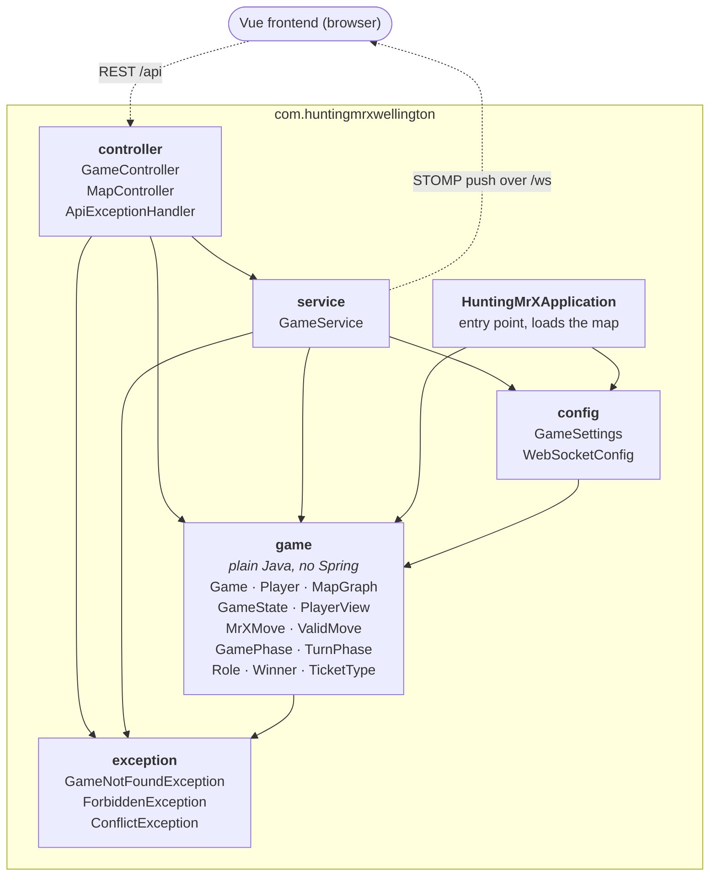
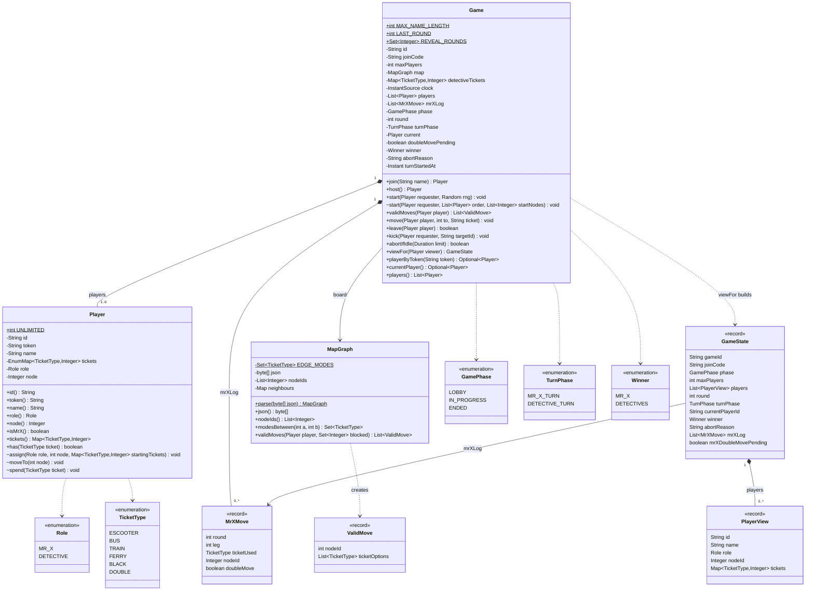
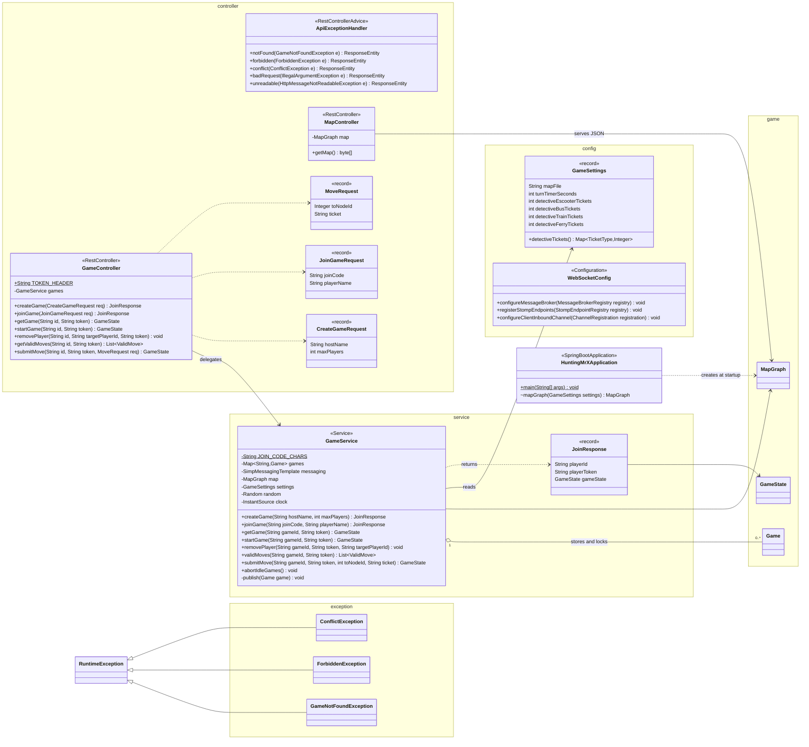

# Backend Package and Class Graphs

Rendered (Mermaid) version of [`classdiagram.md`](classdiagram.md). Both describe the backend in `backend/src/main/java/com/huntingmrxwellington/`.

## High-Level Package Diagram

Each box is a Java package with the classes in it. Solid arrows mean "imports from"; dotted arrows are network traffic. `game` is the rules engine: plain Java with no Spring, so it's unit-tested directly.

## Detailed Class Diagram

Every field and public method, plus the package-private ones (marked `~`); static members are underlined. Left out: private helper methods (except `GameService.publish`, which sends every update) and `Game`'s plain getters. The diagram comes in two parts so it stays readable: the rules core, then the Spring layer around it, where `Game`, `MapGraph` and `GameState` appear again as plain boxes.

The same two parts are pages in [`class-graph.drawio`](class-graph.drawio), which is easier to zoom through: open it in draw.io (app.diagrams.net, the desktop app or the VS Code extension).

### Part 1: rules core (`game`)

`MapGraph.neighbours` is a `Map<Integer, Map<Integer, Set<TicketType>>>` (node to neighbour to modes); Mermaid can't draw a generic that nested, so it shows as `Map`.

### Part 2: Spring layer (`controller`, `service`, `config`, `exception`)

`Game` and `GameService` throw the three exceptions. `ApiExceptionHandler` turns them into 404, 403 and 409, and an `IllegalArgumentException` or an unreadable request body into 400.

