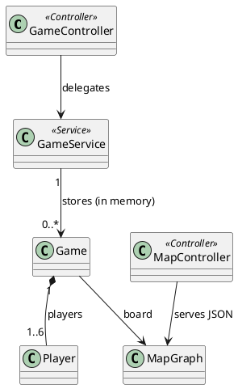
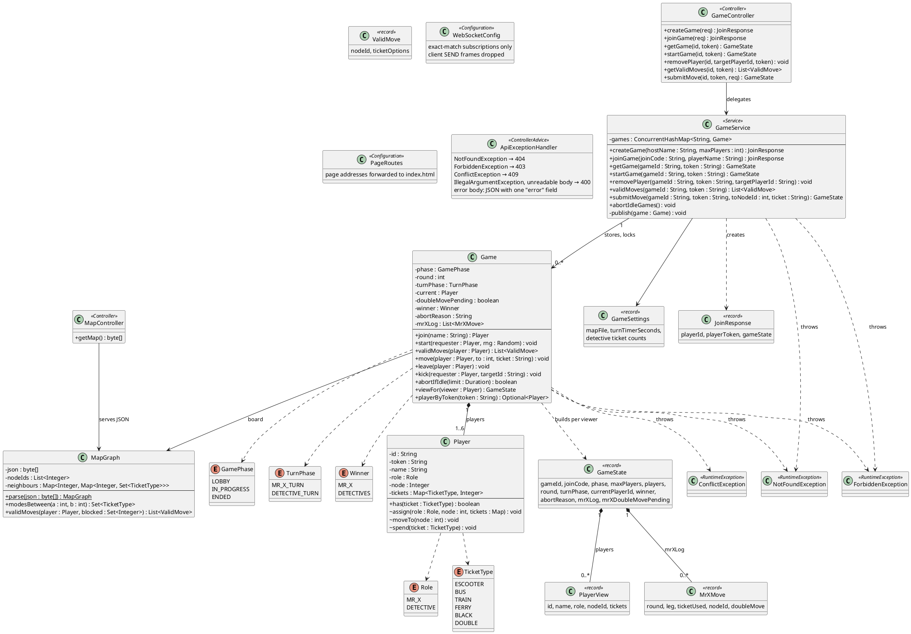

# Backend Class Diagrams

PlantUML source. A Mermaid version that renders on GitHub, with a package diagram, is in [`class-graph.md`](class-graph.md).

## High-Level Overview

## Detailed Diagram

