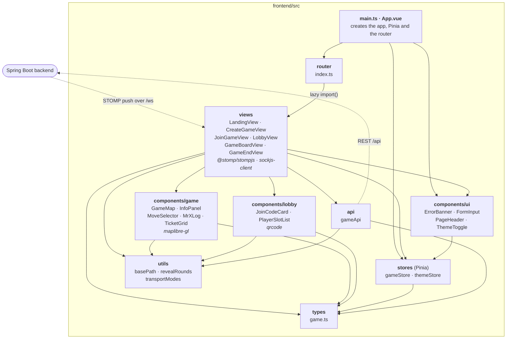
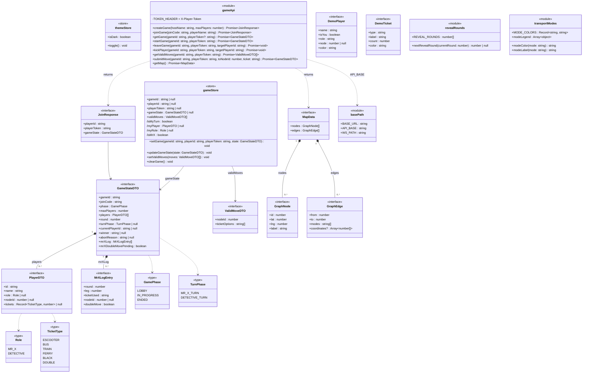
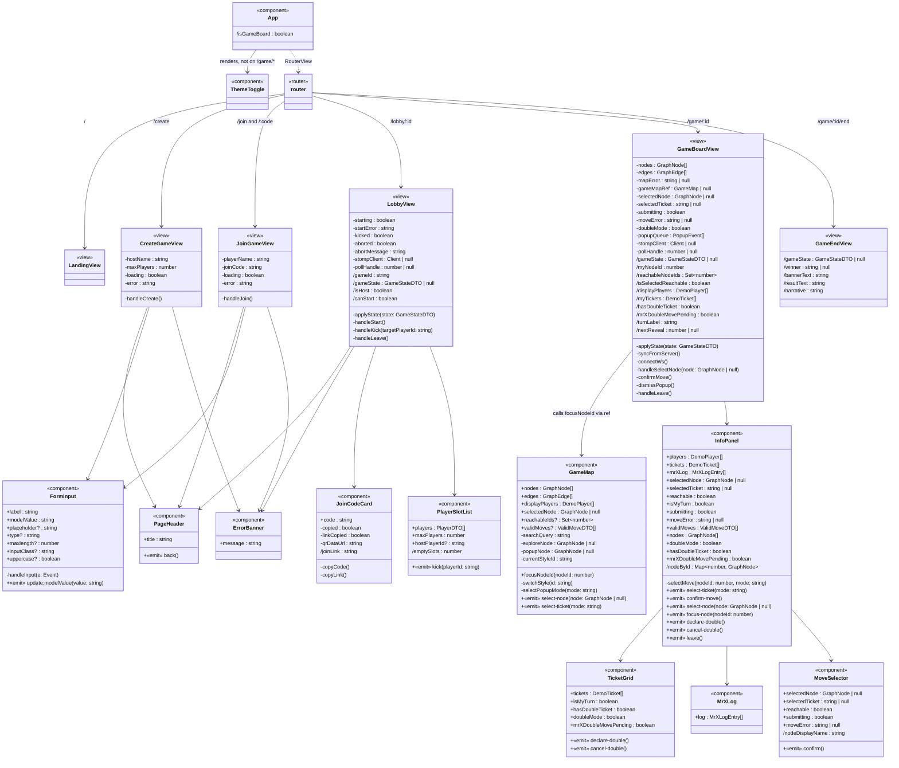

# Frontend Package and Component Graphs

Mermaid diagrams of the Vue frontend in `frontend/src/`, the counterpart of [`class-graph.md`](class-graph.md) for the backend. The detailed diagrams are also pages in [`frontend-graph.drawio`](frontend-graph.drawio), which is easier to zoom through: open it in draw.io (app.diagrams.net, the desktop app or the VS Code extension).

## High-Level Package Diagram

Each box is a folder under `frontend/src/` with the files in it and, in italics, the libraries only it uses. Solid arrows mean "imports from" (the router imports views lazily); dotted arrows are network traffic.

## Detailed Component Diagram

Vue components are drawn as classes: `+` marks props, `-` local state and functions, `/` computed values, and `«emit»` the events a component emits. Everything in a `<script setup>` block is private except what it exposes; `GameMap.focusNodeId` is the only exposed method. Left out: CSS-class and colour computeds, the popup text helpers in `GameBoardView`, and `GameMap`'s map-drawing internals. The diagram comes in two parts: state, API and types first, then the router, views and components that use them.

### Part 1: state, API and types (`stores`, `api`, `types`, `utils`)

`gameStore` keeps `gameId`, `playerId` and `playerToken` in `sessionStorage`; `themeStore` keeps the theme in `localStorage`. `leaveGame` and `kickPlayer` are the same function: `DELETE /api/games/{id}/players/{targetPlayerId}`.

### Part 2: router, views and components

Every view except `LandingView` reads `gameStore`, and `CreateGameView`, `JoinGameView`, `LobbyView` and `GameBoardView` call `gameApi` (see Part 1). `LobbyView` subscribes to the public topic `/topic/games/{id}`; `GameBoardView` subscribes to the player's two private topics. Both also re-sync over REST on every reconnect and poll every 6 s. Props flow down each arrow and events flow back up.

