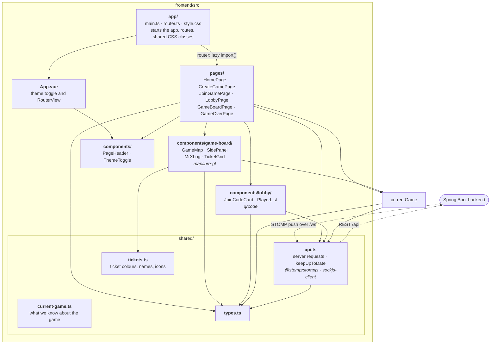
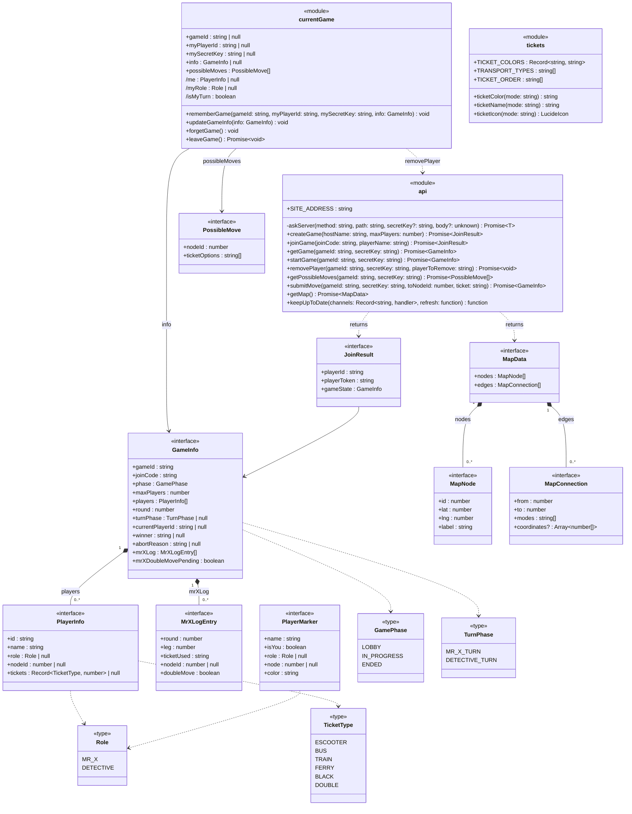
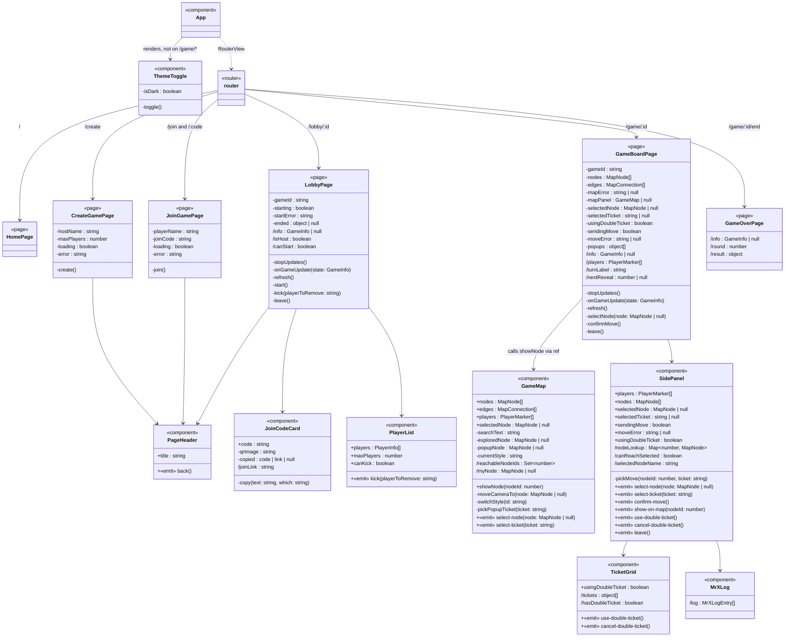

# Frontend Package and Component Graphs

Mermaid diagrams of the Vue frontend in `frontend/src/`, the counterpart of [`class-graph.md`](class-graph.md) for the backend. The detailed diagrams are also pages in [`frontend-graph.drawio`](frontend-graph.drawio), which is easier to zoom through: open it in draw.io (app.diagrams.net, the desktop app or the VS Code extension).

## High-Level Package Diagram

Each box is a file or folder under `frontend/src/`; `src/` itself holds only `App.vue` and folders. Italics mark libraries that only that box uses; `vue`, `vue-router` and the `lucide-vue-next` icons are used throughout. Solid arrows mean "imports from" (the router loads each page only when it's needed). Dotted arrows are network traffic.

## Detailed Component Diagram

Vue components are drawn as classes: `+` marks props and exports, `-` local state and functions, `/` computed values and getters, and `«emit»` the events a component emits. Everything in a `<script setup>` block is private except what it exposes; `GameMap.showNode` is the only exposed method. Left out: CSS-class computeds and `GameMap`'s map-drawing internals (icons, map data and layers). The diagram comes in two parts: game information, server calls and types first, then the router, pages and components that use them.

### Part 1: game information, server and types (`shared/`: `current-game.ts`, `api.ts`, `types.ts`, `tickets.ts`)

`currentGame` is a plain Vue `reactive()` object. It keeps `gameId`, `myPlayerId` and `mySecretKey` in `sessionStorage` so a refresh keeps your seat. `api.removePlayer` does both leaving and kicking: `DELETE /api/games/{id}/players/{playerToRemove}`. `JoinResult` keeps the server's own field names (`playerId`, `playerToken`, `gameState`). `keepUpToDate` opens the live connection (STOMP over SockJS), listens on the given channels, asks the server for the whole game again on every (re)connect and every 6 s, and returns a stop function.

### Part 2: router, pages and components

Every page except `HomePage` uses `currentGame`, and every page except `HomePage` and `GameOverPage` calls `api` (see Part 1). `LobbyPage` listens on the public channel `/topic/games/{id}`; `GameBoardPage` listens on the player's two private channels. Both do it through `api.keepUpToDate`. `GameMap`, `SidePanel`, `TicketGrid` and `MrXLog` read game information straight from `currentGame`; props carry only the move being built in `GameBoardPage`. Props flow down each arrow and events flow back up.

