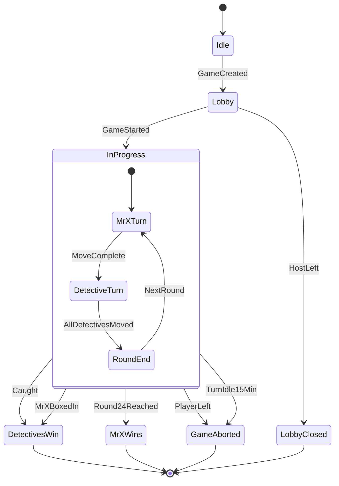
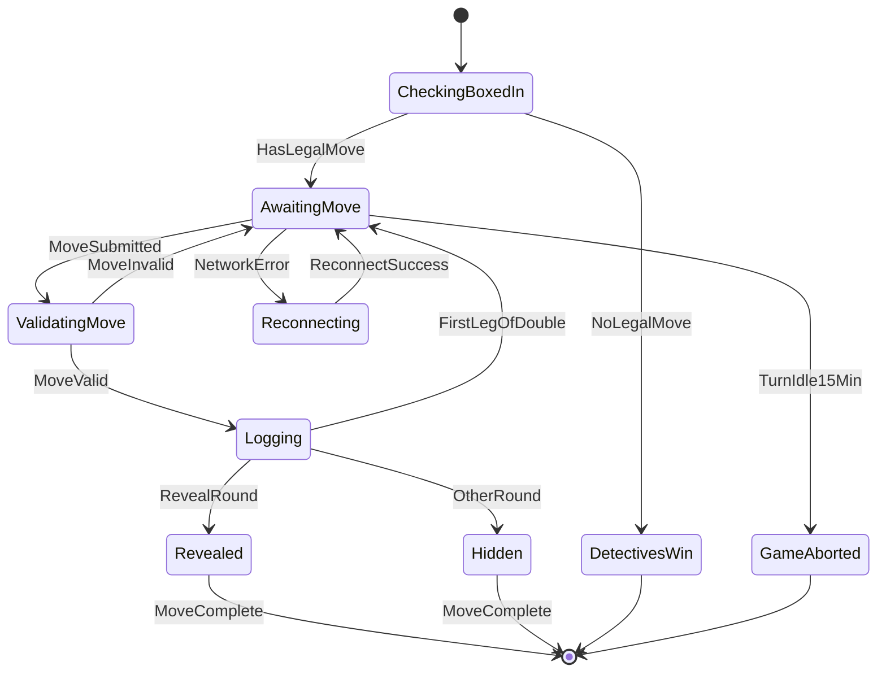
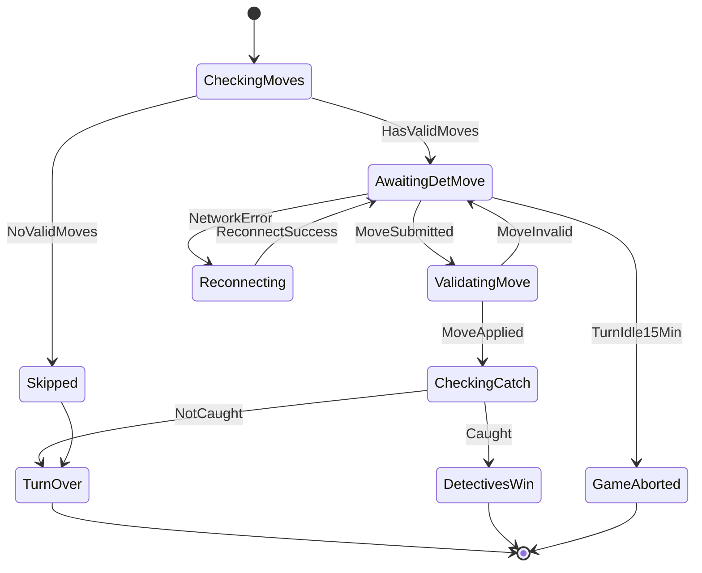

### Overview

Game-level phases. A game in progress ends when the detectives catch Mr X or box him in, when Mr X survives round 24, or when it's aborted because a player left or the current player went 15 minutes without moving. A dropped WebSocket doesn't pause anything: clients reconnect and re-sync over REST.

---

### Mr X states

His turn starts with a check that he can move at all: if detectives hold every neighbouring node, the detectives win. Every leg he plays is logged. The first leg of a double move (sent as `DOUBLE_<ticket>`) is never revealed and hands the turn straight back to him with a fresh idle clock; any other leg on a reveal round reveals the node he ends on. If he goes 15 minutes without moving, the server aborts the game. Network errors enter the client's reconnect loop (STOMP retries indefinitely, and the client re-syncs over REST on every reconnect and every 6 s).

---

### Detective states

A detective with no legal move is skipped without spending a ticket and never gets the turn. Otherwise the same idle limit and reconnect path apply as for Mr X. When the turn is over it passes to the next detective who can move, or the round ends.

