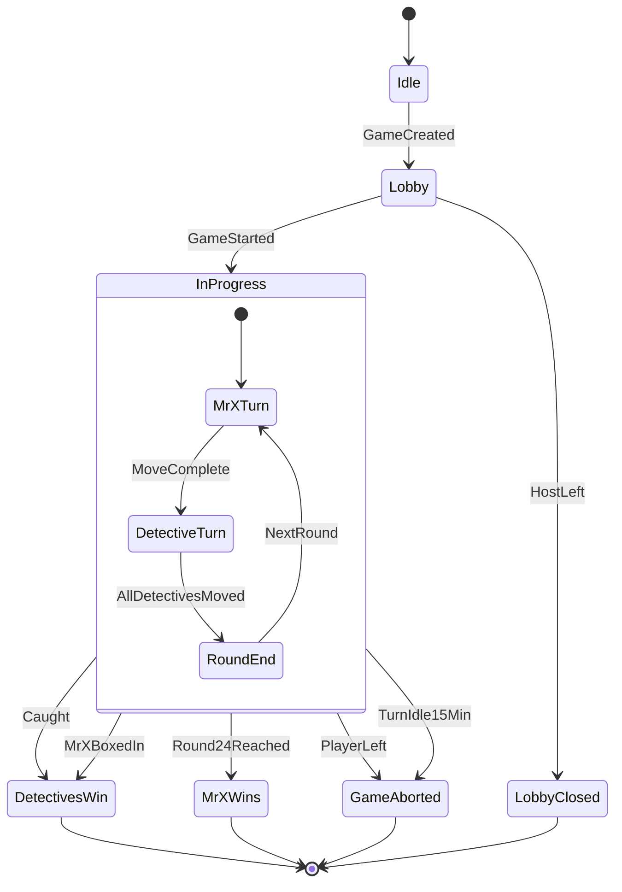
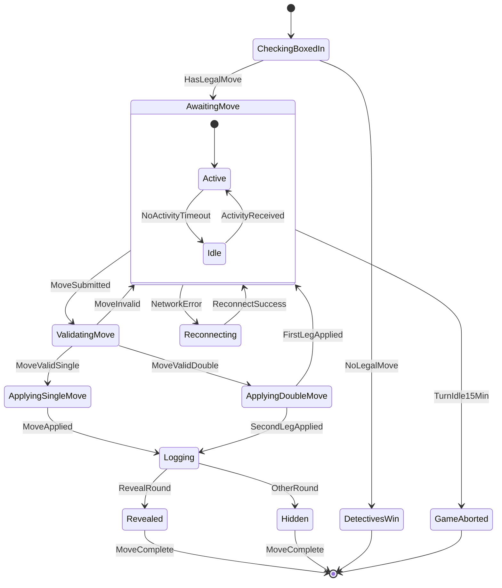
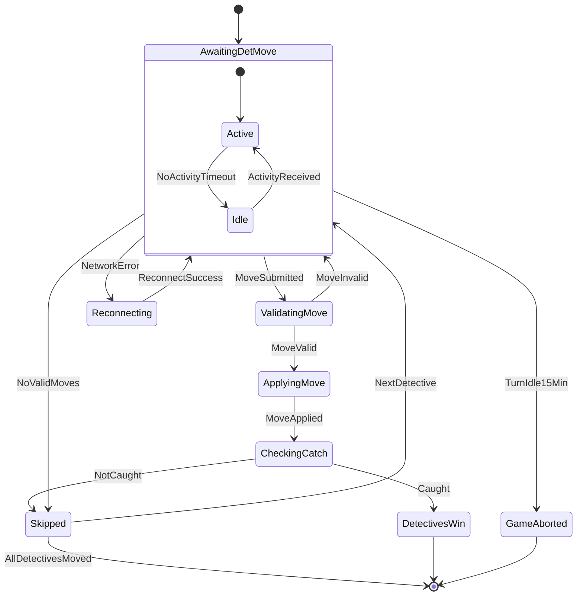

### Overview

Game-level phases. A game in progress ends when the detectives catch Mr X or box him in, when Mr X survives round 24, or when it's aborted because a player left or the current player went 15 minutes without moving. A dropped WebSocket doesn't pause anything: clients reconnect and re-sync over REST.

---

### Mr X states

His turn starts with a check that he can move at all: if detectives hold every neighbouring node, the detectives win. **AwaitingMove** tracks whether he's active or idle; after 15 minutes without a move the server aborts the game. Network errors enter the client's reconnect loop (STOMP retries indefinitely, and the client re-syncs over REST every 6 s).

---

### Detective states

Same active/idle tracking, idle limit and reconnect path as Mr X. A detective with no legal move is skipped without spending a ticket.

